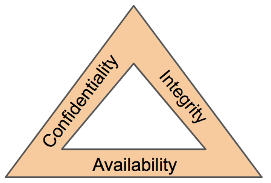
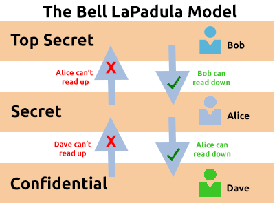
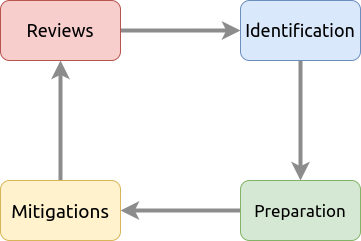
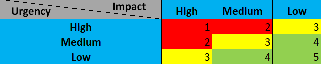

## The CIA Triad

- The CIA triad is a crucial information security model used to create security policies.
- Its history dates back to 1998 and it encompasses aspects beyond cybersecurity, such as record storage.
- Comprising of confidentiality, integrity, and availability, this model is now widely recognized and aids in assessing data value and business focus.

 

- The CIA triad is a continuous cycle, with overlapping elements.If one element is not met, the other two become useless, making an ineffective security policy

### Confidentiality
- The protection of data from unauthorized access and misuse is crucial.
- Organizations store sensitive data and confidentiality ensures that only designated parties can access it.
- For instance, employee records are considered sensitive and are accessible only to HR administrators with strict access controls.
- Governments also use sensitivity classification ratings like top-secret, classified, and unclassified.

### Integrity
- The CIA triad element of integrity ensures information is accurate and consistent unless authorized changes are made.
- Integrity can be compromised by careless access, system errors, or unauthorized use. 
- It is maintained when data remains unchanged during storage, transmission, and usage unless modified legitimately.

To protect integrity:

- Use access controls and rigorous authentication to prevent unauthorized changes by users.
- Employ hash verifications and digital signatures to confirm the authenticity of transactions and the integrity of files.

## Availability

- For data to be useful, it must be available and accessible to users.
- In the CIA triad, the focus is on ensuring that information is available when authorized users need it. 
- Availability is crucial for organizations, often measured by uptime (e.g., 99.99% uptime in Service Level Agreements). Downtime can harm an organization's reputation and finances.

Availability is achieved through:

- Reliable, well-tested hardware.
- Redundant technology and services for backup.
- Robust security protocols to protect against attacks.

## Principles of Privileges

- It's crucial to properly define and manage the different levels of access individuals need for an IT system.Access levels are based on:
	- The individual's role or function in the organization.
	- The sensitivity of the information on the system.

- Two key concepts are used to assign and manage the access rights of individuals: **Privileged Identity Management (PIM)** and **Privileged Access Management (or PAM for short).**

**Privileged Identity Management (PIM):**

PIM is a security practice that involves managing and controlling access to high-level accounts or identities within a computer system. It ensures that only authorized users can access these powerful accounts, which have elevated permissions to perform critical tasks. PIM also monitors and tracks the usage of these accounts to prevent misuse and maintain system security.

**Privileged Access Management (PAM):** 

PAM is a security framework designed to manage and control access to sensitive resources, systems, and applications within a computer network. It focuses on restricting and monitoring access to privileged accounts, which have elevated permissions, to prevent unauthorized access and potential security breaches. PAM includes processes and technologies to enforce strong authentication, authorization, and auditing mechanisms for privileged access.

## Security Models Continued

### The Bell-La Padula Model

The Bell-La Padula Model is used to achieve confidentiality.
The model works by granting access to pieces of data (called objects) on a strictly need to know basis. This model uses the rule "no write down, no read up".

### Biba Model

The Biba model is arguably the equivalent of the Bell-La Padula model but for the integrity of the CIA triad.

*To Do*

## Threat Modelling & Incident Response

Threat modelling is the process of reviewing, improving, and testing the security protocols in place in an organisation's information technology infrastructure and services.

A critical stage of the threat modelling process is identifying likely threats that an application or system may face, the vulnerabilities a system or application may be vulnerable to.

  
To help with this, there are frameworks such as **STRIDE**

| **Principle**          | **Description**                                                                                                                                                                                                                                               |
| ---------------------- | ------------------------------------------------------------------------------------------------------------------------------------------------------------------------------------------------------------------------------------------------------------- |
| Spoofing               | This principle requires you to authenticate requests and users accessing a system. Spoofing involves a malicious party falsely identifying itself as another.  Access keys (such as API keys) or signatures via encryption helps remediate this threat. |
| Tampering              | By providing anti-tampering measures to a system or application, you help provide integrity to the data. Data that is accessed must be kept integral and accurate.  For example, shops use seals on food products.                                      |
| Repudiation            | This principle dictates the use of services such as logging of activity for a system or application to track.                                                                                                                                                 |
| Information Disclosure | Applications or services that handle information of multiple users need to be appropriately configured to only show information relevant to the owner.                                                                                                        |
| Denial of Service      | Applications and services use up system resources, these two things should have measures in place so that abuse of the application/service won't result in bringing the whole system down.                                                                    |
| Elevation of Privilege | This is the worst-case scenario for an application or service. It means that a user was able to escalate their authorization to that of a higher level i.e. an administrator. This scenario often leads to further exploitation or information disclosure.    |

A breach of security is known as an incident Actions taken to resolve and remediate the threat are known as **Incident Response (IR)**.   
Incidents are classified using a rating of urgency and impact.

An incident is responded to by a **C**omputer **S**ecurity **I**ncident **R**esponse **T**eam (**CSIRT**) which is prearranged group of employees with technical knowledge about the systems and/or current incident.

To successfully solve an incident, these steps are often referred to as the six phases of Incident Response that takes place, listed in the table below:

| **Action**      | **Description**                                                                                                                             |
| --------------- | ------------------------------------------------------------------------------------------------------------------------------------------- |
| Preparation     | Do we have the resources and plans in place to deal with the security incident?                                                             |
| Identification  | Has the threat and the threat actor been correctly identified in order for us to respond to?                                                |
| Containment     | Can the threat/security incident be contained to prevent other systems or users from being impacted?                                        |
| Eradication     | Remove the active threat.                                                                                                                   |
| Recovery        | Perform a full review of the impacted systems to return to business as usual operations.                                                    |
| Lessons Learned | What can be learnt from the incident? I.e. if it was due to a phishing email, employees should be trained better to detect phishing emails. |