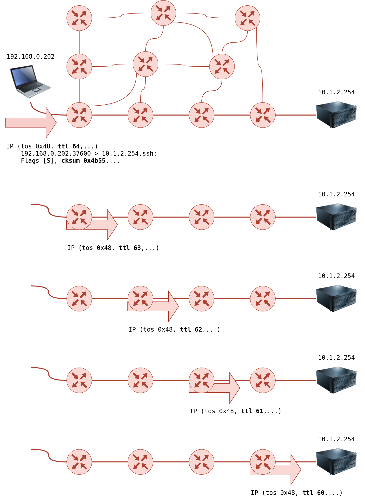

## Web Browser
The web browser can be a convenient tool, especially that it is readily available on all systems. There are several ways where you can use a web browser to gather information about a target.

**Developer tools** : Developer Tools lets you inspect many things that your browser has received and exchanged with the remote server.
**FroxyProxy** : lets you quickly change the proxy server you are using to access the target website.
**User-Agent Switcher and Manager** : gives you the ability to pretend to be accessing the webpage from a different operating system or different web browser.
**Wappalyzer** provides insights about the technologies used on the visited websites. Such extension is handy, primarily when you collect all this information while browsing the website like any other user.

## Ping
The primary purpose of ping is to check whether you can reach the remote system and that the remote system can reach you back. In other words, initially, this was used to check network connectivity; however, we are more interested in its different uses: checking whether the remote system is online.

Ping is a command that sends a message to a remote system. If the remote system is online and not blocked by firewalls, it sends a reply back. This shows if the connection is working and how fast it is.

Ping operates within the Internet Control Message Protocol (ICMP). It uses ICMP echo (type 8) to send a message and expects an echo reply (type 0) from the remote system.

```shell-session
user@machine$ ping google.com
```

## Traceroute
Traceroute is a command-line tool available on Linux systems used to trace the route that packets take from your computer to a destination IP address or domain. It works by sending packets with increasingly high time-to-live (TTL) values and noting the IP addresses of the routers that process the packets along the way.

```shell-session
user@machine$ traceroute google.com
```

**How traceroute works**

Traceroute in Linux works by sending a series of UDP or ICMP packets to the destination with increasing TTL (Time To Live) values. Here's how it works step by step:

1. Traceroute starts by sending a packet with TTL set to 1 to the destination IP address.
2. The first router encountered decrements the TTL by 1 and forwards the packet.
3. If the TTL becomes 0, the router drops the packet and sends back an ICMP Time Exceeded message to the sender.
4. Traceroute receives the ICMP Time Exceeded message and records the IP address of the router.
5. Traceroute repeats this process, increasing the TTL by 1 each time, until it reaches the destination.
6. Once the destination is reached, it sends back an ICMP Port Unreachable message, indicating that the packet couldn't reach the target port.
7. Traceroute displays the list of routers along the path, showing their IP addresses and response times.

By analyzing the list of routers and their response times, traceroute provides a detailed map of the network path packets take from your system to the destination.



## Conclusion

|Command|Example|
|---|---|
|ping|`ping -c 10 MACHINE_IP` on Linux or macOS|
|ping|`ping -n 10 MACHINE_IP` on MS Windows|
|traceroute|`traceroute MACHINE_IP` on Linux or macOS|
|tracert|`tracert MACHINE_IP` on MS Windows|
|telnet|`telnet MACHINE_IP PORT_NUMBER`|
|netcat as client|`nc MACHINE_IP PORT_NUMBER`|
|netcat as server|`nc -lvnp PORT_NUMBER`|

| Operating System    | Developer Tools Shortcut |
| ------------------- | ------------------------ |
| Linux or MS Windows | `Ctrl+Shift+I`           |
| macOS               | `Option + Command + I`   |