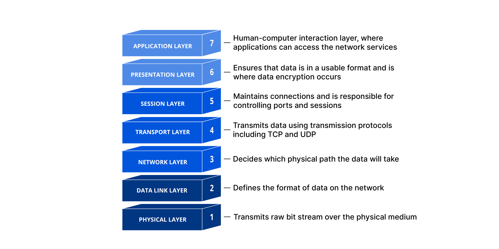

## Neworking Models

Two networking models describe the communication and transfer of data from one host to another, called `ISO/OSI model(Open Systems Interconnection)`  and the `TCP/IP model`.

#### Packet Transfer

- different layer accept data from different format called `protocol data unit` (pdu).

- During the transmission, each layer adds a `header` to the `PDU` from the upper layer, which controls and identifies the packet.
- this process is called `Encapsulation` , the header and the data together form the PDU for the next layer.

## The OSI Model

When an application sends a packet to the other system, the system works the layers shown above from layer `7` down to layer `1`, and the receiving system unpacks the received packet from layer `1` up to layer `7`.

## The TCP/IP Model

The term `TCP/IP` stands for the two protocols `Transmission Control Protocol` (`TCP`) and `Internet Protocol` (`IP`). `IP` is located within the `network layer` (`Layer 3`) and `TCP` is located within the `transport layer` (`Layer 4`) of the `OSI` layer model.

|**Layer**|**Function**|
|---|---|
|`4.Application`|The Application Layer allows applications to access the other layers' services and defines the protocols applications use to exchange data.|
|`3.Transport`|The Transport Layer is responsible for providing (TCP) session and (UDP) datagram services for the Application Layer.|
|`2.Internet`|The Internet Layer is responsible for host addressing, packaging, and routing functions.|
|`1.Link`|The Link layer is responsible for placing the TCP/IP packets on the network medium and receiving corresponding packets from the network medium. TCP/IP is designed to work independently of the network access method, frame format, and medium.|

The most important tasks of `TCP/IP` are:

|**Task**|**Protocol**|**Description**|
|---|---|---|
|`Logical Addressing`|`IP`|Due to many hosts in different networks, there is a need to structure the network topology and logical addressing. Within TCP/IP, IP takes over the logical addressing of networks and nodes. Data packets only reach the network where they are supposed to be. The methods to do so are `network classes`, `subnetting`, and `CIDR`.|
|`Routing`|`IP`|For each data packet, the next node is determined in each node on the way from the sender to the receiver. This way, a data packet is routed to its receiver, even if its location is unknown to the sender.|
|`Error & Control Flow`|`TCP`|The sender and receiver are frequently in touch with each other via a virtual connection. Therefore control messages are sent continuously to check if the connection is still established.|
|`Application Support`|`TCP`|TCP and UDP ports form a software abstraction to distinguish specific applications and their communication links.|
|`Name Resolution`|`DNS`|DNS provides name resolution through Fully Qualified Domain Names (FQDN) in IP addresses, enabling us to reach the desired host with the specified name on the internet.|
