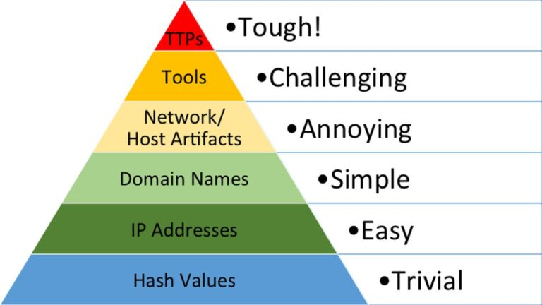

## What is Pyramid of Pain

is a conceptual model in cybersecurity that ranks indicators of compromise (IoCs) and tactics, techniques, and procedures (TTPs) based on how difficult they are for attackers to change. The higher up the pyramid, the more difficult it is for attackers to modify their methods and behaviors.



## Levels of the Pyramid

### Hash Values (Trivial)

The easiest for attackers to change. These are unique digital fingerprints of files, but they can be altered by recompiling or modifying the file.

### IP Addresses (Easy)

Also relatively easy to change. Attackers can use dynamic IP addresses or proxies to mask their location.

One of the ways an attacker can make it challenging to successfully carry out IP blocking is by using Fast Flux.

### Domain Names (Simple)

While harder to change, attackers can register new domains or use domain generation algorithms.

- Attacker can also use `Punycode` method (way of converting words that cannot be written in ASCII, into a Unicode ASCII encoding.

```
URL adıdas.de which has the Punycode of <http://xn--addas-o4a.de/>
```

- Another tech is URL shortener. ([bit.ly](http://bit.ly), [goo.gl](http://goo.gl))

You can view connections in [`Any.run`](http://Any.run) website to see if attacker using any techniques by observing http request, DNS request etc.

### Host Artifacts (Annoying)

if you can detect and respond to the threat, the attacker would need more time to go back and change his tactics or modify the tools

Host artifacts are the traces or observables that attackers leave on the system, such as registry values, suspicious process execution, attack patterns or IOCs (Indicators of Compromise), files dropped by malicious applications, or anything exclusive to the current threat.

It's more difficult to alter, but attackers can use techniques like obfuscation.

### Network Artifacts ( Annoying)

if you can detect and respond to the threat, the attacker would need more time to go back and change his tactics or modify the tools

A network artifact can be a user-agent string, C2 information, or URI patterns followed by the HTTP POST requests.

Network artifacts can be detected in wireshark PCAPs by using a network protocol analyzer such as Tshark. or by exploring IDS logging.

### Tools ( Challenging)

The tools attackers use can be harder to change, as they often require specialized knowledge or resources.

Antivirus signatures, detection rules, and YARA rules can be great weapones for you to use against attacker at this stage.

Fuzzy hashing is also a strong weapon against the attacker's tools. Fuzzy hashing helps you to perform similarity analysis - match two files with minor differences based on the fuzzy hash values. One of the examples of fuzzy hashing is the usage of [SSDeep](https://ssdeep-project.github.io/ssdeep/index.html);

### TTPs (Tough)

The highest level of the pyramid.

These are the fundamental methods and strategies attackers employ. Changing TTPs is the most difficult and painful for attackers