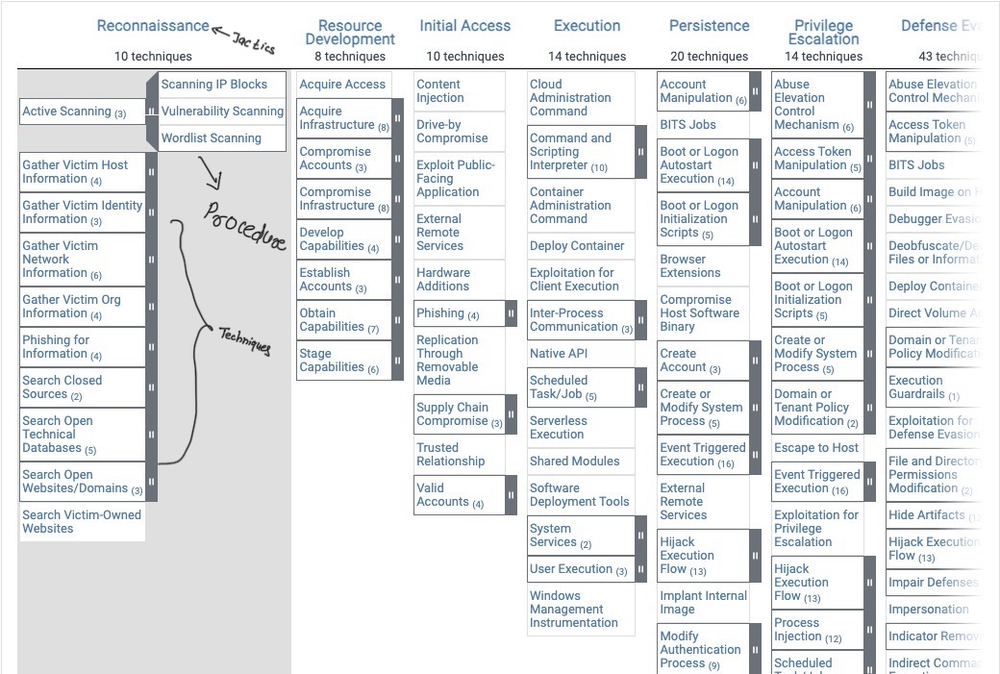

## MITRE

- Its American Corporation not-for-profit organization
- Handles federally funded research and developement center(FFRDCs) supporting various agencies in the aviation, defense, healthcare,homeland security and cyber security field.

## ATT$CK (Adversarial Tactics Techniques and Common Knowledge)

ATT&CK is knowledge base of adversarial techniques based on real-world observations.

### Terminologies

1. **APT** : **Advanced Persistent Threat**. This can be considered a team/group (_**threat group**_), or even country (_**nation-state group**_), that engages in long-term attacks against organizations and/or countries.
2. **TTP** : Tactics**,** Techniques**,** and ****Procedures
    1. Tactics : adversary’s(attacker’s) goal or objective.They represent the **why** behind an attack. For example, a tactic might be **data exfiltration** or **privilege escalation**.
    2. Techniques : how the adversary achieves the goal or objective. for example if the tactic is **data exfiltration**, a technique might be using **command and control channels** to transfer stolen data.
    3. Procedures : Procedures are the detailed **step-by-step actions** attackers take to implement techniques. These include the tools, malware, scripts, or configurations they use.

## MITRE ATT&CK Navigator

_The ATT&CK® Navigator is designed to provide basic navigation and annotation of ATT&CK® matrices, something that people are already doing today in tools like Excel._

## MITRE CAR Knowledge Base

- Cyber Analytic Repository.

The MITRE Cyber Analytics Repository (CAR) is like a library of strategies and tools that help detect and analyze cyber-attacks. These strategies are created by MITRE and are based on their well-known system for understanding how attackers behave (called ATT&CK®).

CAR has two key features:

1. **Data Model**: It uses a specific structure to represent the detection methods, which helps explain how attacks are identified.
2. **Tools**: CAR provides ready-made examples and instructions for how to use popular security tools (like Splunk and EQL) to detect cyber threats.

The goal of CAR is to offer reliable and clear methods that security teams can use to detect and understand potential threats, explaining how and why these methods work.