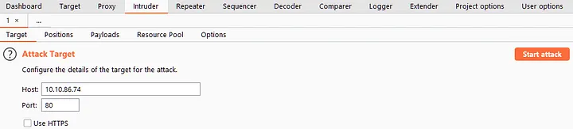

Intruder is Burp Suite's fuzzing tool. It takes a captured request (usually from Proxy) and automatically sends many requests with slightly altered values based on a template. For instance, with a login request, Intruder can replace username/password with values from a wordlist for brute-forcing. It can also fuzz for subdirectories, endpoints, or virtual hosts using a wordlist, similar to tools like Wfuzz or Ffuf.



- **Positions** :allows us to select an **Attack Type**  as well as configure where in the request template we wish to insert our payloads.
- **Payloads** : allows us to select values to insert into each of the positions we defined.
- **Resource Pool** :  isn't very useful in Burp Community. It lets us allocate resources between tasks, which is handy in Burp Pro for running automated tasks in the background. Without access to these tasks, there's little point in using it, so we won't focus on it much.
- **Options** : Intruder's Options sub-tab lets us adjust attack behavior. We can set how Burp handles results and the attack itself, such as flagging requests with specific text or defining responses to redirects (3xx).

## Attack Types.

There are four attack types available:

- Sniper
- Battering ram
- Pitchfork
- Cluster bomb

two wordlist to understand with example.

wl 1: 

```
username1
username2
username3
username4
username5
```

wl2 :

```
password1
password2
password3
password4
password5
```

**Sniper**  : This is a type where we can send only payload at a specific position. We can use this in the cases where we know the other things and only one field is to be brute-forced. Ex: we know the username and we have to brute force the password.

```
Username: password
Username1:Password1  
Username1:Password2  
Username1:Password3  
Username1:Password4
```

**Battering ram** :  This is a type where we can send only one payload at all the positions. We can use this for the cases where the usernames and passwords are the same.

```
Username1:Username1  
Username2:Username2  
Username3:Username3  
Username4:Username4
```

**Pitch Pork**: This is the mode where we can specify different wordlists for different positions.

```
Username1:Password1  
Username2:Password2  
Username3:Password3  
Username4:Password4
```
**Cluster Bomb** : This will use an iterative approach. Let’s suppose we have selected 2 fields: username and password. Also we have supplied the list Usernames and passwords(from above wordlist).  Then the underlying combination will look like this,

```
Username1:Password1  
Username1:Password2  
Username1:Password3  
Username1::Password4  
  
Username2:Password1  
Username2:Password2  
Username2:Password3  
Username2:Password4  
  
Username3:Password1  
Username3:Password2  
Username3:Password3  
Username3:Password4  
  
Username4:Password1  
Username4:Password2  
Username4:Password3  
Username4:Password4
```

## Other Modules

Burp suit also have other modules like Decoder, Comparer and Sequencer tools. These allow us to: work with encoded text; compare sets of text; and analyse the randomness of captured tokens, respectively.

