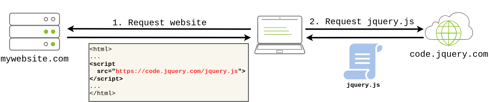
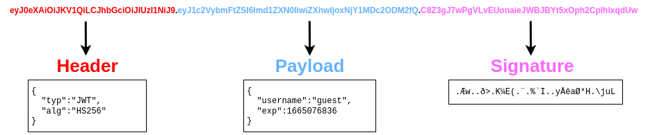
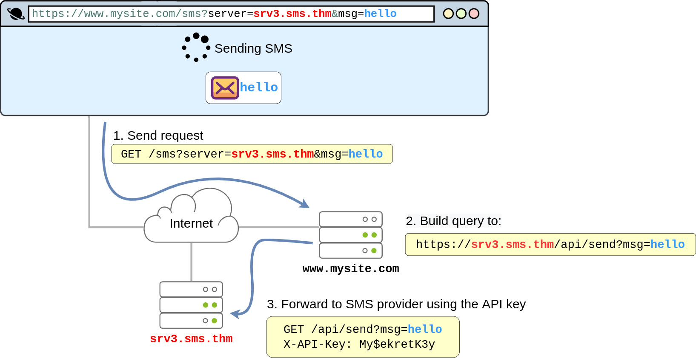

## Introduction

We will cover...

1. Broken Access Control
2. Cryptographic Failures
3. Injection
4. Insecure Design
5. Security Misconfiguration
6. Vulnerable and Outdated Components
7. Identification and Authentication Failures
8. Software and Data Integrity Failures
9. Security Logging & Monitoring Failures
10. Server-Side Request Forgery (SSRF)

## 1. Broken Access Control

Websites have pages that are protected from regular visitors. For example, only the site's admin user should be able to access a page to manage other users. If a website visitor can access protected pages they are not meant to see, then the access controls are broken.

Simply put, broken access control allows attackers to bypass authorisation, allowing them to view sensitive data or perform tasks they aren't supposed to.

## Broken Access Con trol (IDOR Challenge)

- IDOR or Insecure Direct Object Reference refers to an access control vulnerability where you can access resources you wouldn't ordinarily be able to see. 
- This occurs when the programmer exposes a Direct Object Reference, which is just an identifier that refers to specific objects within the server. 
- By object, we could mean a file, a user, a bank account in a banking application, or anything really.

## 2. Cryptographic Failures

- A cryptographic failure occurs when cryptographic algorithms are misused or not used properly to protect sensitive information. Web applications rely on cryptography to ensure user data remains confidential.

1. Encrypt data in transit: Secure communication between client (your device) and server (email provider).
2. Encrypt data at rest: Protect stored emails on the email provider's servers.

- Cryptographic failures lead to sensitive data exposure.

## Cryptographic Failures (Supporting Material 1)

- Databases, often in SQL format, store large amounts of data for web apps.
- Dedicated servers host databases, but smaller apps may use flat-file databases.
- Storing flat-file databases in the website's root directory risks exposing sensitive data.
- SQLite is a common flat-file format, queried using tools like sqlite3.

## Cryptographic Failures (Supporting Material 2)

- Crackstation is an online tool for cracking weak password hashes.

## Injection

Injection flaws in applications occur when user input is interpreted as commands or parameters, enabling attackers to manipulate system behavior. Common examples include:

- SQL Injection: User input passed to SQL queries allows attackers to manipulate database queries, potentially accessing or modifying sensitive data.
- Command Injection: User input passed to system commands lets attackers execute arbitrary commands on application servers, risking system compromise.

Preventing injection attacks involves ensuring user input isn't interpreted as queries or commands:

- Using an allow list: Compare input to a list of safe inputs or characters; reject unsafe input to prevent malicious queries or commands.
- Stripping input: Remove dangerous characters before processing to mitigate injection risks.

Libraries exist to automate allow listing or input stripping to bolster security measures.

## 3.1 Command Injection

- Command Injection arises when server-side code, like PHP in a web app, executes a function interacting with the server's console. 
- This vulnerability enables attackers to run OS commands arbitrarily on the server, akin to issuing commands directly on the command line. 
- Attackers gain significant control, accessing files, reading contents, and conducting reconnaissance. 
- Once on the server, attackers can enumerate systems and seek pivot points

### Example :

```php
<?php
    if (isset($_GET["mooing"])) {
        $mooing = $_GET["mooing"];
        $cow = 'default';

        if(isset($_GET["cow"]))
            $cow = $_GET["cow"];
        
        passthru("perl /usr/bin/cowsay -f $cow $mooing");
    }
?>
```

- Vulnerability: Command injection due to unsanitized user input passed to passthru().
- User inputs ("mooing" and "cow") are directly concatenated into the command string.
- Lack of input validation or sanitization allows attackers to inject arbitrary commands.
- Potential consequences: unauthorized system access, data compromise, etc.

## Insecure Design

- Insecure design vulnerabilities arise from flaws in the application's architecture.
- They result from inadequate threat modeling during the planning stages.
- These vulnerabilities can persist through development and affect the final application.
- Developers may introduce insecure design vulnerabilities by implementing shortcuts for testing purposes.
- For example, disabling OTP validation during development but forgetting to re-enable it in production poses a security risk.

## Security Misconfiguration
Security misconfigurations occur when security settings are not appropriately configured, leaving systems vulnerable even with up-to-date software. Examples include:

- Poor permissions on cloud services like S3 buckets.
- Enabling unnecessary features, services, or privileges.
- Default accounts with unchanged passwords.
- Detailed error messages revealing system information.
- Absence of HTTP security headers.

These misconfigurations can lead to further vulnerabilities, such as access to sensitive data through default credentials or exploitation of admin pages for attacks like XML External Entities (XXE) or command injection.

### Debugging Interface

Exposing debugging interfaces in production software poses a significant security misconfiguration risk. Debugging features, commonly available in programming frameworks, provide developers with advanced functionality for debugging during application development. 
However, if these debugging features are not disabled before publishing the application, attackers can exploit them.

One notable example is the alleged use of a debugging vulnerability in the Patreon hack of 2015. Five days before the hack, a security researcher reported finding an open debug interface for a Werkzeug console in Patreon's system. Werkzeug is crucial for Python-based web applications, providing a web server interface to execute Python code. The Werkzeug debug console can be accessed via URL (/console) or when an exception is raised. This console allows running arbitrary Python code, giving attackers the ability to execute commands.

## Vulnerable and Outdated Components

- Using outdated software with well-known vulnerabilities poses a significant risk during penetration testing. 
- For instance, if a company is running an outdated version of WordPress, such as version 4.6, a tool like WPScan can quickly identify it. Upon further research, it may reveal that WordPress 4.6 is vulnerable to unauthenticated remote code execution (RCE) exploits. Furthermore, exploit code may already exist on platforms like Exploit-DB.
- This situation is particularly dangerous because it requires minimal effort on the attacker's part. With well-known vulnerabilities, attackers often find pre-existing exploit code readily available. 
- The risk escalates when considering how easy it is for organizations to miss software updates. A single missed update can render a system vulnerable to a wide range of attacks.

## Identification and Authentication Failures

uthentication and session management are crucial components of web applications, ensuring secure access for users. Here's an overview and common flaws:

Authentication:
- Validates user identities using mechanisms like username-password.
- Server verifies credentials, issues session cookies to track user actions.
- Session cookies maintain user-state in stateless HTTP(S) communication.

Common Authentication Flaws:

1. Brute Force Attacks:
    - Attackers attempt multiple logins to guess usernames and passwords.
2. Weak Credentials:
    - Lack of strong password policies allows attackers to guess weak passwords (e.g., "password1").
3. Weak Session Cookies:
    - If session cookies have predictable values, attackers can create their own cookies to access user accounts.

Consequences of Flaws:
- Successful attacks grant attackers access to sensitive data, compromising user accounts.

- Mitigating broken authentication mechanisms involves specific strategies tailored to each flaw:
1. Password-Guessing Attacks:
    
    - Enforce a strong password policy:
        - Require minimum password length.
        - Require a combination of letters, numbers, and special characters.
        - Prohibit common or easily guessable passwords.
2. Brute Force Attacks:
    
    - Implement automatic lockout:
        - Temporarily lock user accounts after a certain number of failed login attempts.
        - Prevents attackers from continuing brute-force attacks.
3. Multi-Factor Authentication (MFA):
    
    - Require multiple authentication methods:
        - User provides a password and receives a code on their mobile device.
        - Even if attackers obtain passwords, they still need secondary authentication.

## Software and Data integrity Failure

### What is integrity ?

Integrity refers to ensuring that data remains unmodified, a critical aspect of cybersecurity to prevent unwanted or malicious alterations. For example, when downloading a file, how can you be certain it wasn't modified or corrupted during transmission?

To address this, a hash, or digest, is often sent alongside the file. This hash is a number generated by applying a specific algorithm (e.g., MD5, SHA1, SHA256) to the data. By comparing the received file's hash to the provided one, you can verify its integrity, ensuring it hasn't been altered in transit.

### Software and Data Integrity Failures  

This vulnerability arises from code or infrastructure that uses software or data without using any kind of integrity checks. Since no integrity verification is being done, an attacker might modify the software or data passed to the application, resulting in unexpected consequences. There are mainly two types of vulnerabilities in this category:

- Software Integrity Failures
- Data Integrity Failures

#### Software Integrity Failures 

- Suppose you have a website that uses third-party libraries that are stored in some external servers that are out of your control.  
- Take as an example jQuery, a commonly used javascript library. If you want, you can include jQuery in your website directly from their servers without actually downloading it by including the following line in the HTML code of your website:

`<script src="https://code.jquery.com/jquery-3.6.1.min.js"></script>`

- When a user navigates to your website, its browser will read its HTML code and download jQuery from the specified external source.



- The problem is that if an attacker somehow hacks into the jQuery official repository, they could change the contents of https://code.jquery.com/jquery-3.6.1.min.js to inject malicious code. 
- As a result, anyone visiting your website would now pull the malicious code and execute it into their browsers unknowingly. 
- To mitigate this risk, modern browsers offer a security mechanism called Subresource Integrity (SRI). SRI allows developers to specify a hash along with the library's URL.
- The browser then checks if the downloaded file's hash matches the expected value before executing the code.

#### Data Integrity Failures

Web applications maintain sessions by assigning session tokens to users upon login. These tokens are stored on the user's browser and sent with each subsequent request to identify the user's session.

- Session Token:
    - Assigned to the user upon login.
    - Used to identify the user's session.
    - Sent with each request to the website that issued it.
- Cookies:
    - Commonly used to store session tokens.
    - Key-value pairs stored on the user's browser.
    - Automatically sent with each request to the issuing website. 

Storing sensitive data, like usernames, directly in cookies poses a significant security risk as they are vulnerable to tampering by users. This could lead to impersonation or unauthorized access, resulting in a data integrity failure.

A solution to this problem is using integrity mechanisms to ensure that cookies remain unaltered. Token implementations like JSON Web Tokens (JWT) provide cryptographic methods to verify the integrity of data without the need for manual cryptography implementation.

JSON Web Tokens (JWTs) are simple tokens used to store key-value pairs with integrity assurance. They consist of three parts:

1. Header:
    
    - Metadata indicating it's a JWT.
    - Specifies the signing algorithm used (e.g., HS256).
2. Payload:
    
    - Contains key-value pairs with data for the client to store.
    - Information desired by the web application.
3. Signature:
    
    - Verifies the integrity of the payload.
    - Similar to a hash but involves a secret key held only by the server.
    - Changing the payload will result in a signature mismatch, alerting the server to tampering attempts



## 9. Security Logging and Monitoring Failures

Logging user actions in web applications is crucial for tracing activities and identifying attackers in the event of an incident. Without logging, determining the scope and impact of an attack becomes challenging. Key implications of inadequate logging include:

1. Regulatory Damage:
    - Lack of logging compromises compliance with regulations.
    - Failure to record breaches of personally identifiable user information can result in fines or penalties.
2. Risk of Further Attacks:
    - Undetected attacker presence increases the risk of subsequent attacks.
    - Attackers may exploit vulnerabilities to steal credentials, attack infrastructure, or perpetrate further breaches.

The information stored in logs should include the following:

- HTTP status codes
- Time Stamps
- Usernames
- API endpoints/page locations
- IP addresses

Detecting suspicious activity in web applications is crucial for mitigating potential security breaches. Common examples of suspicious activity include:

1. Multiple Unauthorised Attempts:
    
    - Numerous failed authentication attempts or access to unauthorized resources (e.g., admin pages).

2. Requests from Anomalous IP Addresses:
    
    - Requests originating from unusual IP addresses or locations.
    - Can indicate unauthorized access attempts but may also result in false positives.

3. Use of Automated Tools:
    
    - Detection of specific automated tooling, identifiable by User-Agent headers or request speed.
    - Indicates potential attacks orchestrated by automated tools.

4. Common Payloads:
    
    - Identification of known malicious payloads commonly used in attacks.
    - Indicates unauthorized or malicious testing on web applications.

Response and Impact Rating:

- Detected suspicious activity must be rated based on impact level.
- Higher-impact actions require immediate response and should raise alarms to alert relevant parties.

## Server-Side Request Forgery

- SSRF vulnerabilities allow attackers to manipulate web applications to send requests on their behalf.
- Common in scenarios where web apps interact with third-party services.



SSRF can be used for:  

- Enumerate internal networks, including IP addresses and ports.
- Abuse trust relationships between servers and gain access to otherwise restricted services.
- Interact with some non-HTTP services to get remote code execution (RCE).

