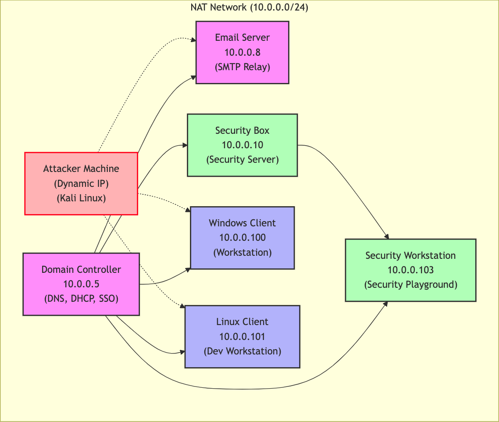
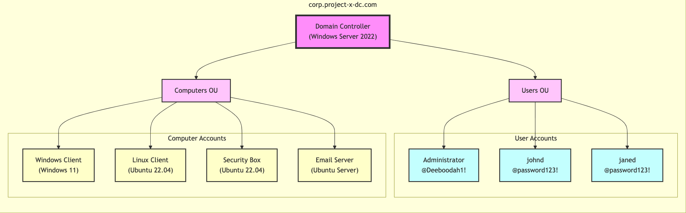

# Enterprise-101-Cyber-Attack-Simulation

## Project Overview

**Enterprise 101** Enterprise 101 is a hands-on project that I developed to  simulates a real-world enterprise network environment to test, analyze, and improve cybersecurity defenses through penetration testing and security monitoring.

This project demonstrates my ability to design, implement, and secure complex network infrastructures while simulating real-world cyber attacks.
 
---

## Key Features

- **Network Topology:** Designed and implemented a NAT-based network with VirtualBox, including DHCP and DNS services.
- **Active Directory:** Deployed and managed Microsoft Active Directory for user and resource management.
- **Email Server:** Configured and secured an SMTP relay server using **Postfix** on Ubuntu Server.
- **Security Monitoring:** Integrated **Wazuh** and **Security Onion** for intrusion detection and log analysis.
- **Penetration Testing:** Conducted simulated attacks using tools like **Hydra**, **Evil-WinRM**, and **NetExec**.
- **Documentation:** Created detailed, step-by-step guides for each phase of the project, from setup to attack simulation.
---

## Technical Details

### Network Setup
- **NAT Network:** `10.0.0.0/24` with DHCP scope `10.0.0.100–10.0.0.200`.
- **Hosts:**
  - Domain Controller (`10.0.0.5`): DNS, DHCP, and Single Sign-On (SSO).
  - Email Server (`10.0.0.8`): SMTP relay server.
  - Security Server (`10.0.0.10`): Dedicated security monitoring.
  - Windows Workstation (`10.0.0.100`): Simulated business user environment.
  - Linux Desktop (`10.0.0.101`): Simulated software development environment.
  - Attacker Machine: Dynamic IP for penetration testing

### Operating Systems

- **Windows Server 2022:** For directory services and network management.
- **Windows 11 Enterprise:** Simulates a typical business user environment.
- **Ubuntu Desktop 22.04:** For software development and security monitoring.
- **Ubuntu Server 2022:** Used as the email server.
- **Kali Linux:** For penetration testing and ethical hacking.
- **Security Onion:** For network security monitoring and intrusion detection.

### Tools Used

- **Virtualization:** Hypervisor for virtual machine management.
- **Operating Systems:** Windows Server 2025, Windows 11 Enterprise, Ubuntu Desktop/Server, Kali Linux
- **Security Tools:** Wazuh, Security Onion, Hydra, Evil-WinRM, NetExec, XFreeRDP
- **Networking:** NAT, DHCP, DNS, Active Directory
- **Scripting:** Bash, PowerShell

---

## Visuals

### Network Topology

### Active Directory Setup

---

## Blog Post Guides

As part of this project, I documented the setup and configuration process in detail through comprehensive blog posts. These posts are available for reference below:
1. **Set up VirtualBox:** Step-by-step guide to setting up virtual machines for the project.
2. **Build a Directory Service Server With Active Directory:** Detailed instructions for deploying and configuring Active Directory.
3. **Provision & Setup Windows 11 Enterprise:** Configuring a simulated business user environment.
4. **Provision & Setup Ubuntu Desktop 22.04:** Setting up a software development environment.
5. **Provision & Setup Ubuntu Server 22.04:** Configuring the email server.
6. **Setup Postfix Mail Transfer Agent:** Securing an SMTP relay server on Ubuntu Server.
7. **Provision & Setup Security Onion:** Implementing network security monitoring.
8. **Security Server - Provision & Setup Ubuntu Desktop 22.04:** Configuring the security monitoring environment.
9. **Setup Wazuh:** Integrating Wazuh for intrusion detection.
10. **Configure a Vulnerable Environment:** Preparing the network for penetration testing.
11. **Setup The Attacker Machine:** Configuring Kali Linux for ethical hacking.
12. **Cyber Attack - Initial Access To Breached:** Simulating and analyzing cyber attacks.

---

## Outcome 

- Successfully simulated a realistic enterprise network environment.
- Configured and integrated various operating systems and security tools.
- Demonstrated the ability to perform and detect cyber attacks using penetration testing tools.
- Gained hands-on experience with network security, Active Directory, and email server management.

## Learnings

- Understanding of network topologies and virtualization.
- Proficiency in configuring and managing Active Directory and Postfix.
- Insight into security monitoring and incident response using Wazuh.
- Familiarity with penetration testing tools and techniques.

---

## GitHub Repository

For more details, including scripts and configurations, check out the [GitHub Repository](https://github.com/akshaychavan10/Enterprise-101-Cyber-Attack-Simulation).

---

## Let’s Connect!

Interested in learning more about this project or collaborating on something similar? Feel free to reach out to me at [your email] or connect with me on [LinkedIn](https://www.linkedin.com/in/akshaychavan07).
