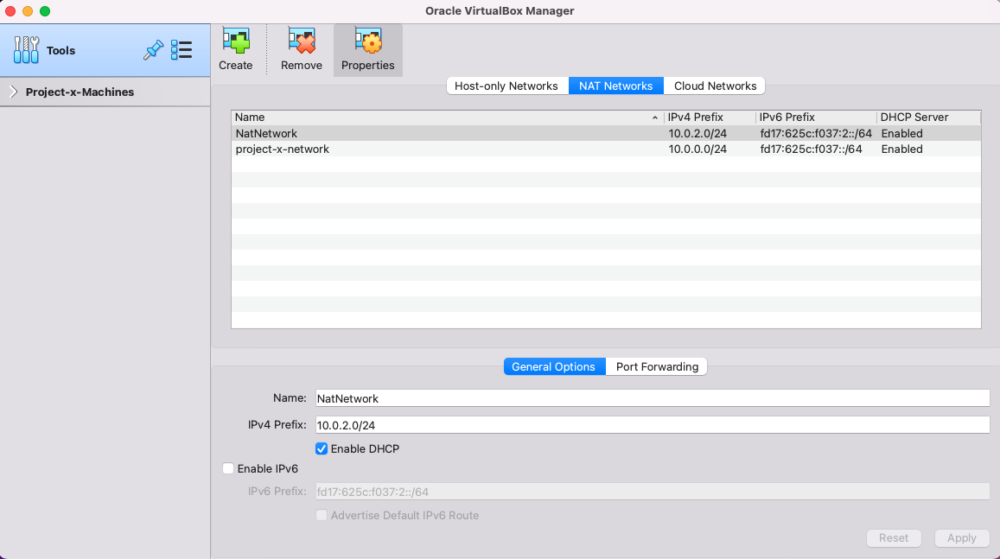
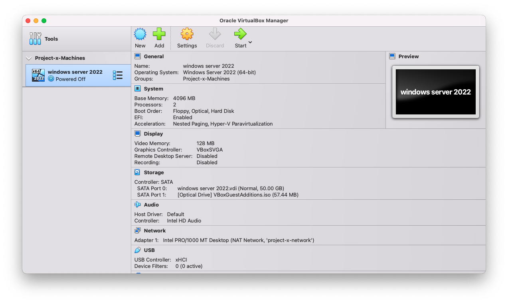

Virtual machines (VMs) are an essential tool for anyone interested in cybersecurity, software development, or IT infrastructure. They allow you to run multiple operating systems on a single physical machine, creating isolated environments for testing, learning, and experimentation. In this guide, we'll walk you through the process of setting up virtual machines using **Oracle VirtualBox**, a popular and free virtualization tool.

## What is VirtualBox?

**VirtualBox** is a Type 2 hypervisor, which means it runs on top of your existing operating system (like Windows, macOS, or Linux). It allows you to create and manage virtual machines, each with its own operating system, applications, and network settings. This makes it an ideal tool for setting up cybersecurity labs, testing software, or simulating network environments.

### Why Use VirtualBox?

- **Free and Open Source**: VirtualBox is completely free to use, making it accessible for everyone.
- **Cross-Platform**: It works on Windows, macOS, Linux, and even Solaris.
- **Flexible Networking**: VirtualBox offers various networking modes, allowing you to create isolated or connected environments.
- **Snapshot Feature**: You can save the state of a VM at any point and revert back to it later, which is incredibly useful for testing and experimentation.

## Setting Up VirtualBox

### Step 1: Download and Install VirtualBox

1. **Download VirtualBox**: Head over to the [VirtualBox website](https://www.virtualbox.org/) and download the version compatible with your operating system.

2. **Install VirtualBox**: Run the installer and follow the on-screen instructions. You can stick with the default settings unless you have specific customization needs.

### Step 2: Create a NAT Network

For this project, we'll be using a **NAT Network**, which allows multiple VMs to communicate with each other while still having internet access.

1. **Open VirtualBox** and go to `File > Tools > Network Manager`.
2. **Create a New NAT Network**: Click on `NAT Networks` and then `Create`. Name the network `project-x-network` and set the IPv4 prefix to `10.0.0.0/24`.

### Step 3: Provision a Virtual Machine

Now that VirtualBox is set up, let's create our first virtual machine.

1. **Create a New VM**: Go to `Machine > New` in VirtualBox. Enter a name for your VM (e.g., `Windows Server 2022`), select the type (e.g., `Microsoft Windows`), and choose the version (e.g., `Windows 2022 (64-bit)`).

2. **Allocate Resources**: Assign at least **4GB of RAM** and **2 CPUs** to the VM. For Windows VMs, enable **EFI** (Extensible Firmware Interface).

3. **Create a Virtual Hard Disk**: Allocate at least **50GB** of storage for the VM. You can choose to pre-allocate the full size or dynamically allocate it.

4. **Attach the ISO**: Go to the `Storage` tab in the VM settings and attach the ISO file for the operating system you want to install.

5. **Configure Networking**: In the `Network` tab, set the `Attached to` option to `NAT Network` and select `project-x-network`.

6. **Start the VM**: Click `Start` to boot the VM and begin the OS installation process.

### Step 4: Take a Snapshot

One of the most powerful features of VirtualBox is the ability to take **snapshots**. A snapshot saves the current state of the VM, allowing you to revert back to it at any time.

1. **Take a Snapshot**: With the VM running, go to `Machine > Take Snapshot`. Give it a descriptive name so you can easily identify it later.

2. **Restore a Snapshot**: If something goes wrong, you can restore the VM to a previous state by selecting the snapshot and clicking `Restore`.

### Step 5: Install VirtualBox Guest Additions

**VirtualBox Guest Additions** are a set of drivers and utilities that enhance the performance and usability of your VMs. They allow for features like seamless mouse integration, better video support, and shared folders.

#### For Windows VMs:

1. **Insert Guest Additions CD Image**: Go to `Devices > Insert Guest Additions CD Image`.
2. **Run the Installer**: Open `File Explorer`, navigate to the CD drive, and run the `VBoxWindowsAdditions` installer.
3. **Reboot the VM**: After installation, reboot the VM to apply the changes.

#### For Linux VMs:

1. **Insert Guest Additions CD Image**: Go to `Devices > Insert Guest Additions CD Image`.
2. **Open Terminal**: Right-click on the desktop and select `Open in Terminal`.
3. **Run the Installer**: Type `sudo ./VBoxLinuxAdditions.run` and enter your password.
4. **Reboot the VM**: Type `reboot` to restart the VM.

## Conclusion

Setting up virtual machines with VirtualBox is a straightforward process that opens up a world of possibilities for learning and experimentation. Whether you're building a cybersecurity lab, testing software, or simulating network environments, VirtualBox provides the tools you need to get started.

For more detailed guides and project-specific setups, refer to the [Project Overview - Enterprise 101](Enterprise-101.md) document.

Happy virtualizing!

---

**Further Reading**:
- [VirtualBox User Manual](https://www.virtualbox.org/manual/)
- [Project Overview - Enterprise 101](part-1-Enterprise-101.md)
