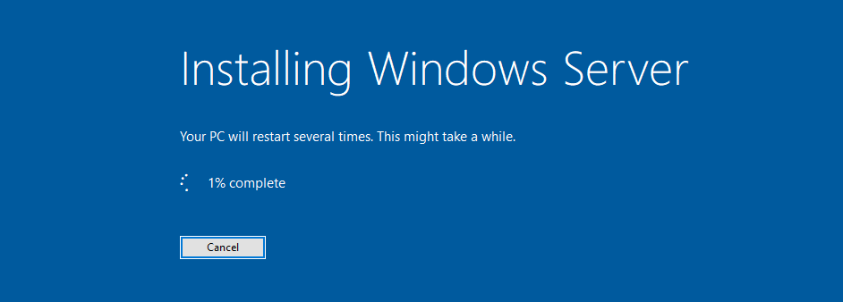
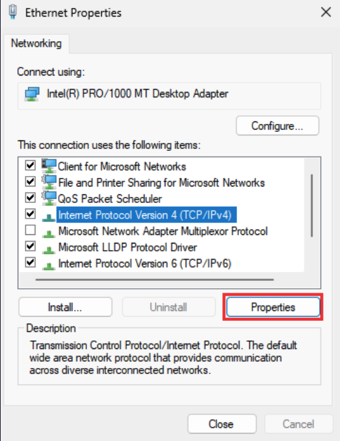
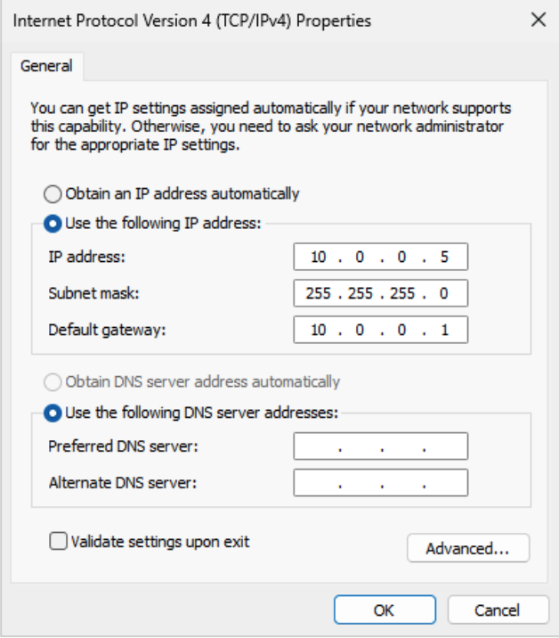
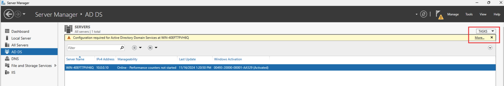
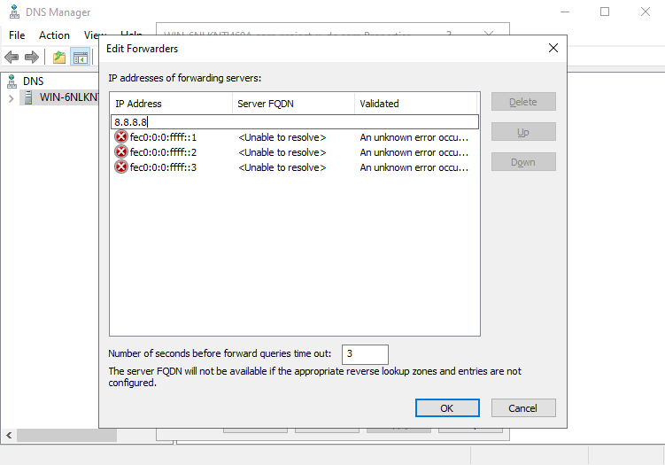
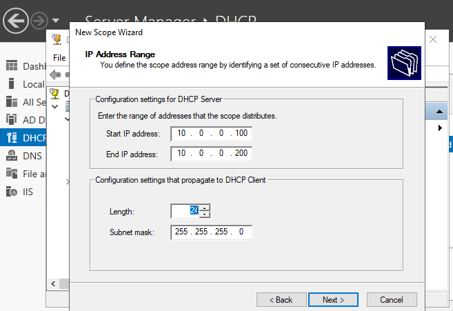
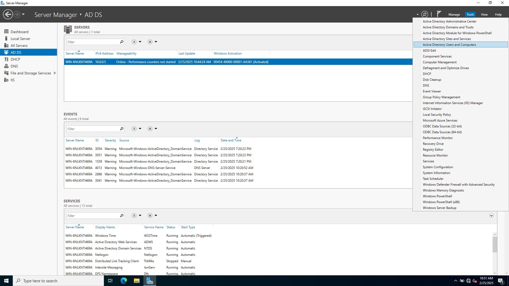
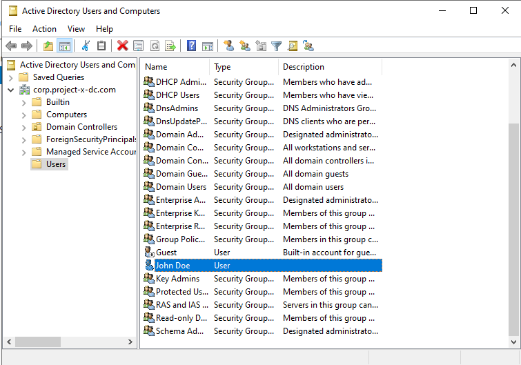

In today’s interconnected world, managing users, devices, and resources efficiently is crucial for any organization. Active Directory (AD), developed by Microsoft, is a powerful directory service that helps organizations centralize and streamline their network management. In this blog post, I’ll walk you through the steps to build a Directory Service Server using Active Directory. Whether you're setting up a lab environment or deploying a production server, th
is guide will help you get started.

---

## **What is Active Directory?**

Active Directory is a directory service that acts as a centralized database for managing and organizing network resources. It provides authentication, authorization, and management capabilities, making it the backbone of most Windows-based enterprise environments. With AD, you can manage users, computers, and other resources from a single location, ensuring scalability and security.

### **Key Components of Active Directory:**
- **Authentication:** Verifies user identity using credentials like username and password.
- **Authorization:** Grants or denies access to network resources based on permissions.
- **Management:** Centralizes control over users, computers, and other resources.

---

## Active Directory Core Concepts

Before diving into the setup, it’s essential to understand some core concepts of Active Directory:

1. **Domains:** A logical grouping of objects (users, devices, etc.) that share the same database and security policies. For this project,I created  `corp.project-x-dc.com` domain.
2. **Domain Controllers (DCs):** Servers that host the Active Directory database and perform authentication, authorization, and replication.
3. **Organizational Units (OUs):** Containers within a domain used to organize objects logically, such as separate OUs for HR, IT, and Finance.
4. **Objects:** Every entity in AD, such as users, computers, printers, and groups, is an object.
5. **Groups:** Security groups manage permissions, while distribution groups are used for email distribution.
6. **Forest and Trees:** A forest is the highest-level container, encompassing multiple domains that share a common schema. A tree is a hierarchy of domains within a forest.
7. **Global Catalog (GC):** A distributed data repository that provides information about all objects in the forest for faster lookups.
8. **Trust Relationships:** Trusts enable users in one domain to access resources in another domain.

---

## **Why Use Active Directory?**

Active Directory is widely used in enterprise environments for several reasons:
1. **Centralized Resource Management:** AD allows administrators to manage users, devices, and permissions from a single location.
2. **Scalability:** It can handle environments ranging from small businesses to large corporations.
3. **Security:** AD provides robust authentication and authorization mechanisms using protocols like Kerberos and LDAP.
4. **Group Policy Management:** Administrators can enforce security settings and deploy software across the network using Group Policy Objects (GPOs).
5. **Integration:** AD integrates seamlessly with other Microsoft services like Exchange, Azure AD, and more.

---

## **Prerequisites**  

Before diving in, ensure you’ve completed:  

1. **[Part 2: VirtualBox Setup](https://akshaychavan10.github.io/blog/part-2-a-guide-to-set-up-virtual-box/)**: Configured the `project-x-nat` network.  
2. **Windows Server 2025 ISO**: Attached to a VM with:  
   - **4GB RAM**, **2 CPUs**, **50GB Disk**.  
   - Static IP: `10.0.0.5`. 

---

## **Step 1: Install Windows Server 2022**

1. **Launch the Windows Server 2022 ISO** in your VM and follow the installation prompts.
2. Select **"Desktop Experience"** during setup to install the full graphical environment.
3. Accept the **End User License Agreement (EULA)** and create partitions on the disk.
4. Set a strong password for the default **Administrator** account.



---

## **Step 2: Configuring Static IP and Basic Settings**  

### Why Static IPs Matter in This Project 

In enterprise environments, critical services like **Domain Controllers**, **DNS**, and **DHCP servers** require a **static IP address**. Here’s why:  

- **Consistency**: Services and clients rely on a predictable IP to locate the Domain Controller.  
- **DNS Reliance**: The DC’s IP is tied to the domain name (`corp.project-x-dc.com`). If the IP changes, DNS resolution breaks.  
- **DHCP Dependency**: The DHCP server itself cannot lease IPs dynamically—it needs a fixed address to function reliably.  

### Assign Static IP 

1. Open **Control Panel > Network and Sharing Center > Change adapter settings**.
2. A window will pop-up with a computer icon named **“Ethernet”**. Right-click this icon **“Properties”**.
3. Another box will open. Select **Internet Protocol Version 4 (TCP/IPv4) -> "Properties"**. 

4. Set IPv4 to:  
   - **IP**: `10.0.0.5`  
   - **Subnet**: `255.255.255.0`  
   - **Gateway**: `10.0.0.1`  

  

---

## **Step 3: Promote the Server to a Domain Controller**

1. Open **Server Manager** and select **"Add roles and features"**. Select **"Next"** for the next 3 boxes.
2. Install the following roles:
   - **Active Directory Domain Services (AD DS)**
   - **File and Storage Servies**
   - **DNS Server**
   - **DHCP Server**
   - **Web Server(IIS)**
3. Select **"Next"** until you get to the Confirmation tab. Select **"Install"**. (you can read sideways **Description** for more information about each settings.)
4. After installation, promote the server to a **Domain Controller** by selecting **"Promote this server to a domain"** in **More** tab.


5. Create a **new forest** and enter the root domain name (e.g., `corp.project-x-dc.com`).
6. Set the **Directory Services Restore Mode (DSRM)** password.
*DSRM is a special boot mode used for repairing or restoring the AD database, ensuring the Domain Controller can recover from critical failures* 
7. Leave the NetBIOS **CORP**, proceed with all other defaults until getting to the check screen. and complete the installation.

---

## **Step 4: Configuring DNS and DHCP**  

### What Are DNS and DHCP?  

- **DNS (Domain Name System)**: Translates human-readable domain names (like `corp.project-x-dc.com`) to machine-readable IP addresses.  
- **DHCP (Dynamic Host Configuration Protocol)**: Automatically assigns IP addresses, subnet masks, and other network settings to devices.  

### Why Configure DNS and DHCP?  

- **DNS**:  
  - Essential for AD functionality. Clients use DNS to locate the Domain Controller.  
  - Enables internet access by resolving external domains (e.g., `google.com`).  
- **DHCP**:  
  - Simplifies network management by automating IP assignments.  
  - Ensures devices in the lab (e.g., workstations, attacker VM) can communicate without manual IP configuration.  

### DNS Forwarding  

1. Go to **"Server Manager"** --> **"DNS"** Select the Server --> Right-Click --> **"DNS Manager"**
2. Right-Click the domain --> **"Properties"**
3. Select the **"Forwarders"** tab --> **"Edit"** 
4. Add Google’s DNS (`8.8.8.8`) as a forwarder for external queries. 



Validate with PowerShell:  

```powershell
nslookup corp.project-x-dc.com  # Should resolve to 10.0.0.5
```  

### DHCP Scope  

1. Navigate to **"DHCP"** --> **"DHCP Manager"**
2. Navigate to **"IPv4"** --> **"New Scope"**
1. Create a scope named `project-x-scope` with:  
   - **IP Range**: `10.0.0.100–200`  
   - **Gateway**: `10.0.0.1`    



*DHCP ensures automatic IP assignment for lab hosts.*  


---

## **Step 6: Add User Accounts in Active Directory**

1. Open **Active Directory Users and Computers** from the **Server Manager**.



2. Navigate to the **Users** container and create new user accounts.
3. Fill in the user details (e.g., First Name, Last Name, Username) and set a password.
4. Configure password policies **"User cannot change password"** and complete the setup.

  

---

## **Conclusion**

Congratulations! You’ve successfully built a Directory Service Server using Active Directory. This setup provides a solid foundation for managing users, devices, and resources in your network. Whether you’re running a small lab or a large enterprise environment, Active Directory offers the tools you need to maintain security, scalability, and efficiency.

---

**Pro Tip:** Don’t forget to take a **snapshot** of your VM after completing the setup. This allows you to revert to a clean state if anything goes wrong in the future.

---

**References:**

- [Microsoft Active Directory Documentation](https://learn.microsoft.com/en-us/troubleshoot/windows-server/active-directory/active-directory-overview)
- [Project Overview PDF](https://akshaychavan10.github.io/blog/part-1-enterpirse-101/)