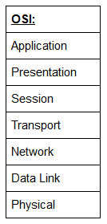
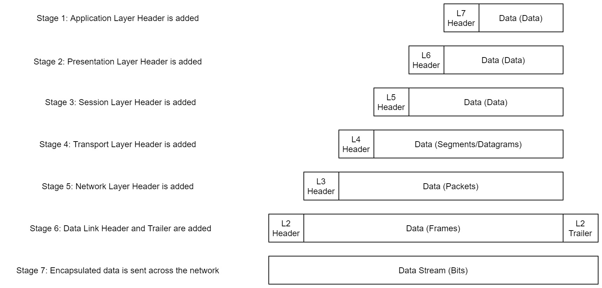
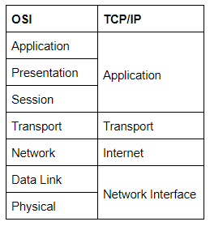
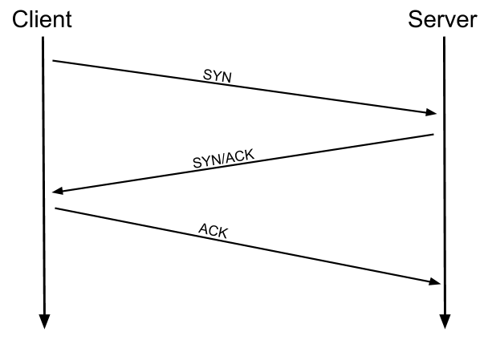

## Introduction
The topics that we're going to cover in this room are:

- The OSI Model
- The TCP/IP Model
- How these models look in practice
- An introduction to basic networking tools

## The OSI Model: An Overview
The OSI (Open Systems Interconnection) Model is a standard framework for understanding computer networking theory. While real-world networking is based on the TCP/IP model, the OSI model is often used for its simplicity in grasping networking concepts initially.

### Layer 7 -- Application
Application layer, helps computer programs connect to networks.  It deals directly with applications, providing them with a way to send data. Data received at this layer moves on to the presentation layer.
### Layer 6 -- Presentation
The Presentation layer, gets data from the Application layer. It might not be in a format the receiving computer understands, so this layer translates it into a standard format and handles encryption or compression. Then it sends the data to the Session layer.
### Layer 5 -- Session
The Session layer checks if it can establish a connection with the remote computer. If successful, it maintains and synchronizes the communication session. 
This unique session prevents data mix-up when making multiple requests simultaneously, like opening multiple tabs in a web browser. Once a connection is logged, data moves to Layer 4: the Transport layer.
### Layer 4 -- Transport 
The Transport layer is crucial, selecting the transmission protocol, typically TCP or UDP. 

TCP offers reliable transmission by establishing and maintaining connections, ensuring data reaches the right place. It facilitates constant communication between computers, resending lost data for accuracy. 

UDP, on the other hand, prioritizes speed, throwing data packets without connection maintenance. This makes it ideal for tasks like video streaming where speed is paramount. However, UDP's lack of error correction means data loss is possible, resulting in issues like pixelation in video transmission over poor connections. 

Therefore, TCP is preferred for accuracy-driven tasks like file transfer or webpage loading.

With a protocol selected, the transport layer then divides the transmission up into bite-sized pieces (over TCP these are called segments, over UDP they're called datagrams), which makes it easier to transmit the message successfully. 
### Layer 3 -- Network:
The Network layer finds the destination of your request, like locating a webpage on the Internet using its IP address. It uses logical addressing, such as IP addresses, to organize and sort networks. The most common logical addressing format is IPv4, like 192.168.1.1 for home routers.

### Layer 2 -- Data Link:
The data link layer focuses on the physical addressing of the transmission. It receives a packet from the network layer (that includes the IP address for the remote computer) and adds in the physical (MAC) address of the receiving endpoint. Inside every network enabled computer is a Network Interface Card (NIC) which comes with a unique MAC (Media Access Control) address to identify it.

MAC addresses are set by the manufacturer and literally burnt into the card; they can't be changed -- although they can be spoofed. When information is sent across a network, it's actually the physical address that is used to identify where exactly to send the information.

The data link layer also serves an important function when it receives data, as it checks the received information to make sure that it hasn't been corrupted during transmission, which could well happen when the data is transmitted by layer 1: the physical layer.

### Layer 1 -- Physical:
The Physical layer deals with hardware, transmitting and receiving electrical signals that make up data transfer on a network. It converts binary data into signals for transmission and receives incoming signals, converting them back into binary data.
## Encapsulation
As data moves through each layer of the model, specific information is added to the transmission. For instance, the Network Layer adds source and destination IP addresses, while the Transport Layer includes protocol-specific details. The Data Link Layer adds a piece at the end to verify data integrity, enhancing security. This process, called encapsulation, ensures data can be sent from one computer to another.

Notice that the encapsulated data is given a different name at different steps of the process. In layers 7 to 5, it's simply "data." In the Transport layer, it's called a segment or datagram (depending on TCP or UDP). At the Network Layer, it's a packet. In the Data Link layer, it becomes a frame, and when transmitted, it's broken down into bits.

When the message reaches the second computer, it undergoes de-encapsulation, starting from the Physical layer and moving up to the Application layer, removing added information at each step. This process is called de-encapsulation. While it's not exactly the same in practice, all computers follow this process of encapsulation to send data and de-encapsulation upon receiving it, following the OSI model layers.

Encapsulation and de-encapsulation are crucial processes as they provide a standardized method for sending data. This ensures consistency in transmissions, allowing any network-enabled device to communicate with others reliably, irrespective of manufacturer, operating system, or other factors.

## The TCP/IP Model.

The TCP/IP model, older than OSI, forms the foundation for real-world networking. It comprises four layers: Application, Transport, Internet, and Network Interface, covering functions similar to OSI's seven layers.

> Some recent sources split the TCP/IP model into five layers -- breaking the Network Interface layer into Data Link and Physical layers (as with the OSI model). This is accepted and well-known; however, it is not officially defined (unlike the original four layers which are defined in RFC1122). It's up to you which version you use -- both are generally considered valid. 

---

> Why we bother with osi model if its not actually used for anything in the real-world?
We use the OSI model primarily for learning networking theory. Its structured approach makes it easier to understand fundamental concepts, even though real-world networking is based on the TCP/IP model.

The processes of encapsulation and de-encapsulation work in exactly the same way with the TCP/IP model as they do with the OSI model

**Now Let's get down to the practical side of things:** 

When discussing TCP/IP, we're referring to a suite of protocols, which are sets of rules defining how actions are carried out. The two main protocols are Transmission Control Protocol (TCP), managing data flow between endpoints, and Internet Protocol (IP), controlling packet addressing and sending. TCP/IP comprises many more protocols, which we'll explore later. For now, let's focus on TCP.

TCP is connection-based, meaning you need to establish a stable connection before sending data. This process is called the three-way handshake.

### Three Way Handshake

- To establish a connection, your computer sends a SYN (synchronize) bit to the remote server, initiating the process. 
- The server responds with a packet containing SYN and ACK (acknowledgment) bits. 
- Your computer then sends a packet with just the ACK bit, confirming the connection setup. 

This three-way handshake ensures reliable data transmission, with lost or corrupted data being resent.

## Networking Tools Ping
The ping command tests if a connection to a remote resource, like a website or computer on your network, is possible. It uses the ICMP protocol, operating at the Network layer of the OSI Model and the Internet layer of the TCP/IP model. The basic syntax is `ping <target>`. For instance, "ping google.com" tests the network connection to Google.

The ping command can reveal the IP address of the server hosting a website, instead of the requested URL.

Ping is widely available; all operating systems support it by default, and even most embedded devices can use it.

## Networking Tools Traceroute 
Traceroute maps the path your request takes to reach the target machine.

The internet consists of numerous servers and endpoints interconnected. To reach desired content, your request often passes through several servers. Traceroute reveals these connections, showing every step between your computer and the requested resource. The basic syntax for traceroute on Linux is `traceroute <destination>`.

By default, the Windows traceroute utility (tracert) uses ICMP protocol, similar to ping, while the Unix equivalent operates over UDP. However, you can change this using switches in both cases.
## Networking Tools WHOIS
Domains translate into IP addresses, sparing us from remembering complex strings of numbers. They are managed by companies called Domain Registrars. To obtain a domain, you register with a registrar and lease it for a certain period.

Whois essentially allows you to query who a domain name is registered to. In Europe personal details are redacted; however, elsewhere you can potentially get a great deal of information from a whois search.

You can use `whois google.com`
## Networking Tools Dig
DNS (Domain Name System) is the system that converts a URL into an IP address. When you request a website like www.google.com, your computer asks a DNS server for its IP address. The server finds the IP and sends it back. Then your computer connects to that IP to access the website.

Let's break this down a bit.

- When you request a website, your computer first checks its local "Hosts File" for an explicit IP-to-Domain mapping. This is an older system than DNS but still takes precedence in most operating systems. If no mapping exists, your computer then checks its local DNS cache. If it finds the IP address there, it uses it; otherwise, it proceeds to the next stage of the process.

- If your computer hasn't found the address yet, it sends a request to a recursive DNS server, which is typically known to your router. ISPs often have their own recursive servers, and companies like Google and OpenDNS also provide them. Your computer automatically knows where to send the request because details for a recursive DNS server are stored in your router or computer. The server maintains a cache of results for popular domains. If the requested website isn't in the cache, the recursive server passes the request to a root name server.

- Before 2004, there were only 13 root name DNS servers worldwide. Now there are more, but they are still accessible using the same 13 IP addresses assigned to the original servers. These servers balance requests to ensure you connect to the closest one. Root name servers manage DNS servers in the next level down, known as Top-Level Domain (TLD) servers. They redirect your request to an appropriate TLD server.

- Top-Level Domain (TLD) servers are categorized by extensions. For example, if you search for tryhackme.com, your request goes to a TLD server for .com domains. If you search for bbc.co.uk, it goes to a TLD server for .co.uk domains. Like root name servers, TLD servers manage the next level down: Authoritative name servers. When a TLD server receives your request, it passes it down to an appropriate Authoritative name server.

- Authoritative name servers store DNS records for domains directly. They are the source of information for every domain worldwide. When your request reaches the authoritative name server for the domain you're querying, it sends back the relevant information, enabling your computer to connect to the IP address behind the requested domain.

*** 

The `dig` command in Linux is a powerful DNS (Domain Name System) tool used for querying DNS name servers for various DNS records like A, AAAA, CNAME, MX, TXT, etc. It stands for "domain information groper."

With `dig`, you can retrieve information about DNS records for a given domain name or IP address. It provides detailed information such as the IP addresses associated with a domain, the authoritative name servers for a domain, TTL (time to live) values, and much more.

Here's a basic example of how you might use `dig`:

`dig example.com`

***

## Further Reading

 if you want to expand your knowledge of networking theory, the [CISCO Self Study Guide by Steve McQuerry](https://www.amazon.co.uk/Interconnecting-Cisco-Network-Devices-ICND1/dp/1587054620/ref=sr_1_1?keywords=Interconnecting+Cisco+Network+Devices%2C+Part+1&qid=1583683766&sr=8-1) is a great resource to work from
