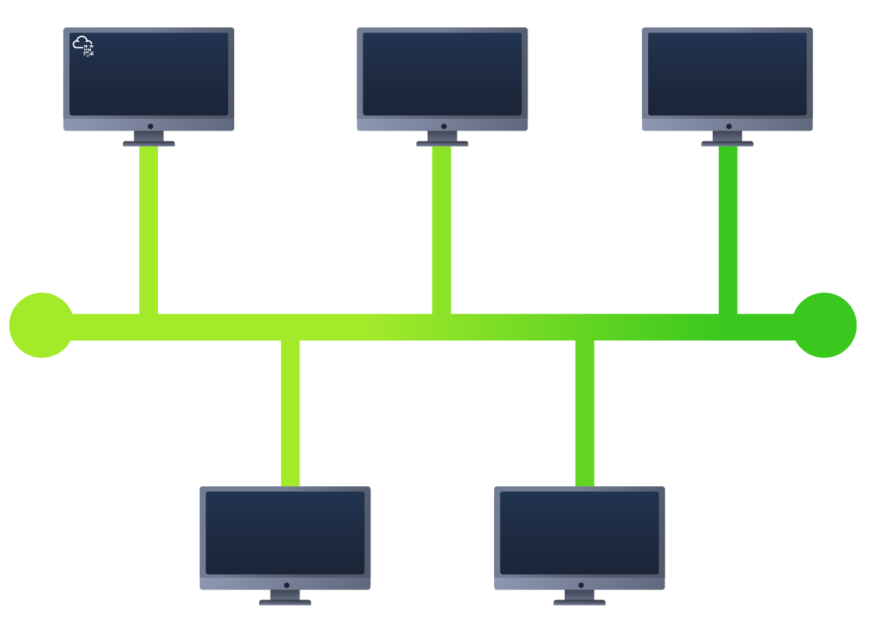
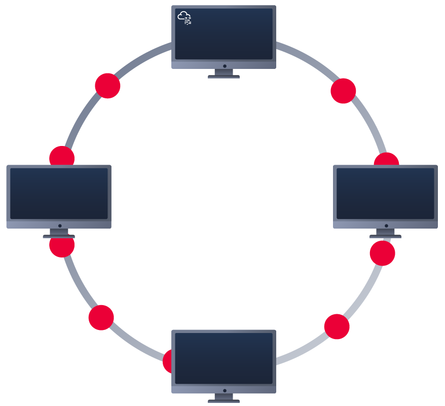
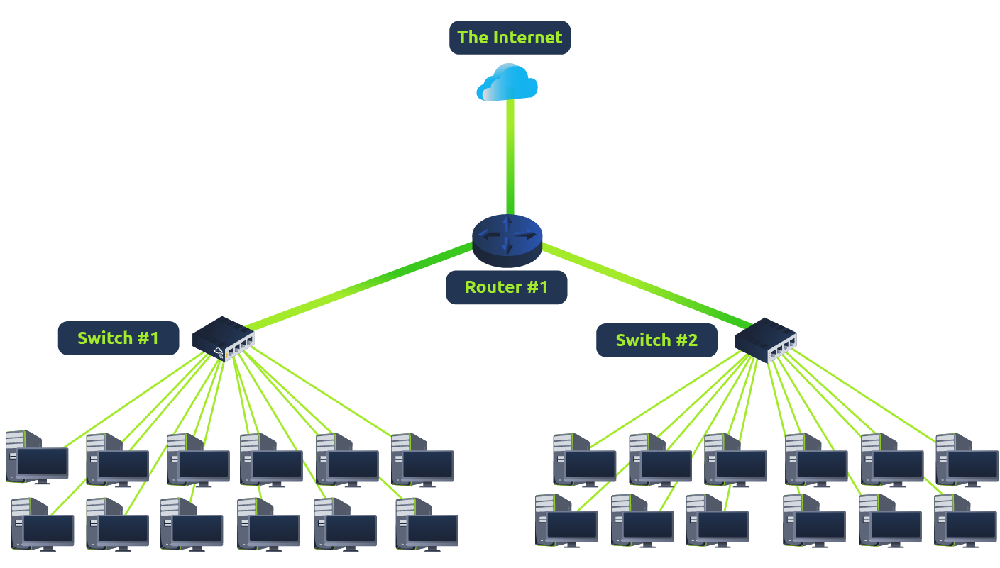
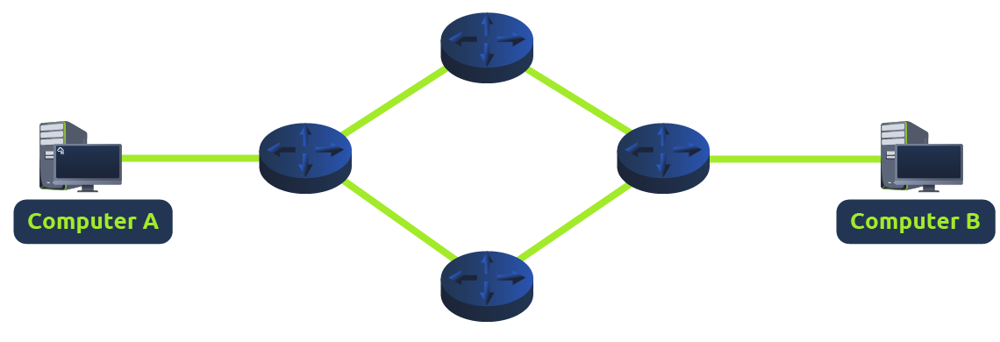
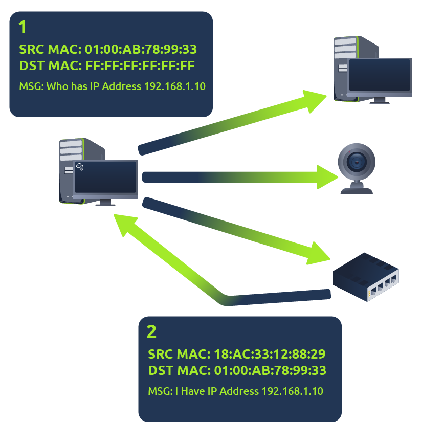
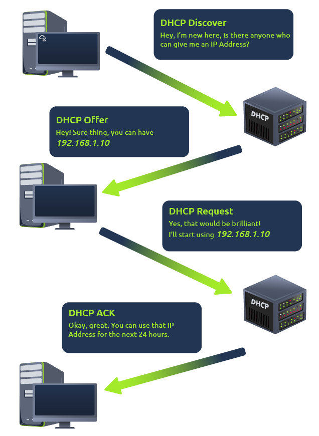

## Topology

### Star topology


- **Description**: Devices connect individually to a central networking device like a switch or hub.
- **Advantages**:
    - Reliable and scalable despite higher cost.
    - Easy addition of devices as network demand increases.
    - Centralized hardware often robust.
- **Disadvantages**:
    - Higher cost due to more cabling and dedicated networking equipment.
    - Increased maintenance needs as network scales.
    - Centralized hardware failure disrupts entire network.

### Bus Topology



- **Description**: Devices connect to a single backbone cable.
- **Advantages**:
    - Easy and cost-efficient setup.
- **Disadvantages**:
    - Prone to becoming slow and bottlenecked as all data travels along the same cable.
    - Difficult troubleshooting due to shared route for data.
    - Little redundancy, single point of failure if backbone cable breaks.

### Ring Topology



- **Description**: Devices connect in a loop with each device directly linked to its neighbors.
- **Advantages**:
    - Minimal cabling required and less dependence on dedicated hardware compared to star topology.
    - Easy troubleshooting due to single direction for data travel.
    - Less prone to bottlenecks compared to bus topology.
- **Disadvantages**:
    - Inefficient data travel as it may visit multiple devices before reaching the intended device.
    - Entire network breaks if there's a fault like a cut cable or broken device.
### What is Switch



- **Description**: Switches are dedicated devices in a network that aggregate multiple devices like computers and printers using Ethernet. Devices connect to switch ports.
- **Functionality**:
    - Efficiently routes packets to intended targets, reducing network traffic compared to hubs/repeaters.
    - Keeps track of device-port connections for targeted packet delivery.
- **Use Cases**:
    - Commonly found in larger networks such as businesses and schools.
    - Available with varying port configurations to connect numerous devices.
- **Connectivity**:
    - Can be connected to routers to increase network reliability through redundancy.
    - Redundancy ensures network reliability by offering multiple data paths.

### What is Router



- **Description**: Routers connect networks and facilitate data transfer between them.
- **Functionality**:
    - Utilizes routing to establish paths for data across networks.
    - Ensures successful delivery of data between networks.
- **Connectivity**:
    - Essential component in network infrastructure, enabling communication between disparate networks.
- **Routing**:
    - Process of directing data packets across networks to reach their intended destinations.
## Subnetting

- the division of an address range of ipv4 addresses into several smaller address ranges is called subnetting.
- subnet is logical segment of a network that uses IP addresses with the same network address.

| CIDR                                                                                                                                                                                                                                                                        | SUBNETTING                                                                                                                                                                                                                     |
| --------------------------------------------------------------------------------------------------------------------------------------------------------------------------------------------------------------------------------------------------------------------------- | ------------------------------------------------------------------------------------------------------------------------------------------------------------------------------------------------------------------------------ |
| - Think of CIDR as a blueprint or map that outlines the boundaries of your entire piece of land. It tells you the total size of your land and how it's divided into different sections..                                                                                    | - Subnetting, on the other hand, is like taking your large piece of land and dividing it into smaller plots for specific purposes. It's about breaking down your overall network space into smaller, more manageable sections. |
| - For example, if your land is 100 acres in total, CIDR would tell you that your land is "100 acres" in size. This is similar to CIDR notation like "192.168.1.0/24", which tells you the total address range available and how it's divided into network and host portions | - For example, let's say you decide to divide your 100-acre land into smaller plots of 10 acres each. Each 10-acre plot represents a subnet. You might use one plot for building houses, another for farming, and so on.       |

**Lets take example and understand how subnetting works**

- IPv4 Address: `192.168.12.160`
    
- Subnet Mask: `255.255.255.192`
    
- CIDR: `192.168.12.160/26`
    
- we know that ip address is divided into the `network part` (cannot be changed, fixed )and `host part.`(can be changed to first and last address. first address is network address and last address is broadcast address.) this division is determined by subnet mask, which indicate how many bits are used for the network portion and how many bits are used for the host portion.
    
- _How to identify network part and host part of an ip address_
    
    - We need ip address and subnet mask to find out network part and host par.
    - _Example_ : IP : 192.168.12.160 with subnet mask 255.255.255.192.
    - First convet both ip address into binary.
    - `11000000.10101000.00001100.10100000` and
    - `11111111.11111111.11111111.11000000`
    - Perform a bitwise AND operation between the binary representations of the IP address and the subnet mask. This operation will give you the network address.

```bash
11000000.10101000.00001100.10100000 (192.168.12.160)
& 
11111111.11111111.11111111.11000000 (255.255.255.192)
----------------------------------------------------------
11000000.10101000.00001100.10000000  (192.168.12.128)
```

```
- if we look at subnet mask first `26` bits are represent `network part` and last 6 bit represent `host part`. 
- Here 0.0.0.160 is the host part.
```

- **Network address** : important for delivery of data packets. if the network address is the same for the source and destination address, the data packet is delivered within the same subnet. if network addresses are different the data packet must be routed to another subnet via the default gateway.(usually a router).
- **How to find out network address and broadcast address** :
    - if we set all bits to `0` in `host part` of the ipv4 address we get respective subnet's network address.

| **Details of** | **1st Octet** | **2nd Octet** | **3rd Octet** | **4th Octet** | **Decimal** |                     |
| -------------- | ------------- | ------------- | ------------- | ------------- | ----------- | ------------------- |
| IPv4           | 1100 0000     | 1010 1000     | 0000 1100     | 10`\\         | 00 0000`    | `192.168.12.128`/26 |
| Subnet mask    | `1111 1111`   | `1111 1111`   | `1111 1111`   | `11\\         | `00 0000    | 255.255.255.192     |
| Bits           | /8            | /16           | /24           | /32           |             |                     |

```
- If we set all bits in the host part of the ipv4 address to 1 we get the braodcast address.
```

|**Details of**|**1st Octet**|**2nd Octet**|**3rd Octet**|**4th Octet**|**Decimal**|
|---|---|---|---|---|---|
|IPv4|1100 0000|1010 1000|0000 1100|10`\\|11 1111`|`192.168.12.191`/26|
|Subnet mask|`1111 1111`|`1111 1111`|`1111 1111`|`11\\|`00 0000|255.255.255.192|
|Bits|/8|/16|/24|/32||

- **How to calculate available addresses in subnet** :
    - identify the subnet mask and covert it to binary.
    - count the number of host bits. (count the number of consecutive 0's after the last 1. this gives you the number of host bits.)
    - calculate the number of addresses using `2^ (number of host bits) - 2`
        - 2^6-2=62 ip address assigned to above subnet.

|**1st Octet**|**2nd Octet**|**3rd Octet**|**4th Octet**|
|---|---|---|---|
|/8|/16|/24|/32|

#### Subnetting into smaller networks

- we can only divide the subnets on the binary system.

| **Exponent** | **Value** |
| ------------ | --------- |
| 2`^0`        | = 1       |
| 2`^1`        | = 2       |
| 2`^2`        | = 4       |
| 2`^3`        | = 8       |
| 2`^4`        | = 16      |
| 2`^5`        | = 32      |
| 2`^6`        | = 64      |
| 2`^7`        | = 128     |
| 2`^8`        | = 256     |

## ARP

- Address Resolution Protocol
- Maps Host IP address to its corresponding MAC address to facilitate communication between devices on Local Area Network(lan).
1. **ARP Request**: When a device in a network wants to communicate with another device but only knows its IP address, it sends out an ARP request to find the MAC (Media Access Control) address associated with that IP address. The ARP request is broadcasted to all devices on the local network. It contains the IP address of the target device that the sender wants to communicate with.
2. **ARP Response**: When the device with the requested IP address receives the ARP request, it responds with an ARP reply. This reply contains its MAC address. The ARP reply is unicast, meaning it is sent directly back to the device that sent the ARP request. Once the requester receives this ARP reply, it can use the MAC address to communicate directly with the target device.



**ARP Resolution** :

when device on LAN wants to communicate with another device, it send a broadcast message containing the destination IP address and its own mac address.

the device with matching IP address responds with its own mac address and two devices can then communicate directly using mac address.

This process is called ARP resolution.


## DHCP

The DHCP (Dynamic Host Configuration Protocol) is a network management protocol used on IP networks. It's responsible for dynamically assigning IP addresses and other network configuration parameters (such as subnet mask, default gateway, DNS servers, etc.) to devices on a network. Here's how it generally works:

1. **DHCP Discovery**: When a device connects to a network, it sends out a DHCP discovery message broadcast to find a DHCP server.
    
2. **DHCP Offer**: DHCP servers on the network respond to the DHCP discovery with a DHCP offer message. This offer includes an IP address lease along with other configuration parameters.
    
3. **DHCP Request**: The client selects one of the DHCP offers it receives and responds with a DHCP request message, confirming the lease for the offered IP address and configuration.
    
4. **DHCP Acknowledgment**: Finally, the DHCP server sends a DHCP acknowledgment message to the client, confirming that the lease has been granted. The client can then use the assigned IP address and network configuration.

