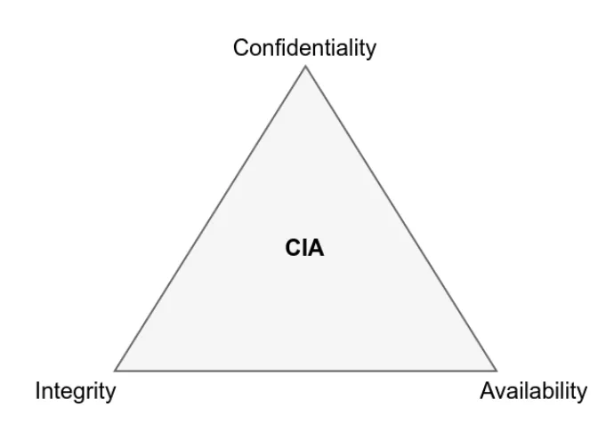
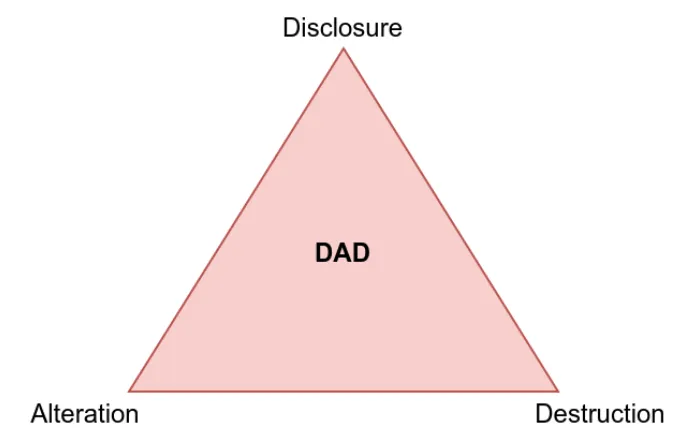
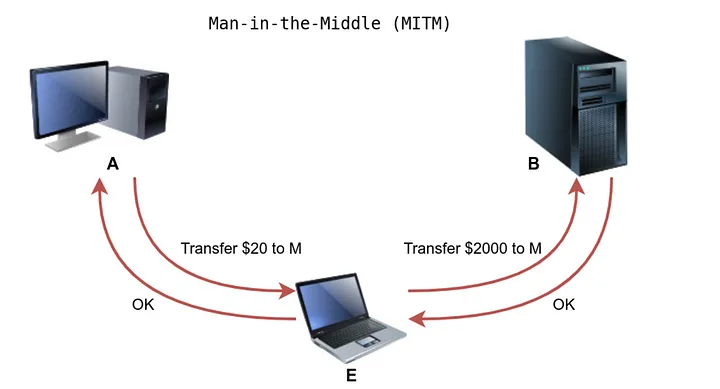
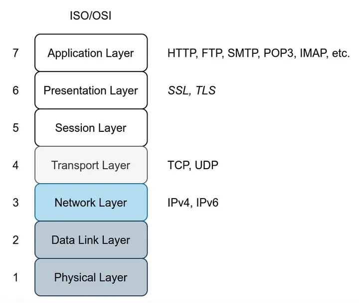
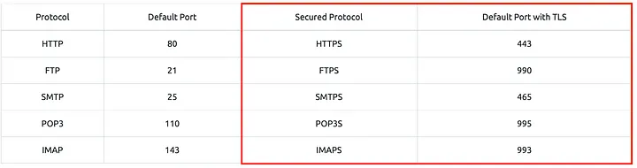

Servers that implement protocols are vulnerable to a variety of attacks such as.

- Sniffing Attacker (network packet capture)
- Man-In-The-Middle(MITM) Attack
- Password Attack(Authentication Attack)
- Vulnerabilities



the “**attack**” perspective differs from that of the CIA, and the goals are to induce **Disclosure, Alteration, and Destruction (DAD).**



These cyberattacks have a direct impact on the system’s security.

- Network Packet Capture — It compromises confidentiality and leads to information leakage.
- Password Attack — It will also lead to disclosure.
- Man-in-the-Middle (MITM) Attack — It compromises the system’s integrity since it has the ability to change the data that is communicated.

Vulnerabilities span a wide range of severity, and exploited weaknesses have varying effects on target systems.

## Sniffing Attack
a network packet capture tool is used to **gather information about the target**, such as the content of private **messages and login passwords**, but only if the data is not encrypted in transit.

Tools to capture network packets:

- TCPDUMP
- Wireshark
- Tshark

## Man-In-The-Middle Attack

 It happens when a victim (A) believes they are interacting with a legitimate destination (B), but are actually communicating with an attacker (E).




Anytime you **surf over HTTP, you are vulnerable to an MITM attack**, and the worrying thing is that you will not be able to detect it. Many tools, such as **Ettercap** and **Bettercap**, might be useful in carrying out such an attack.

MITM can also have an **impact on other cleartext protocols including FTP, SMTP, and POP3**.

## TLS (Transport Layer Security)

 the standard approach for **protecting the confidentiality and integrity of exchanged packets from password sniffing and MITM attacks**.

The data is sent in **cleartext** using the common protocols we’ve discussed so far, making it **easy for anyone with network access to collect, save, and analyze the exchanged messages**.



**Consider the ISO/OSI model:** We can use the “**presentation layer**” to apply encryption to our protocols. As a result, data will be presented in an **encrypted (ciphertext) format rather than its original form**.

 **TLS, on the other hand, is more secure** than SSL and has mostly replaced it.

A cleartext protocol can be upgraded to use SSL/TLS encryption. 




## Secure shell (ssh)
it allows you to **securely connect to another machine over the network and execute commands** on that machine.

```
1. You can verify the remote server’s identification.
2. Messages are encrypted and can be decoded only by the intended receiver.
3. Any change in the communications can be detected by both parties.
```
