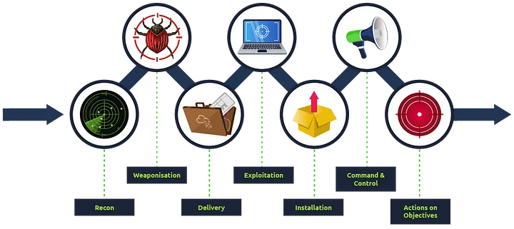

## Introduction

A computer network is a collection of interconnected devices. Network security safeguards these devices and their connections. It involves tools and practices to ensure the confidentiality, integrity, and availability of network data.

Network security employs hardware and software to meet security objectives. Hardware solutions are physical devices implemented within the network to enhance security. These tangible devices include appliances like the one depicted below.

**Examples of hardware appliances**

- Firewall appliance: The firewall allows and blocks connections based on a predefined set of rules. It restricts what can enter and what can leave a network.
- Intrusion Detection System (IDS) appliance: An IDS detects system and network intrusions and intrusion attempts. It tries to detect attackers’ attempts to break into your network.
- Intrusion Prevention System (IPS) appliance: An IPS blocks detected intrusions and intrusion attempts. It aims to prevent attackers from breaking into your network.
- Virtual Private Network (VPN) concentrator appliance: A VPN ensures that the network traffic cannot be read nor altered by a third party. It protects the confidentiality (secrecy) and integrity of the sent data

**Software Solutions**

- Antivirus Softwares: Antivirus software is installed on computers or smartphones to detect and prevent malicious files from running.
- Host Firewall : a host firewall is a program that ships as part of your system, or it is a program that you install on your system. For instance, MS Windows includes Windows Defender Firewall, and Apple macOS includes an application firewall; both are host firewalls.

## Methodology

Breaking into a target network usually includes a number of steps. According to [Lockheed Martin](https://www.lockheedmartin.com/en-us/capabilities/cyber/cyber-kill-chain.html), the Cyber Kill Chain has seven steps: 

1. **Recon**: Recon, short for reconnaissance, refers to the step where the attacker tries to learn as much as possible about the target. Information such as the types of servers, operating system, IP addresses, names of users, and email addresses, can help the attack’s success.
2. **Weaponization**: This step refers to preparing a file with a malicious component, for example, to provide the attacker with remote access.
3. **Delivery**: Delivery means delivering the “weaponized” file to the target via any feasible method, such as email or USB flash memory.
4. **Exploitation**: When the user opens the malicious file, their system executes the malicious component.
5. **Installation**: The previous step should install the malware on the target system.
6. **Command & Control (C2):** The successful installation of the malware provides the attacker with a command and control ability over the target system.
7. **Actions on Objectives:** After gaining control over one target system, the attacker has achieved their objectives. One example objective is Data Exfiltration (stealing target’s data).

