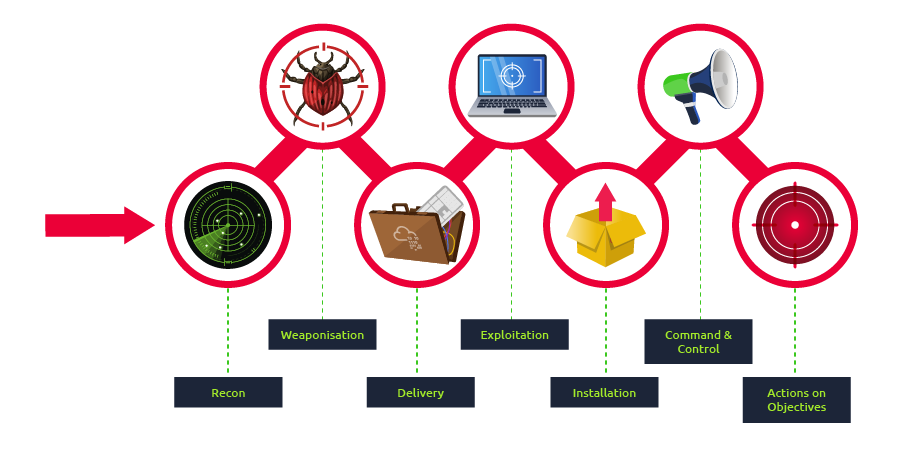

## Introduction
- Learn about the basics of red team engagements
- Identify the main components and stakeholders involved in a red team engagement
- Understand the main differences between red teaming and other types of cybersecurity engagements

## VAPT Limitations

- **Vulnerability Assessment (VA)**: Aims to identify and categorize potential security weaknesses in a system, network, or application. It focuses on finding and listing vulnerabilities.
- **Penetration Test (PAT)**: Aims to actively exploit vulnerabilities to determine the potential impact of real-world attacks. It focuses on testing the effectiveness of security measures by simulating actual attacks.

In summary, a VA identifies and catalogs vulnerabilities, while a PAT goes further by actively exploiting those vulnerabilities to assess their impact in a real-world attack scenario.

### APT and why regular pentesting is not enough
While conventional security measures like vulnerability assessments and penetration tests identify most technical vulnerabilities, they have limitations in effectively preparing a company for real attackers. These limitations include:

**What is APT**
Advanced Persistent Threats (APTs) are sophisticated, prolonged cyber attacks typically carried out by well-funded and highly skilled adversaries.

## Red Team Engagements 
- Red team engagements shift the focus from regular penetration tests to test our defensive team's ability to detect and respond to real threat actors. they dont replace VAPT but complement them.
- Red team engagements begin by setting clear objectives, known as "crown jewels," such as compromising critical hosts or stealing sensitive data. Blue teams are typically not informed to ensure unbiased analysis of their detection and response capabilities.
- Unlike traditional vulnerability assessments, red team engagements focus on identifying critical vulnerabilities rather than scanning all network hosts.
- The goal of these exercises isn't for the red team to "win" against the blue team, but to simulate realistic threats so the blue team can learn how to respond effectively to ongoing attacks.

Red team engagements also improve on regular penetration tests by considering several attack surfaces:

- Technical infrastructure 
- Social Engineering
- physical intrusion

Depending on the resources available, the red team exercise can be run in several ways : 

- Full Engagement: Simulate the attacker's entire process, from initial breach to achieving objectives.
- Assumed Breach: Begin with the assumption that the attacker has already compromised assets, and proceed from there.
- Table-top Exercise: Conduct simulated discussions between red and blue teams to evaluate theoretical responses to threats, suitable for complex scenarios.

## Teams and Functions of an Engagement

|Team|Definition|
|---|---|
|Red Cell|A red cell is the component that makes up the offensive portion of a red team engagement that simulates a given target's strategic and tactical responses.|
|Blue Cell|The blue cell is the opposite side of red. It includes all the components defending a target network. The blue cell is typically comprised of blue team members, defenders, internal staff, and an organisation's management.|
|White Cell|Serves as referee between red cell activities and blue cell responses during an engagement. Controls the engagement environment/network. Monitors adherence to the ROE. Coordinates activities required to achieve engagement goals. Correlates red cell activities with defensive actions. Ensures the engagement is conducted without bias to either side.|

## Engagement Structure

The cyber kill chain is like a roadmap for cyberattacks. The red team can adapt this idea to map adversary TTPs (**T**actics, **T**echniques, and **P**rocedures) to components of an engagement. The blue team commonly uses cyber kill chains to map behaviors and break down an adversaries movement.

Below is a small list of standard cyber kill chains.

- [Lockheed Martin Cyber Kill Chain](https://www.lockheedmartin.com/en-us/capabilities/cyber/cyber-kill-chain.html)
- [Unified Kill Chain](https://unifiedkillchain.com/)
- [Varonis Cyber Kill Chain](https://www.varonis.com/blog/cyber-kill-chain/)
- [Active Directory Attack Cycle](https://github.com/infosecn1nja/AD-Attack-Defense)
- [MITRE ATT&CK Framework](https://attack.mitre.org/)

Lets take a look at *Lockheed Martin Cyber Kill Chain* :

|Technique|Purpose|Examples|
|---|---|---|
|Reconnaissance|Obtain information on the target|Harvesting emails, OSINT|
|Weaponization|Combine the objective with an exploit. Commonly results in a deliverable payload.|Exploit with backdoor, malicious office document|
|Delivery|How will the weaponized function be delivered to the target|Email, web, USB|
|Exploitation|Exploit the target's system to execute code|MS17-010, Zero-Logon, etc.|
|Installation|Install malware or other tooling|Mimikatz, Rubeus, etc.|
|Command & Control|Control the compromised asset from a remote central controller|Empire, Cobalt Strike, etc.|
|Actions on Objectives|Any end objectives: ransomware, data exfiltration, etc.|Conti, LockBit2.0, etc.|
