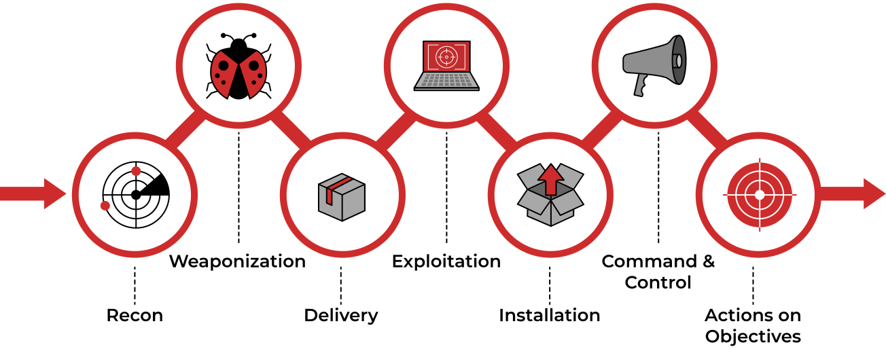

## Introduction

Threat Intelligence (TI) or Cyber Threat Intelligence (CTI) refers to information about adversaries' tactics, techniques, and procedures (TTPs), used by defenders to enhance detection capabilities. The red team can utilize CTI from an offensive standpoint to mimic adversary behavior during adversary emulation exercises.

Learning Objectives

- Understand the basics of threat intelligence and how it can be applied to red team engagements.
- Learn how to create a threat-intel-driven campaign.
- Use frameworks to understand concepts and leverage threat intelligence.

## What is Threat Intelligence

Threat Intelligence (TI) or Cyber Threat Intelligence (CTI) refers to information about adversaries' tactics, techniques, and procedures (TTPs), used by defenders to enhance detection capabilities. The red team can utilize CTI from an offensive standpoint to mimic adversary behavior during adversary emulation exercises.

## Applying Threat intel to the red Team

To effectively utilize Cyber Threat Intelligence (CTI) and gather information on Tactics, Techniques, and Procedures (TTPs), red teams use threat intelligence platforms and frameworks like MITRE ATT&CK, TIBER-EU, and OST Map.

These cyber frameworks will collect known TTPs and categorize them based on varying characteristics such as,

- Threat Group
- Kill Chain Phase
- Tactic
- Objective/Goal

## The TIBER-EU Framework

- common framework developed by the European Central Bank .

> From the ECB TIBER-EU white paper 
> The Framework for Threat Intelligence-based Ethical Red Teaming (TIBER-EU) enables European and national authorities to work with financial infrastructures and institutions (hereafter referred to collectively as ’entities’) to put in place a programme to test and improve their resilience against sophisticated cyber attacks.

**White papers and documents for further reading** :

- [https://www.ecb.europa.eu/pub/pdf/other/ecb.tiber_eu_framework.en.pdf](https://www.ecb.europa.eu/pub/pdf/other/ecb.tiber_eu_framework.en.pdf)
- [https://www.crest-approved.org/tiber-eu/index.html](https://www.crest-approved.org/tiber-eu/index.html)
- [https://www.fireeye.com/content/dam/fireeye-www/services/pdfs/pf/ms/sb-tiber-eu.pdf](https://www.fireeye.com/content/dam/fireeye-www/services/pdfs/pf/ms/sb-tiber-eu.pdf)

## TTP Mapping

The red team uses TTP Mapping to link adversaries' tactics, techniques, and procedures (TTPs) to a standard cyber kill chain. This helps the red team plan engagements to mimic adversary behavior effectively.

1. **Selecting an Adversary**:
    
    - An adversary is chosen based on several criteria, such as the target industry, employed attack vectors, country of origin, or other relevant factors.
    - The example given is APT 39, an Iranian cyber-espionage group known for targeting various industries.

2. **Cyber Kill Chain**:
    
    - The Lockheed Martin cyber kill chain is used as the standard framework for mapping TTPs. This kill chain includes stages such as Reconnaissance, Weaponization, Delivery, Exploitation, Installation, Command and Control, and Actions on Objectives.

Below is a compiled kill chain with mapped TTPs for APT39.

1. Reconnaissance: No identified TTPs, use internal team methodology
    
2. Weaponization:
    
    - Command and Scripting Interpreter
    - PowerShell
    - Python
    - VBA

3. Delivery:
    
    - Exploit Public-Facing Applications
    - Spearphishing

4. Exploitation:
    
    - Registry modification
    - Scheduled tasks
    - Keylogging
    - Credential dumping

5. Installation:
    
    - Ingress tool transfer
    - Proxy usage

6. Command & Control:
    
    - Web protocols (HTTP/HTTPS)
    - DNS

7. Actions on Objectives
    
    - Exfiltration over C2

While MITRE ATT&CK is a primary resource, other platforms can supplement threat intelligence information.

Examples include OST Map, which provides visual maps linking multiple threat actors and their TTPs, and platforms like Mandiant Advantage, Ontic, and CrowdStrike Falcon.

## Creating a Threat Intel Driven Campaign

A threat intel driven campaign will take all knowledge and topics previously covered and combine them to create a well-planned and research campaign :

1. **Identify Framework and General Kill Chain**: Choose a framework and outline the stages of the attack.
2. **Determine Targeted Adversary**: Select which adversary to emulate.
3. **Identify Adversary’s TTPs and IOCs**: Gather information on the tactics, techniques, procedures, and indicators of compromise used by the adversary.
4. **Map Threat Intelligence to a Kill Chain or Framework**: Align the collected intelligence with the chosen framework or kill chain stages.
5. **Draft and Maintain Engagement Documentation**: Prepare and update the necessary documentation for the campaign.
6. **Determine and Use Engagement Resources**: Identify and utilize the required tools, modify C2 traffic, register domains, etc., to emulate the adversary effectively.

|Cyber Kill Chain|MITRE ATT&CK|
|---|---|
|Recon|Reconnaissance|
|Weaponization|Execution|
|Delivery|Initial Access|
|Exploitation|Initial Access|
|Installation|Persistence / Defense Evasion|
|Command & Control|Command and Control|
|Actions on Objectives|Exfiltration / Impact|

