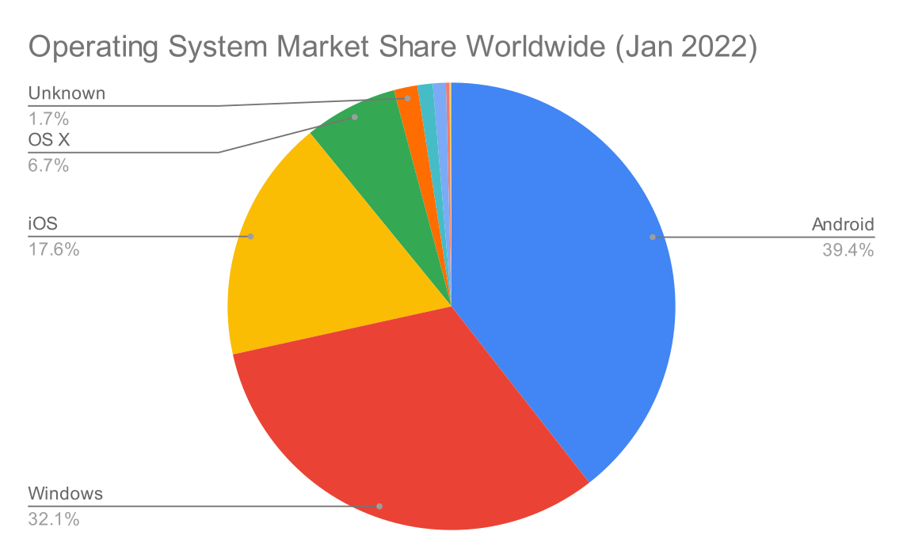
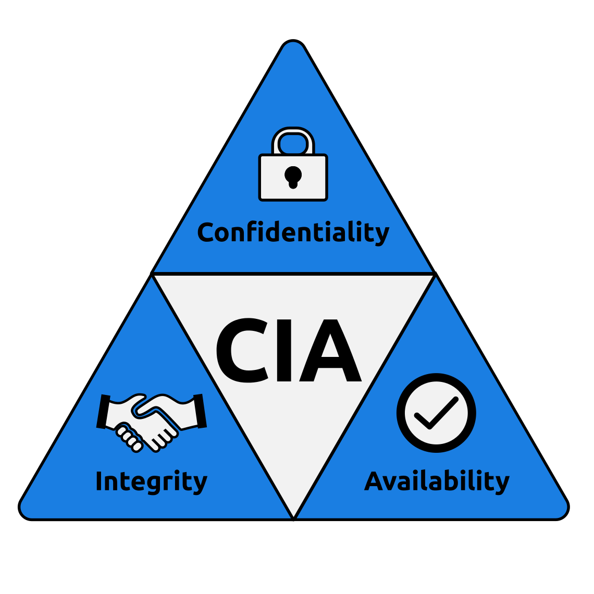

## Introduction to Operating Security

An operating system is vital for computer interaction, present in devices like smartphones and laptops. Examples include MS Windows, macOS, iOS, Android, Chrome OS, and Linux.

Computer hardware encompasses all tangible computer components and peripherals. This includes the screen, keyboard, printer, USB flash memory, and desktop board, which houses key elements like the central processing unit (CPU) and memory chips (RAM).

The desktop board acts as the main part of a computer, linking all hardware components. However, without an Operating System, these components cannot effectively run programs or applications.

The Operating System (OS) serves as the intermediary between hardware and applications. Programs like web browsers (Firefox, Safari, Chrome) and messaging apps (Signal, WhatsApp, Telegram) run on top of the OS, which facilitates their access to hardware resources through defined rules.

Operating systems are tailored for various devices: MS Windows 11 and macOS for personal computers, Android and iOS for smartphones, MS Windows Server 2022, IBM AIX, and Oracle Solaris for servers, and Linux for both personal computers and servers.

- Confidentiality: You want to ensure that secret and private files and information are only available to intended persons.
- Integrity: It is crucial that no one can tamper with the files stored on your system or while being transferred on the network.
- Availability: You want your laptop or smartphone to be available to use anytime you decide to use it.

## Common Examples of OS Security

we will focus on three weaknesses targeted by malicious users:

- Authentication and Weak Passwords
- Weak File Permissions
- Malicious Programs

### Authentication and Weak Passwords

- Authentication is the act of verifying your identity, be it a local or a remote system.
- Authentication can be achieved via three main ways:

	1. Something you know, such as a password or a PIN code.
	2. Something you are, such as a fingerprint.
	3. Something you have, such as a phone number via which you can receive an SMS message

- Passwords, widely used for authentication, are frequent targets for attacks due to users' tendencies to choose weak or reused passwords, often based on easily discoverable personal information.

- The National Cyber Security Centre (NCSC) has published a list of the 100,000 most common passwords. https://www.ncsc.gov.uk/blog-post/passwords-passwords-everywhere

In summary, if attackers guess your password for any online account, such as email or social media, they can access your private data. Hence, it's crucial to use complex passwords and unique ones for each account.

### Weak File Permissions

the principle of least privilege ensures that only those who need access can obtain it. Whether at work or personally, it dictates restricting access to files or information to necessary individuals, ensuring privacy and security.

Weak file permissions create vulnerabilities that attackers exploit to compromise confidentiality and integrity. They can access files they shouldn't and alter files they shouldn't, undermining security.

### Access to Malicious Programs

Certain malicious programs, like Trojan horses, grant attackers access to your system, enabling them to view or alter your files.

Another type, ransomware, targets availability by encrypting files. To regain access, users must pay a ransom for the decryption password, restoring their files' readability.

