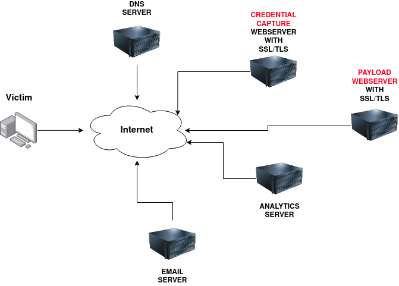

## Phishing Attacks
Before learning about phishing, understand that social engineering is the psychological manipulation of people to exploit weaknesses like curiosity, greed, or kindness.Phishing is a source of social engineering delivered through email to trick someone into either revealing personal information, credentials or even executing malicious code on their computer.

These emails, appearing to come from trusted sources, attempt to trick recipients into downloading software, opening attachments, or following links to bogus websites.

**Spare-phishing :** a targeted form of phishing aimed at specific individuals or organizations, is effective in red team engagements because it is tailored to the target and hard to detect by spam filters, antivirus, and firewalls.

## Writing Convincing Phishing Emails :

When crafting phishing emails, consider three key elements: the sender's address, the subject, and the content.

**Sender's Address:** The sender's address should mimic a known brand, contact, or coworker. Use OSINT (Open Source Intelligence) to find out who the victim interacts with. This can involve:

- Checking social media for brands or friends they mention.
- Searching for reviews they’ve left.
- Looking at their business website for suppliers.
- Checking LinkedIn for coworkers.

**Subject:** Make the subject urgent or intriguing to prompt quick action. Examples include:

- "Your account has been compromised."
- "Your package has been shipped."
- "Staff payroll information (do not forward!)"
- "Your photos have been published."

**Content:** Match the style and branding of the impersonated entity. This includes using similar templates, logos, and signatures. Small details, like how a person refers to themselves, can make the email more convincing. For example, if Dorothy signs as "Dot," use that. If you have a spoof website, disguise the links using text like "Click Here" or a legitimate-looking URL. For example:
`<a href="http://spoofsite.thm">Click Here</a> <a href="http://spoofsite.thm">https://onlinebank.thm</a>`

## Phishing Infrastructure 

To launch a successful phishing campaign, you'll need the following infrastructure:

**Domain Name:** Register a domain that looks authentic or mimics a legitimate one.

**SSL/TLS Certificates:** Create SSL/TLS certificates for your domain to add authenticity.

**Email Server/Account:** Set up an email server or use an SMTP email provider.

**DNS Records:** Configure DNS records like SPF, DKIM, and DMARC to improve email deliverability.

**Web Server:** Set up or purchase web hosting for your phishing websites, and add SSL/TLS for extra credibility.

**Analytics:** Track emails sent, opened, and clicked, and gather data from your phishing websites.

**Automation and Useful Software:** Use tools like GoPhish (getgophish.com) for setting up and managing campaigns, and the Social Engineering Toolkit (trustedsec.com) for creating spear-phishing attacks and fake websites.

## Droppers

Droppers are software that phishing victims are tricked into downloading, often disguised as something useful like a video codec or file opener. Droppers usually pass antivirus checks because they aren't harmful on their own. Once installed, they unpack or download the actual malware, which then installs on the victim's computer. This malware connects back to the attacker, allowing them to control the victim’s computer and potentially exploit the local network.

## Choosing A Phishing Domain

Choosing the right phishing domain is crucial for gaining a psychological edge over your target. Here are some methods:

**Expired Domains:** Buying a domain with some history can help it pass spam filters more easily than a brand-new one.

**Typosquatting:** Register domains that look similar to the target domain by using common typos, like:

- Misspelling: goggle.com vs. google.com
- Additional Period: go.ogle.com vs. google.com
- Numbers for Letters: g00gle.com vs. google.com
- Phrasing: googles.com vs. google.com
- Extra Word: googleresults.com vs. google.com

**TLD Alternatives:** Use the same name but with a different TLD (Top Level Domain), like tryhackme.co.uk instead of tryhackme.com.

**IDN Homograph Attack:** Register domains using characters from different languages that look identical to Latin characters, like Cyrillic 'a' (U+0430) vs. Latin 'a' (U+0061).

## Using MS Office In Phishing

During phishing campaigns, Microsoft Office documents (Word, Excel, or PowerPoint) are often used as attachments. These documents can contain macros, which, while legitimate, can also run harmful commands. For example:

A staff member at Acme IT Support receives an email from "human resources" with an Excel file, “Staff_Salaries.xlsx,” meant for the boss but mistakenly sent to them. In reality, an attacker spoofed the HR email and crafted a tempting message. When the staff member opens the attachment and enables macros, their computer gets compromised.

## Using Browser Exploits

Another way to gain control over a victim’s computer is through browser exploits, where vulnerabilities in browsers like Internet Explorer, Firefox, Chrome, or Safari allow attackers to run remote commands.

Though not common in red team engagements due to browser updates and security measures, it can target outdated technologies in institutions like education, government, or healthcare where updates may be challenging.

Victims may receive convincing emails prompting them to visit a website set up by the attacker. Once on the site, the exploit targets the browser, enabling the attacker to execute commands on the victim’s computer.

For instance, CVE-2021-40444 in September 2021 was a Microsoft system vulnerability allowing code execution just by visiting a website.