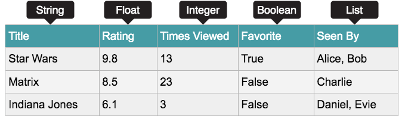
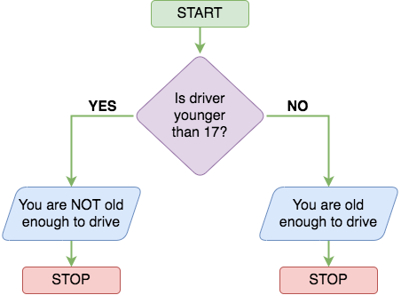

## Introduction to python

This note will cover :

- Variables
- Loops
- Functions
- Data Structures
- If statements
- Files

## Hello World

```python
# This is an example comment
print("Hello World")
```

`#` this line is comment.

`print()` : print output on screen. we have to put text inside `""` .

## Mathematical Opeations

The table below shows the different operations.  

| **Operator**   | **Syntax** | **Example**     |
| -------------- | ---------- | --------------- |
| Addition       | +          | 1 + 1 = 2       |
| Subtraction    | -          | 5 - 1 = 4       |
| Multiplication | *          | 10 * 10 = 100   |
| Division       | /          | 10 / 2 = 5      |
| Modulus        | %          | 10 % 2 = 0      |
| Exponent       | **         | 5**2  = 25 (52) |

These operators are used to evaluate a program's condition at a particular state.


| **Symbol**               | **Syntax** |
| ------------------------ | ---------- |
| Greater than             | >          |
| Less than                | <          |
| Equal to                 | ==         |
| Not Equal to             | !=         |
| Greater than or equal to | >=         |
| Less than or equal       | <=         |

## Variables and Data Types

Variables allow you to store and update data in a computer program. You have a variable name and store data to that name.  

```python
food = "ice cream"
money = 2000
```

 Data Types, which is the type of data being stored in a variable. You can store text, or numbers, and many other types. The data types to know are:

- **String** - Used for combinations of characters, such as letters or symbols
- **Integer** - Whole numbers
- **Float** - Numbers that contain decimal points or for fractions
- **Boolean** - Used for data that is restricted to True or False options
- **List** - Series of different data types stored in a collection



## Logical and Boolean Operators

Logical operators allow assignment and comparisons to be made and are used in conditional testing (such as if statements).

| **Logical Operation**    | **Operator** | **Example** |
| ------------------------ | ------------ | ----------- |
| Equivalence              | ==           | if x == 5   |
| Less than                | <            | if x < 5    |
| Less than or equal to    | <=           | if x <= 5   |
| Greater than             | >            | if x > 5    |
| Greater than or equal to | >=           | if x >= 5   |

Boolean operators are used to connect and compare relationships between statements. Like an if statement, conditions can be true or false.

| **Boolean Operation**                                     | Operator | **Example**                                                                                |
| --------------------------------------------------------- | -------- | ------------------------------------------------------------------------------------------ |
| Both conditions must be true for the statement to be true | **AND**  | if x >= 5 **AND** x <= 100  <br>  <br>Returns TRUE if x is  <br>a number between 5 and 100 |
| Only one condition of the statement needs to be true      | **OR**   | if x == 1 **OR** x == 10  <br>  <br>Returns TRUE if X is 1 or 10                           |
| If a condition is the opposite of an argument             | **NOT**  | if **NOT** y  <br>  <br>Returns TRUE if the y value is False                               |

## Introduction to If Statements

Using "if statements" allows programs to make decisions. They let a program chose a decision based on a condition.

```python
if age < 17:
    print('You are NOT old enough to drive')
else:
    print('You are old enough to drive')
```



## Loops

 loops allow programs to iterate and perform actions a number of times. There are two types of loops, `for` and `while` loops

**While Loops** : Executes a block of code as long as a condition is true.

```python
i = 1
while i <= 10:
     print(i)
     i = i + 1
```

**For Loops** : Iterates over a sequence (such as lists, tuples, strings, or range) or any other iterable object.

```python
websites = ["facebook.com", "google.com", "amazon.com"]
for site in websites:
     print(site)
```

## Introduction to Functions

In Python, functions are blocks of reusable code that perform a specific task. They help in organizing code and making it more readable and maintainable.

```python
def calcCost(item):
     if(item == "sweets"):
          return 3.99
     elif (item == "oranges"):
          return 1.99
     else:
          return 0.99

spent = 10
spent = spent + calcCost("sweets")
print("You have spent:" + str(spent))
```

## Files

**Opening a File:**

```python
file = open("example.txt", "mode")

```

- `"r"`: Read mode (default). Opens a file for reading.
- `"w"`: Write mode. Opens a file for writing. If the file does not exist, it creates a new file. If the file exists, it truncates the file.
- `"a"`: Append mode. Opens a file for appending. If the file does not exist, it creates a new file.
- `"b"`: Binary mode. Opens a file in binary mode.
- `"t"`: Text mode (default). Opens a file in text mode.

**Reading File**: 

- Use the `read()` or `readline()` methods to read from a file.

```python
content = file.read() # Reads the entire file 
line = file.readline() # Reads a single line
```

**Writing to a File:**

- Use the `write()` method to write to a file.

```python
file.write("Hello, world!\n")
```

**Closing a File:** 

```python
file.close
```

## Imports

we can import libraries, which are a collection of files that contain functions. Think of importing a library as importing functions you can use that have been already written for you.

```python
import datetime
current_time = datetime.datetime.now()
print(current_time)
```