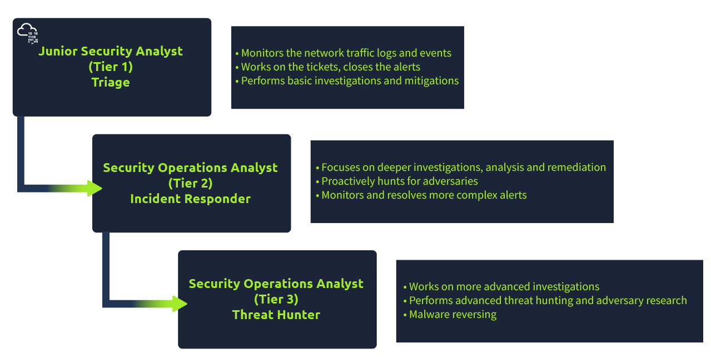
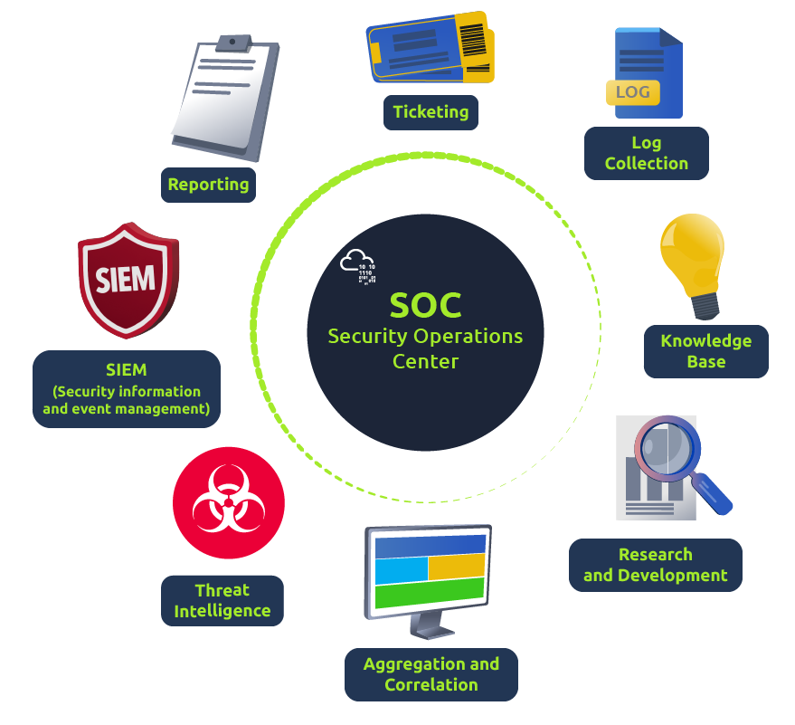

The responsibilities for a Junior Security Analyst or Tier 1 SOC Analyst include:

- Monitor and investigate the alerts (most of the time, it's a 24x7 SOC operations environment)
- Configure and manage the security tools
- Develop and implement basic [IDS (Intrusion Detection System)](https://www.barracuda.com/glossary/intrusion-detection-system) signatures
- Participate in SOC working groups, meetings
- Create tickets and escalate the security incidents to the Tier 2 and Team Lead if needed

## SOC

The core function of a SOC (Security Operations Center) is to investigate, monitor, prevent, and respond to threats in the cyber realm 24/7 or around the clock.

### Responsibilities

**1. Preparation and Prevention**

- Stay informed with the current cyber security threats (twitter and feedly) 
- Preparation method includes gathering intelligence data on latest threats, threat actors and their TTP's. it also includes maintaince procedures like updated firewall signatures, pathching vulnerable softwares etc.

**2. Monitoring and investigation** 

- A SOC team proactively uses [SIEM (Security information and event management)](https://www.fireeye.com/products/helix/what-is-siem-and-how-does-it-work.html) and [EDR (Endpoint Detection and Response)](https://www.mcafee.com/enterprise/en-us/security-awareness/endpoint/what-is-endpoint-detection-and-response.html) tools to monitor suspicious and malicious network activities.

**3. Response** 

After the investigation, the SOC team coordinates and takes action on the compromised hosts, which involves isolating the hosts from the network, terminating the malicious processes, deleting files, and more.

