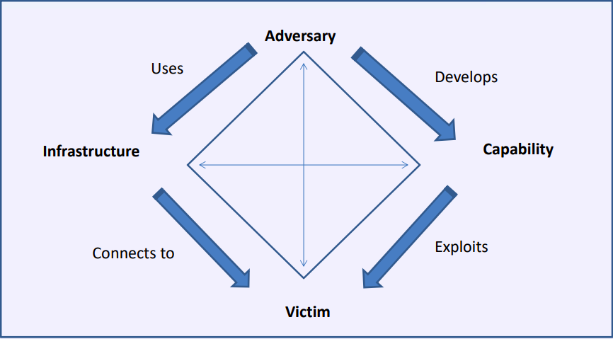

## Introduction

The **Diamond Model of Intrusion Analysis** is a framework for analyzing cyber intrusions, providing a structured approach to understand and counteract cyberattacks. Introduced in 2013 by Sergio Caltagirone, Andrew Pendergast, and Christopher Betz, this model is used by cybersecurity professionals to dissect complex cyber incidents, aiding in proactive defense and effective incident response.

## Core Component of the Diamond Model

The model is built around four core components that form the points of a "diamond".

### 1. Adversary

- The entity (individual, group, or organization) responsible for the cyberattack.
- Motivations can vary: financial gain, espionage, sabotage, or hacktivism.
- The adversary may employ specific techniques and tactics based on goals.

**Example**: A hacker group attempting to steal intellectual property from a corporation.

### 2. Capability

- The tools, techniques, and procedures (TTPs) the adversary uses to execute the attack.
- Capabilities can be sophisticated or rudimentary, including malware, exploits, zero-day vulnerabilities, or publicly available tools.
- The level of sophistication can indicate whether the adversary is a script kiddie, a cybercriminal, or a nation-state actor.

**Example**: Use of ransomware to encrypt files or phishing emails to steal credentials.

### 3. Infrastructure

- The physical or virtual assets the adversary uses to carry out the intrusion.
- These include command-and-control (C2) servers, botnets, compromised websites, malicious email servers, or VPNs.
- Infrastructure can be either directly controlled by the adversary or leased/compromised from other sources.

**Example**: A server controlled by the attacker for exfiltrating sensitive data.

### 4. Victim

- The target of the cyberattack, which could be an individual, organization, or sector (e.g., healthcare, financial, government).
- The victim's vulnerabilities, configurations, or defensive weaknesses often influence why they are chosen.
- Understanding the victim's environment is key to analyzing the intrusion.

**Example**: A financial institution targeted for its customer data.

## Relationships Between Core Components

The model’s real power comes from the **relationships** between these four elements. Understanding how these components interact provides deep insights into the attack:

- **Adversary-Victim Relationship**: Why is the adversary targeting this victim? Is it a random or targeted attack?
- **Adversary-Capability Relationship**: What tools or techniques are being used, and how does the adversary acquire or develop them?
- **Infrastructure-Capability Relationship**: How is the infrastructure supporting the capabilities? (e.g., using a botnet to distribute malware)
- **Infrastructure-Victim Relationship**: How does the adversary use the infrastructure to interact with or affect the victim (e.g., phishing emails, malware delivery)?

This interconnected analysis helps security teams understand the attacker’s motivations, techniques, and goals, which in turn facilitates better defense strategies.

## Meta Features

In addition to the core components, the Diamond Model includes **meta-features** to further enhance the analysis:

- **Timestamps**: Time of activity, which can help link events to the attack timeline or broader campaigns.
- **Kill Chain Phases**: Understanding which stage of the cyber kill chain the attack represents (reconnaissance, weaponization, delivery, etc.).
- **Result**: Outcome of the attack, such as data theft, denial of service, or system compromise.
- **Direction**: Describes the adversary’s approach toward the victim and their interaction with the infrastructure.

Meta-features provide context for the attack, offering a detailed timeline and sequence of events.