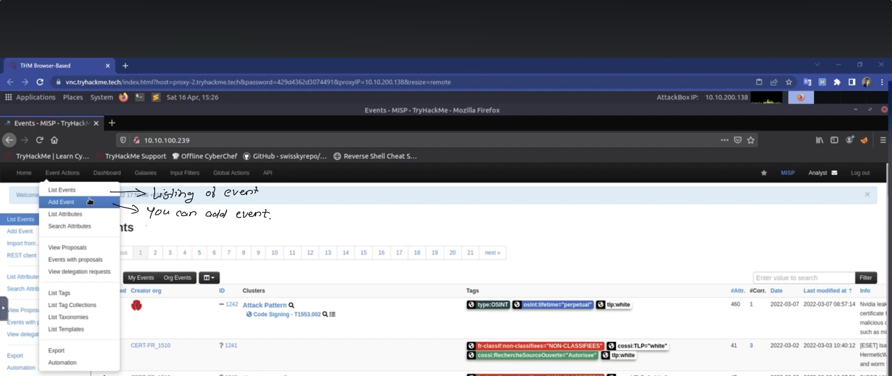

## Introduction

- MISP : Malware Information Sharing Platform
- Collection,storage and distribution of threat intelligence and indicators of compromise (IOCs) related to malware.

**Use Cases**

- Malware Reverse Engineering
- Intelligence Analysis : Gathering information about adversary group and their capabilities (similar to MITRE —> TTPs but for malware)
- Risk Analysis : research new threat, their likelihood and occurrences.

**MISP Features**

- IOC Database : storage of technical and non-technical information about malware samples, incidents , attackers and intelligence.
- Data sharing
- Event Graph
- API Support
- Automatic Correlation : Identification of relationships between attributes and indicators from malware, attack campaigns or analysis.

**Common Terms**

- Events : Collection of contextually linked information.
- Attributes : Individual data points associated with an event, such as network or system indicators.
- Objects : Custom attribute compositions.
- Object References : Relationships between different objects.
- Taxonomies**:** A taxonomy is a means of classifying information based on standard features or attributes. On MISP, taxonomies are used to categorise events, indicators and threat actors based on tags that identify them.

