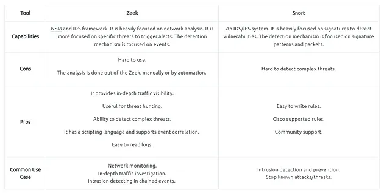
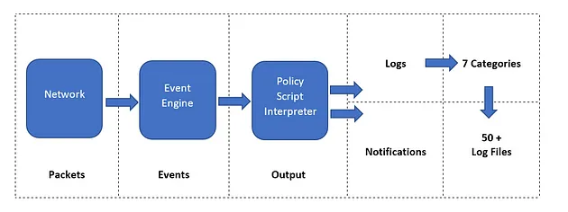
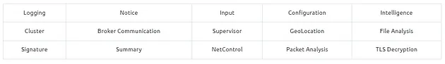
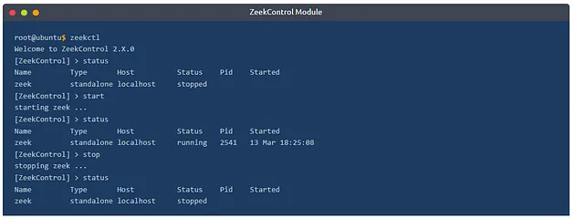
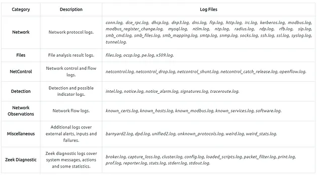
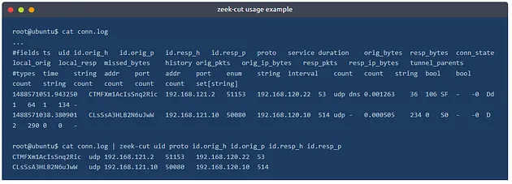

## Network Security Monitoring

**Network Monitoring** vs **Network Security Monitoring**

- **Network Monitoring** is about continuously observing and managing network traffic, focusing on device uptime, performance,device health and Connection Quality.
- **Network Security Monitoring (NSM)** aims to detect anomalies, like suspicious ports, encrypted traffic, and malicious behavior, useful for security teams.

### What is Zeek

- Zeek is passive network traffic analysis tool, generating logs for forensics and data analysis.
- Zeek differs from known monitoring and IDS/IPS tools by providing a wide range of detailed logs ready to investigate both for forensics and data analysis actions. Currently, Zeek provides 50+ logs in 7 categories.

### Zeek vs Snort



- Zeek is designed for detailed forensic logs, while snort focuses more on signature-based Intrusion detection.
- Zeek is Event based while snort is alert based.

### Zeek Architecture

**Event Engine**

- Processes raw traffic.
- Extract info such as source/destination address, protocol identification, session analysis etc.

**Policy Script Interpreter**

- uses zeek script to analyse and correlate events for deeper security insights.



### Zeek Frameworks

- frameworks provide extended functionality in scripting layer.
- Each framework foceses on the specific use case for example **Logging Framework** helps manage logs efficiently.



### Zeek Outputs

- Zeek provides 50+ log files under seven different categories, which are helpful in various areas such as traffic monitoring, intrusion detection, threat hunting and web analytics.
- Logs are saved in default path `/opt/zeek/logs` when running as a service.

### Working with Zeek

1. **Zeek as Service (Network monitoring)**
    
    1. We use **ZeekControl** module with superuser permission.
    2. **ZeekControl** manage zeek service and view the status of the service. Primary management is done with `status`, `start` and `stop` commands.
    3. we can use **zeekcontroll** mode with the following commands as well
        1. `zeekctl status`
        2. `zeekctl start`
        3. `zeekctl stop`
    
    
    
2. **Offline (packet investigator)**
    
    1. Once we process pcap file, zeek automatically creates log files according to the traffic.
    2. Logs are saved in working direcotry.
    3. To investigate generated logs we need command-line tools such as `cat` `cut` `grep` `sort` and `uniq` and additional tools `zeek-cut`.
    
    ```bash
    z eek -C -r sample.pcap
    -r : Reading option/process pcap file.
    -C : Ignore checksum errors.
    -v : version information.
    zeekctl : zeekcontrol module.
    ```
    

## Zeek Logs

- Zeek is capable of identifying 50+ logs and categorising them into seven categories.
- Each log output consist multiple field, each filed holds a different part of the traffic data. Correlation is done through a unique value called **UID.**
- Zeek logs are well structured and tab-separated ASCII files, so reading and processing them is easy but requires effort.



- You will need some cmd-line tools (cat,cut,grep,sort,uniq etc) and addition tools such as zeek-cut to investigates the generated logs.
- Logs provide vast amount of information and `zeek-cut` reduce the effort of extracting specific columns from log files.
- Each log file provide **Field Name** in the beginning you can use this with `zeek-cut` (Make sure that you use the **Fields** and not the Types.


- Below is example of extraction of UID , Protocol , source and destination hosts, source and destination ports from the conn.log.

```bash
cat conn.log | zeek-cut uid proto id.orig_h id.orig_p id.resp_h id.resp_p
```

