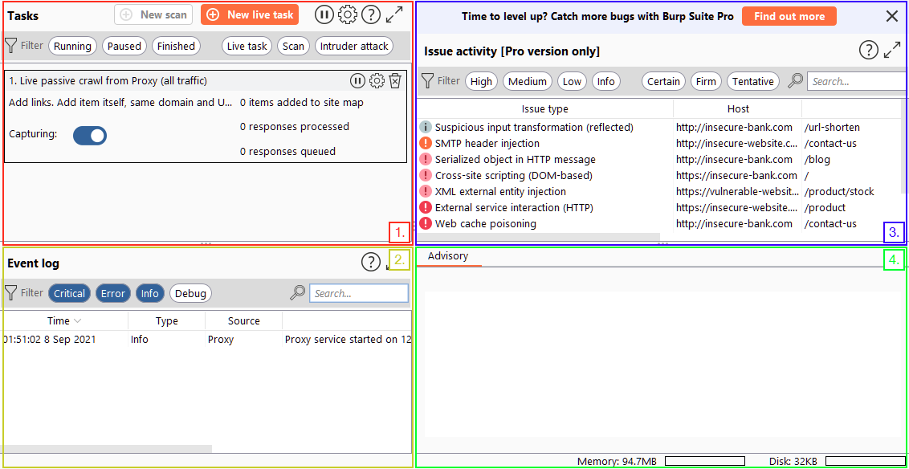
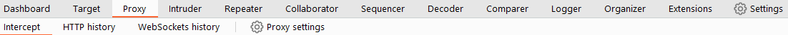
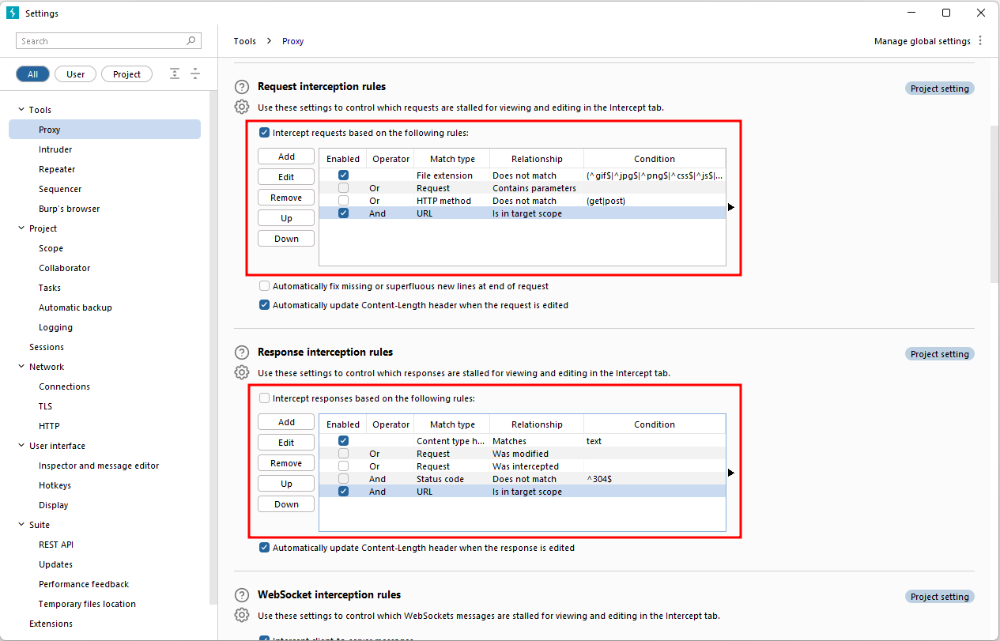

## Introduction

We'll cover:

- An introduction to Burp Suite.
- Overview of its tools.
- Installation guidance.
- Navigating and configuring Burp Suite.

## What is Burp Suite

- Burp Suite is a Java-based framework used for web application penetration testing. It's the go-to tool for assessing the security of web and mobile apps, including those with APIs.
- Burp Suite captures and allows manipulation of HTTP/HTTPS traffic between a browser and a web server. 
- This core feature forms the framework's foundation. Intercepting requests gives users the power to route them to different components within Burp Suite. 
- This ability to intercept, view, and modify requests before they reach the server, or even alter responses before they reach the browser, makes Burp Suite indispensable for manual web app testing.

## Features of Burp Community

- **Proxy**: The Burp Proxy is the most renowned aspect of Burp Suite. It enables interception and modification of requests and responses while interacting with web applications.
- **Repeater**: Another well-known feature. Repeater allows for capturing, modifying, and resending the same request multiple times. This functionality is particularly useful when crafting payloads through trial and error (e.g., in SQLi - Structured Query Language Injection) or testing the functionality of an endpoint for vulnerabilities.
- **Intruder**: Despite rate limitations in Burp Suite Community, Intruder allows for spraying endpoints with requests. It is commonly utilized for brute-force attacks or fuzzing endpoints.
- **Decoder**: Decoder offers a valuable service for data transformation. It can decode captured information or encode payloads before sending them to the target. While alternative services exist for this purpose, leveraging Decoder within Burp Suite can be highly efficient.
- **Comparer**: As the name suggests, Comparer enables the comparison of two pieces of data at either the word or byte level. While not exclusive to Burp Suite, the ability to send potentially large data segments directly to a comparison tool with a single keyboard shortcut significantly accelerates the process.
- **Sequencer**: Sequencer is typically employed when assessing the randomness of tokens, such as session cookie values or other supposedly randomly generated data. If the algorithm used for generating these values lacks secure randomness, it can expose avenues for devastating attacks.

Burp Suite's Java codebase allows developers to create extensions in Java, Python (with Jython), or Ruby (with JRuby). The Extender module simplifies loading extensions, and the BApp Store offers third-party modules. While some extensions need a Pro license, many are free for Burp Community users. For example, the Logger++ module enhances logging functionality.

## The Dashboard
The Burp Dashboard is divided into four quadrants, as labelled in counter-clockwise order starting from the top left:

1. **Tasks**: The Tasks menu allows you to define background tasks that Burp Suite will perform while you use the application. In Burp Suite Community, the default “Live Passive Crawl” task, which automatically logs the pages visited, is sufficient for our purposes in this module. Burp Suite Professional offers additional features like on-demand scans.

2. **Event log**: The Event log provides information about the actions performed by Burp Suite, such as starting the proxy, as well as details about connections made through Burp.

3. **Issue Activity**: This section is specific to Burp Suite Professional. It displays the vulnerabilities identified by the automated scanner, ranked by severity and filterable based on the certainty of the vulnerability.

4. **Advisory**: The Advisory section provides more detailed information about the identified vulnerabilities, including references and suggested remediations. This information can be exported into a report. In Burp Suite Community, this section may not show any vulnerabilities.

## Navigation

Here's how the navigation works:

1. **Module Selection**: The top row of the menu bar displays the available modules in Burp Suite. You can click on each module to switch between them. For example, the Burp Proxy module is selected in the image below.

2. **Sub-Tabs**: If a selected module has multiple sub-tabs, they can be accessed through the second menu bar that appears directly below the main menu bar. These sub-tabs often contain module-specific settings and options. For example, in the image above, the Proxy Intercept sub-tab is selected within the Burp Proxy module.

3. **Detaching Tabs**: If you prefer to view multiple tabs separately, you can detach them into separate windows. To do this, go to the Window option in the application menu above the Module Selection bar. From there, choose the "Detach" option, and the selected tab will open in a separate window. The detached tabs can be reattached using the same method.

Burp Suite also provides keyboard shortcuts for quick navigation to key tabs. By default, the following shortcuts are available:

|Shortcut|Tab|
|---|---|
|`Ctrl + Shift + D`|Dashboard|
|`Ctrl + Shift + T`|Target tab|
|`Ctrl + Shift + P`|Proxy tab|
|`Ctrl + Shift + I`|Intruder tab|
|`Ctrl + Shift + R`|Repeater tab|

## Options

let's explore the available options for configuring Burp Suite. There are two types of settings: Global settings (also known as User settings) and Project settings.

**Global Settings**: These settings affect the entire Burp Suite installation and are applied every time you start the application. They provide a baseline configuration for your Burp Suite environment.

**Project Settings**: These settings are specific to the current project and apply only during the session. However, please note that Burp Suite Community Edition does not support saving projects, so any project-specific options will be lost when you close Burp.

**How to access options:**

1. Go to settings
2. Search
3. Type filter : filter settings for *user* and *Project* options.
	- User settings: Shows settings that affect the entire Burp Suite installation.
	- Project settings: Displays settings specific to the current project.

4. Categories: Allows selecting settings by category.

## Introduction to the Burp Proxy

- It enables the capture of requests and responses between the user and the target web server. This intercepted traffic can be manipulated, sent to other tools for further processing, or explicitly allowed to continue to its destination.

**Intercepting Requests:**

When requests go through Burp Proxy, they're intercepted and held back from reaching the target server. You can manage them in the Proxy tab, performing actions like forwarding, dropping, or editing. 

**Taking Control:**

The ability to intercept requests empowers testers to gain complete control over web traffic, making it invaluable for testing web applications.

**Capture and Logging:**

Burp Suite captures and logs requests made through the proxy by default, even when the interception is turned off. 

**WebSocket Support:**

Burp Suite also captures and logs WebSocket communication, providing additional assistance when analysing web applications.

> Websocket -->
> WebSocket is a communication protocol that enables real-time, full-duplex communication between a client (typically a web browser) and a server over a single, long-lived connection. Unlike traditional HTTP, which follows a request-response model, WebSocket allows for bi-directional communication, where both the client and server can send messages to each other asynchronously. This makes WebSocket ideal for applications requiring constant data exchange, such as chat applications, real-time gaming, stock tickers, and collaborative editing tools.

**Logs and History:** The captured requests can be viewed in the HTTP history and WebSockets history sub-tabs, allowing for retrospective analysis and sending the requests to other Burp modules as needed.

**Match and Replace:** The "Match and Replace" section in the Proxy settings enables the use of regular expressions (regex) to modify incoming and outgoing requests.

## Site Map and Issue Definitions

The Target tab in Burp Suite provides more than just control over the scope of our testing. It consists of three sub-tabs

### Site Map

This feature in Burp Suite allows us to visualize the structure of the web application we're testing in a tree format. Every page visited during active proxy use appears in the site map. It simplifies site mapping by automatically generating a visual representation as we browse the app. In Burp Suite Professional, it can also automate crawling, mapping links between pages comprehensively. Even in Burp Suite Community, the site map helps gather data during initial enumeration, especially useful for mapping APIs as accessed endpoints are captured.

### Issue Definitions

Even though Burp Community lacks the full vulnerability scanning of Burp Suite Professional, it offers a comprehensive list of vulnerabilities that the scanner detects. The Issue Definitions section contains detailed descriptions and references for each vulnerability. This resource is valuable for referencing vulnerabilities in reports or describing identified vulnerabilities during manual testing.

### Scope Settings

In Burp Suite, Scope Settings let us manage the target scope. We can include or exclude specific domains/IPs to define what we're testing. This helps focus on targeted web applications and avoid capturing unnecessary traffic.

## Scoping and Targetting

By setting a scope for the project, we can define what gets proxied and logged in Burp Suite. 

**To add website to scope:** 

- switch to the Target tab, 
- right-clicking on our target from the list on the left, 
- selecting Add To Scope. 

Burp will then prompt us to choose whether we want to stop logging anything that is not in scope, and in most cases, we want to select yes.

To check our scope, we can switch to the Scope settings sub-tab within the Target tab.

However, even if we disabled logging for out-of-scope traffic, the proxy will still intercept everything. 

To prevent this, we need to go to the `Proxy settings` sub-tab and select `And URL Is in target scope` from the "Intercept Client Requests" section.

Enabling this option ensures that the proxy completely ignores any traffic that is not within the defined scope, resulting in a cleaner traffic view in Burp Suite.

## Proxying HTTPS

> Why we need to add certificates to intercept https request ?
