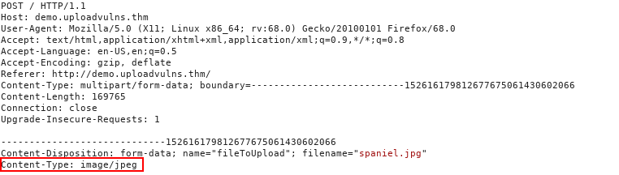
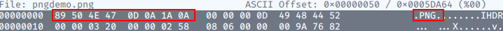
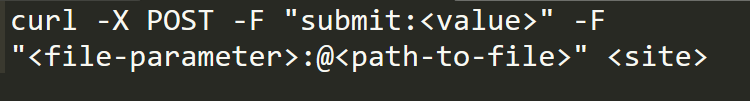

Vulnerabilities Covered in this Notes : 

- Overwriting existing files on a server
- Uploading and Executing Shells on a server (RCE)
- Bypassing Client-Side filtering
- Bypassing various kinds of Server-Side filtering
- Fooling content type validation checks

## General Methodology

1. Source Code Analysis:
    - Reviewing the page source code helps identify client-side filtering mechanisms.
2. Directory Bruteforcing:
    - Tools like Gobuster help scan for directories where files are uploaded.
3. Intercepting Requests with Burp Suite:
    - Burp Suite intercepts upload requests for analysis and manipulation.
4. Browser Extensions:
    - Extensions like Wappalyzer provide insights into the target site's technologies.
5. Testing File Upload Functionality:
    - Experiment with uploading different file types and sizes to identify restrictions.
    - Check for client-side filtering and bypass mechanisms if detected.
    - If server-side filtering is present, analyze error messages to understand filtering criteria.
    - Upload files designed to provoke errors to understand filtering behavior.
6. Utilizing Tools:
    - Tools like Burp Suite and OWASP ZAP aid in file upload testing by facilitating request interception, analysis, and error detection.

## Overwriting Existing Files

- When uploading files, checks should prevent overwriting existing server files.
- Commonly, new filenames are generated, often with random elements or timestamps added.
- Alternatively, checks verify if a file with the same name already exists, prompting users to choose a different name.
- File permissions are crucial to prevent web pages from being writable by users, preventing malicious file uploads.
- Without proper precautions, overwriting existing files on the server is possible.
- Realistically, server file permissions usually mitigate serious vulnerabilities, but caution is warranted during testing and bug hunting.

## Remote Code Execution

- Remote Code Execution (RCE) allows attackers to run code on the web server, usually under a low-privileged account like "www-data" on Linux. This is a severe security issue, often caused by uploading a program written in the same language as the website's backend, such as PHP, Python Django, or Node.js.

- RCE is typically achieved through webshells or reverse shells. A reverse shell is preferred as it provides full control, while a webshell may be the only option available.

- The general approach involves uploading a shell, then activating it by navigating to the file directly or forcing the web app to execute the script.

- In summary, RCE enables attackers to run code on the server, posing a significant risk to the security and integrity of the web application.

## Filtering

- Moving forward, we'll explore defense mechanisms against file upload vulnerabilities and how to bypass them.

- "Client-side" scripts run in the user's browser, with JavaScript being the most common language for this purpose.

- Client-side scripts, regardless of the language, run in the web browser. In the case of file uploads, this means filtering occurs before the file reaches the server.

- Client-side filtering seems beneficial in theory, but it's easily bypassed because it occurs on the user's computer. Consequently, relying solely on client-side filtering is insecure for verifying the safety of uploaded files.

- Server-side scripts run on the server. While PHP was traditionally dominant, other options like C#, Node.js, Python, and Ruby on Rails have gained popularity in recent years.

- Server-side filtering is harder to bypass because the code isn't accessible, and it's executed on the server. While it's challenging to completely bypass the filter, attackers must craft payloads that evade the filters but still execute the desired code.

### Extension Validation

- File extensions are commonly used to identify file contents, but they're easily changed and not reliable indicators. Windows relies on extensions to identify file types, while Unix-based systems use other methods. 

- Filters for extensions typically either blacklist (disallow certain extensions) or whitelist (allow specific extensions) them.

### File Type Filtering

- similar to Extension Validation, ensures that the contents of a file are acceptable for upload. There are two types of file type validation:

**1. MIME validation:** 

- MIME (Multipurpose Internet Mail Extension) types identify files, originally used for email attachments but now also for files transferred over HTTP(S). 
- The MIME type for a file upload is attached in the request header.

**2. Magic Number**

- Magic Number Validation involves checking the initial bytes of a file, known as the "magic number," to determine its content. 

- Each file type has a unique magic number. For instance, a PNG file typically starts with the bytes 89 50 4E 47 0D 0A 1A 0A. 

- While not foolproof, this method is more reliable than simply checking file extensions.

### File Length Filtering

- File length filters restrict the size of uploaded files to prevent resource exhaustion on the server. While they typically don't affect shell uploads, they're important to consider. For instance, if an upload form expects small files, there might be a limit on file length. If a reverse shell exceeds this limit, an alternative shell must be found.

### File Name Filtering

- Uploaded files should be made unique to prevent conflicts. This can be achieved by adding randomness to filenames or checking if a file with the same name exists and prompting the user to choose a different one if necessary. 

- Additionally, filenames should be sanitized to remove any potentially problematic characters that could affect the file system. 

- Therefore, even if content filtering is bypassed, the uploaded files may have different names than expected.

### File Content Filtering

- Various filtering mechanisms, such as extension, MIME type, and magic number validation, work together to enhance file upload security. While no single filter is foolproof, they are often layered to provide better protection. 

- These filters can be applied on the client-side, server-side, or both, depending on the specific requirements of the application.

- Different programming languages and frameworks offer their own methods for filtering and validating uploaded files, but vulnerabilities specific to certain languages or frameworks can still arise. For example, in older versions of PHP, it was possible to bypass extension filters by appending a null byte followed by a valid extension to a malicious file. 

## Bypassing Client-Side Filtering

There are Four easy ways to bypass client-side file upload filter.
1. Turn off javascript
2. Intercept and modify the incoming page.
3. Intercept and modify the file upload.
4. Send the file directly to the upload point.

## Bypassing Server-Side Filtering: File Extensioins

- When you cannot see or manipulate the code, bypassing client-side filters becomes more challenging.

- bypassing client-side filters requires extensive testing to understand the filter's limitations and gradually construct a payload that complies with those restrictions.
- To bypass server-side filtering that uses file extensions, you can try various techniques depending on the specific implementation of the filter:

1. **Double Extensions**: Sometimes, filters only check the last part of the filename for its extension. You can try appending a valid extension after an allowed one, like `malicious.php.txt`.
    
2. **Null Byte Injection**: In older systems or configurations, appending a null byte (`%00`) at the end of a filename can trick the server into ignoring everything after it. For example, `malicious.php%00.jpg`.
    
3. **Alternate Characters**: Use alternate characters that look similar to the filtered ones. For example, instead of `.php`, try `.phtml` or `.php5`.
    

4. **Mixed Case**: If the filter is case-sensitive, try using mixed case or uppercase extensions, like `.PhP` or `.JPG`.
    
5. **No Extension**: Some filters may only allow files with specific extensions. Try uploading a file without an extension or with a non-standard one, like `malicious`.
    
6. **ZIP Files**: If allowed, try uploading a ZIP file containing your malicious file. Some filters may overlook the contents of archived files.
    
7. **Tamper with Headers**: Manipulate the request headers to modify the `Content-Type` or `Content-Disposition` headers to deceive the server about the file type.

## Bypassing Server-Side Filtering: Magic Numbers

Bypassing server-side filtering based on magic numbers involves manipulating the content of the uploaded file to deceive the server into accepting it despite its actual content. Here's how you can bypass this type of filtering:

1. **Spoof the Magic Number**: Identify the expected magic number for the allowed file type, and then prepend it to your malicious file. For example, if the server expects PNG files, you would prepend the PNG magic number (`89 50 4E 47 0D 0A 1A 0A`) to your PHP script.
    
2. **Use File Conversion**: Convert your malicious file to a format with an allowed magic number. For example, if the server allows image files, convert your PHP script to an image format like PNG or JPEG. Then, prepend the appropriate magic number for that format.
    
3. **Trick the Server**: Some servers may only check the first few bytes of a file for its magic number. You can try appending valid content after your malicious payload to make the server accept it. Experiment with different lengths and combinations to find what works.
    
4. **Observe Server Behavior**: Test the server's response to different file contents and magic numbers. Sometimes, servers may have quirks or weaknesses that you can exploit to bypass the filtering.
    
5. **Multi-part Files**: Create a multi-part file that includes both a valid file and your malicious payload. This way, the server might recognize the valid portion and overlook the malicious content.
    
6. **Crafted Binary Payloads**: For more advanced scenarios, craft a binary payload that contains both a valid header and your malicious code. This requires a deep understanding of file formats and their headers.

## Example Methodology

1. Conducting reconnaissance is the initial step in bypassing filters. Utilizing tools like Wappalyzer or Burp Suite, we analyze the web application to identify the technologies and frameworks it employs. This helps us understand the potential filtering mechanisms in place. While Wappalyzer provides quick insights, manual enumeration through intercepted responses with Burp Suite offers more detailed server information, like headers such as "Server" or "X-Powered-By".

2. Examining the source code of the upload page is crucial. We search for client-side scripts to uncover any filtering mechanisms in place. This analysis helps us understand the potential restrictions we might encounter and devise strategies to bypass them.

3. After uploading a benign file, we investigate how it is accessed. We check if it's stored directly in an uploads folder or embedded within a page. Tools like Gobuster help us explore the website's structure and naming conventions. This step provides valuable insights into the virtual environment and establishes a benchmark for subsequent testing.

4. Once we understand how and where uploaded files are accessed, we attempt a malicious upload, bypassing any client-side filters. While we anticipate the server-side filter to block our upload, the error message it provides can offer valuable insights.

Assuming that our malicious file upload was stopped by the server, here are some ways to ascertain what kind of server-side filter may be in place:

- If uploading a file with an invalid extension succeeds (e.g., "image.invalidfileextension"), the server likely uses an extension blacklist. If it fails, the server likely operates on a whitelist.

- To check for a magic number filter, try uploading the innocent file with a modified magic number typical of a blocked file. If it fails, the server likely filters based on magic numbers.

- Similarly, intercept the request for the original innocent file and modify the MIME type to one typically filtered. If the upload fails, the server likely filters by MIME types.

- To determine file length limits, upload progressively larger files until you hit the filter. Error messages may reveal the acceptable size limit.
