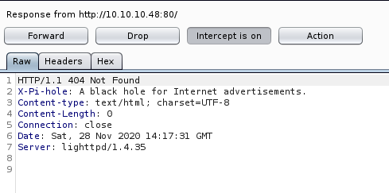
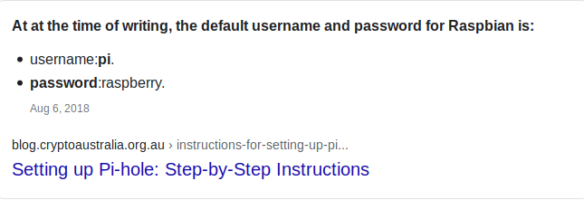
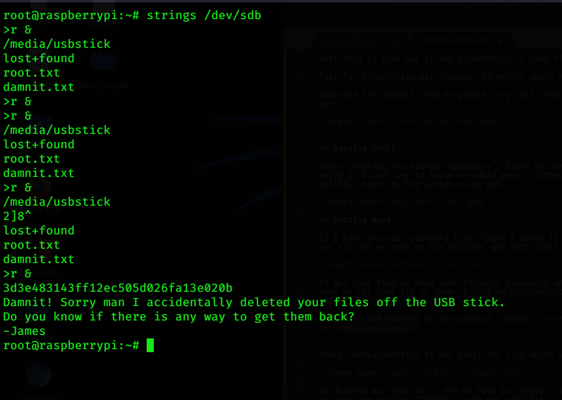

Mirai is an easy-rated box on Hack The Box. It involves exploiting default credentials to gain shell access and using `sudo` privileges to escalate to root. Additionally, there’s a forensic challenge to recover the root flag.

---

## Enumeration

As always, we start with an **Nmap scan** to identify open ports and services running on the target machine.

```bash
Starting Nmap 7.80 ( https://nmap.org ) at 2020-11-28 07:51 EST
Nmap scan report for 10.10.10.48
Host is up (0.43s latency).

PORT      STATE SERVICE VERSION
22/tcp    open  ssh     OpenSSH 6.7p1 Debian 5+deb8u3 (protocol 2.0)
| ssh-hostkey: 
|   1024 aa:ef:5c:e0:8e:86:97:82:47:ff:4a:e5:40:18:90:c5 (DSA)
|   2048 e8:c1:9d:c5:43:ab:fe:61:23:3b:d7:e4:af:9b:74:18 (RSA)
|   256 b6:a0:78:38:d0:c8:10:94:8b:44:b2:ea:a0:17:42:2b (ECDSA)
|_  256 4d:68:40:f7:20:c4:e5:52:80:7a:44:38:b8:a2:a7:52 (ED25519)
53/tcp    open  domain  dnsmasq 2.76
| dns-nsid: 
|_  bind.version: dnsmasq-2.76
80/tcp    open  http    lighttpd 1.4.35
|_http-server-header: lighttpd/1.4.35
|_http-title: Site doesn't have a title (text/html; charset=UTF-8).
1285/tcp  open  upnp    Platinum UPnP 1.0.5.13 (UPnP/1.0 DLNADOC/1.50)
32400/tcp open  http    Plex Media Server httpd
| http-auth: 
| HTTP/1.1 401 Unauthorized\x0D
|_  Server returned status 401 but no WWW-Authenticate header.
|_http-cors: HEAD GET POST PUT DELETE OPTIONS
|_http-title: Unauthorized
Service Info: OS: Linux; CPE: cpe:/o:linux:linux_kernel

Service detection performed. Please report any incorrect results at https://nmap.org/submit/ .
Nmap done: 1 IP address (1 host up) scanned in 26.67 seconds
```

From the Nmap scan, we can see several open ports:
- **Port 22**: SSH (OpenSSH 6.7p1)
- **Port 53**: DNS (dnsmasq 2.76)
- **Port 80**: HTTP (lighttpd 1.4.35)
- **Port 1285**: UPnP
- **Port 32400**: Plex Media Server

My first approach was to enumerate the web service running on **port 80** for more information.

---

## Exploring the Web Service

I visited the website hosted on port 80, but it didn’t return anything useful. To dig deeper, I used **Burp Suite** to inspect the HTTP requests and responses. After analyzing the response, I discovered that the server is hosting **Pi-hole**, a network-wide ad blocker.



Next, I decided to fuzz for directories using **ffuf** (a web fuzzing tool). I discovered the `/admin` directory, which hosts the Pi-hole admin panel.

```bash
ffuf -w /path/to/wordlist -u http://10.10.10.48/FUZZ
```

---

## Default Credentials

I searched for default credentials for Pi-hole on Google and found that the default username is `pi` and the default password is `raspberry`. However, when I tried these credentials on the admin panel login page, they didn’t work.



---

## Gaining Shell Access

After some research, I checked the **Pi-hole GitHub repository** and learned that Pi-hole uses a random password during setup. This meant I couldn’t use default credentials to log in to the admin panel. However, I decided to try the same credentials (`pi:raspberry`) on the SSH service (port 22), and it worked! I gained initial access to the system via SSH.


---

## Privilege Escalation to Root

Once I had access to the user account, the first thing I checked was whether the user had `sudo` privileges. Running `sudo -l` revealed that the user could execute any command as root using `sudo`. I escalated to a root shell using the following command:

```bash
sudo -i
```


---

## Forensic Challenge: Recovering the Root Flag

When I tried to read the `root.txt` file, I encountered a message indicating that the original `root.txt` file was missing and might be backed up on a USB stick.

```bash
cat /root/root.txt
```

Output:
```
I lost my original root.txt! I think I may have a backup on my USB stick...
```

To investigate, I used the `mount` command to list mounted devices. It showed that `/dev/sdb` was mounted at `/media/usbstick`.

```bash
mount
```

I navigated to `/media/usbstick` and found a file named `damit.txt`. This file contained a note from a user named James, explaining that he had accidentally deleted the `root.txt` file.


Since I had no prior experience with forensics, I used the `strings` command to recover the contents of the deleted `root.txt` file from the USB stick.

```bash
strings /dev/sdb | grep "root.txt"
```

This successfully revealed the root flag.



---

## Conclusion

Mirai was a fun and beginner-friendly box that involved:
1. Enumerating open ports and services.
2. Exploiting default credentials to gain SSH access.
3. Using `sudo` privileges to escalate to root.
4. Recovering a deleted file using basic forensic techniques.

This challenge was a great introduction to privilege escalation and basic forensics.

--- 