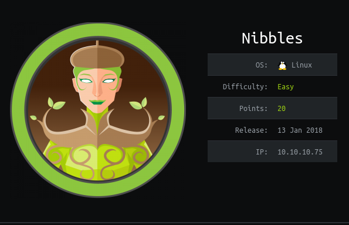
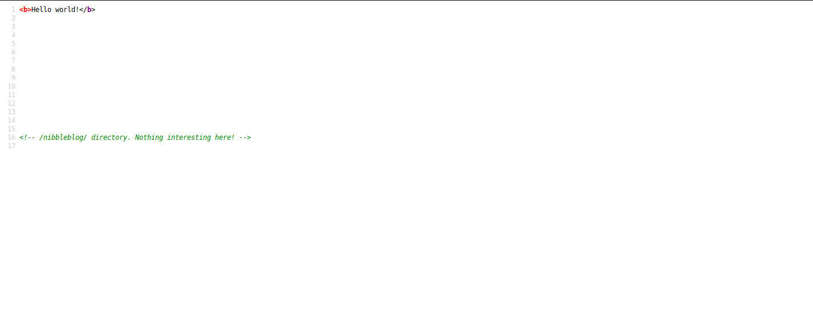
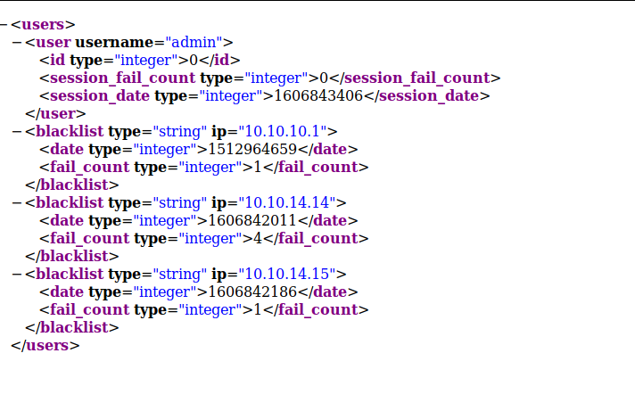

## Introduction

Nibble is an easy machine on HackTheBox that involves exploiting default credentials and an arbitrary file upload vulnerability to gain initial access. Privilege escalation is achieved through a misconfigured script with improper permissions. This walkthrough will guide you through the process of compromising the Nibble machine, from initial reconnaissance to gaining root access.

## Initial Enumeration

### Nmap Scan

The first step in any penetration test is enumeration. We start by scanning the target machine using Nmap to identify open ports and services.

```bash
nmap -sV -sC -p- 10.10.10.75 > nmap/service.log
```

**Nmap Results:**

```nmap
Starting Nmap 7.80 ( https://nmap.org ) at 2020-12-01 11:26 EST
Nmap scan report for 10.10.10.75
Host is up (0.19s latency).

PORT   STATE SERVICE VERSION
22/tcp open  ssh     OpenSSH 7.2p2 Ubuntu 4ubuntu2.2 (Ubuntu Linux; protocol 2.0)
| ssh-hostkey: 
|   2048 c4:f8:ad:e8:f8:04:77:de:cf:15:0d:63:0a:18:7e:49 (RSA)
|   256 22:8f:b1:97:bf:0f:17:08:fc:7e:2c:8f:e9:77:3a:48 (ECDSA)
|_  256 e6:ac:27:a3:b5:a9:f1:12:3c:34:a5:5d:5b:eb:3d:e9 (ED25519)
80/tcp open  http    Apache httpd 2.4.18 ((Ubuntu))
|_http-server-header: Apache/2.4.18 (Ubuntu)
|_http-title: Site doesn't have a title (text/html).
Service Info: OS: Linux; CPE: cpe:/o:linux:linux_kernel

Service detection performed. Please report any incorrect results at https://nmap.org/submit/ .
Nmap done: 1 IP address (1 host up) scanned in 14.65 seconds
```

**Key Services Identified:**

- **SSH (22):** OpenSSH 7.2p2
- **HTTP (80):** Apache httpd 2.4.18

### Web Enumeration

Visiting the HTTP service on port 80 revealed a webpage with a directory named `nibble`.

**Directory Discovery:**



**Directory Brute-Forcing:**

Using `ffuf`, we discovered several directories:

```bash
ffuf -w /usr/share/wordlists/dirb/common.txt -u http://10.10.10.75/FUZZ
```

**Key Directories Identified:**

- `/nibble`
- `/nibble/admin.php`

## Gaining Initial Access

### Discovering Default Credentials

In the `/nibble/content/private/users.xml` file, we found the username `admin`.

**Admin Username:**



### Exploiting the Arbitrary File Upload Vulnerability

Using the default credentials `admin:nibbles`, we logged into the NibbleBlog admin dashboard. Researching NibbleBlog vulnerabilities revealed an arbitrary file upload exploit.

**Exploit Search:**


### Uploading a PHP Reverse Shell

We uploaded a PHP reverse shell to gain a user shell on the machine.

**User Shell Obtained:**


## Privilege Escalation

### Enumerating User Files

In the home directory, we found a file named `personal.zip`. Extracting this file revealed a script named `monitor.sh` with 777 permissions.

**Script Permissions:**


### Exploiting Misconfigured Permissions

The `monitor.sh` script had improper permissions, allowing us to modify it. We replaced the script with a reverse shell payload to gain root access.

**Root Shell Obtained:**


### Alternative Privilege Escalation

The machine also had an outdated kernel version, which could be exploited using a kernel exploit. However, this method was not pursued in this walkthrough.

## Conclusion

The Nibble machine on HackTheBox provided a comprehensive challenge, encompassing web application enumeration, default credential exploitation, and privilege escalation through misconfigured permissions. By methodically enumerating services and exploiting discovered vulnerabilities, we successfully compromised the machine and gained root access. This walkthrough underscores the importance of thorough enumeration and the effective use of discovered vulnerabilities in penetration testing.