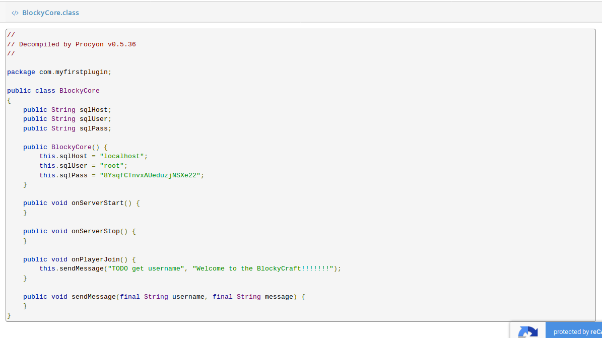

Blocky is a medium-difficulty machine on HackTheBox that involves exploiting a Java Archive (JAR) file to gain initial access and leveraging sudo privileges for privilege escalation. This walkthrough will guide you through the process of compromising the Blocky machine, from initial reconnaissance to gaining root access.

## Enumeration

### Nmap Scan

The first step in any penetration test is enumeration. We start by scanning the target machine using Nmap to identify open ports and services.

```
Starting Nmap 7.80 ( https://nmap.org ) at 2020-11-29 07:25 EST
Nmap scan report for 10.10.10.37
Host is up (0.43s latency).

PORT      STATE  SERVICE   VERSION
21/tcp    open   ftp       ProFTPD 1.3.5a
22/tcp    open   ssh       OpenSSH 7.2p2 Ubuntu 4ubuntu2.2 (Ubuntu Linux; protocol 2.0)
| ssh-hostkey: 
|   2048 d6:2b:99:b4:d5:e7:53:ce:2b:fc:b5:d7:9d:79:fb:a2 (RSA)
|   256 5d:7f:38:95:70:c9:be:ac:67:a0:1e:86:e7:97:84:03 (ECDSA)
|_  256 09:d5:c2:04:95:1a:90:ef:87:56:25:97:df:83:70:67 (ED25519)
80/tcp    open   http      Apache httpd 2.4.18 ((Ubuntu))
|_http-generator: WordPress 4.8
|_http-server-header: Apache/2.4.18 (Ubuntu)
|_http-title: BlockyCraft &#8211; Under Construction!
8192/tcp  closed sophos
25565/tcp open   minecraft Minecraft 1.11.2 (Protocol: 127, Message: A Minecraft Server, Users: 0/20)
Service Info: OSs: Unix, Linux; CPE: cpe:/o:linux:linux_kernel

Service detection performed. Please report any incorrect results at https://nmap.org/submit/ .
Nmap done: 1 IP address (1 host up) scanned in 27.42 seconds
```

**Key Services Identified:**

- **FTP (21):** ProFTPD 1.3.5a
- **SSH (22):** OpenSSH 7.2p2
- **HTTP (80):** Apache httpd 2.4.18 with WordPress 4.8
- **Minecraft (25565):** Minecraft 1.11.2 server

### Web Enumeration

Visiting the HTTP service on port 80 revealed a WordPress site titled "BlockyCraft – Under Construction!" We initiated a `wpscan` in the background to enumerate WordPress vulnerabilities and discovered a username: `notch`.

**Directory Brute-Forcing:**

Using `gobuster`, we discovered several directories:

```
Gobuster v3.0.1
by OJ Reeves (@TheColonial) & Christian Mehlmauer (@_FireFart_)
===============================================================
[+] Url:            http://10.10.10.37
[+] Threads:        10
[+] Wordlist:       /usr/share/wordlists/dirbuster/directory-list-2.3-medium.txt
[+] Status codes:   200,204,301,302,307,401,403
[+] User Agent:     gobuster/3.0.1
[+] Extensions:     php
[+] Timeout:        10s
===============================================================
2020/11/29 08:24:15 Starting gobuster
===============================================================
/index.php (Status: 301)
/wiki (Status: 301)
/wp-content (Status: 301)
/wp-login.php (Status: 200)
/plugins (Status: 301)
/wp-includes (Status: 301)
/javascript (Status: 301)
/wp-trackback.php (Status: 200)
/wp-admin (Status: 301)
```

**Key Directories Identified:**

- `/wiki`
- `/wp-content`
- `/plugins`
- `/wp-admin`

### Discovering the JAR Files

In `/plugins` directory there are two jar file. We downloaded both files for further analysis.


#### Decompiling the JAR File

Using an online Java decompiler, we decompiled `BlockyCore.jar` and found a `BlockyCore.class` file. Decompiling this class revealed hardcoded database credentials for the root user.



## Gaining Initial Access

Using the discovered credentials, we attempted to SSH into the machine with the username `notch` and the password `8YsqfCTnvxAUeduzjNSXe22`. The login was successful, granting us access to the user shell.

**SSH Access:**

```bash
ssh notch@10.10.10.37
```

**User Shell Obtained:**


## Privilege Escalation

### Enumerating Sudo Privileges

Upon gaining access to the user shell, we checked the sudo privileges available to the `notch` user:

```bash
sudo -l
```

**Sudo Privileges:**

```bash
User notch may run the following commands on Blocky:
    (ALL : ALL) ALL
```

### Escalating to Root

Given that the `notch` user can run all commands as root, we escalated privileges by running:

```bash
sudo su
```

**Root Shell Obtained:**

